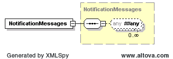

# Get Notifications

This interface is used to retrieve notifications for previously
submitted market transactions for the nouns BidSet, ResParametersSet and
VDIs. The notifications in question are those notifications that were
delivered asynchronously to market participant listeners as the result
of create or change transactions for the aforementioned nouns (BidSet,
ResParametersSet and VDIs).  The interface is synchronous in nature and
subject to the below specifications.

Key Specifications:

- Service supports querying historical notifications upto 4 days old and
  is based on transaction submitted time. “Transaction submitted time”
  represents the time when the original create or change transaction was
  submitted to ERCOT.  It is not the TradingDate on the submission nor
  the StartTime/EndTime of an interval in the submission.

- A single query cannot span more than 24hours. Specifically, the
  StartTime and EndTime sent on the query may not exceeded 24hours.

- Notifications can be retrieved using combinations of following query
  parameters

  1.  mRID(s)

  2.  BidType

  3.  Bid Processed Status (ACCEPTED/ERROR)

> StartTime and EndTime, which represent the submitted times that the
> query will span, are required with above parameter combinations.
>
> A maximum of 1000 notifications will be returned from a single
> request.  This threshold will also be subject to payload size
> limitations.  If the resulting response exceeds 3MB after compression,
> an error will be returned indicating that the query parameters need to
> be refined (i.e. further constrained).
>
> If a query by MRID is received and ERCOT determines that the MRID in
> question exists within a multi-bid notification (i.e. a notification
> that has two or more Bids and thus potentially two or more MRIDs), the
> entire multi-bid notification will be returned in the response.  ERCOT
> will not filter the notification and only return the bid that
> corresponds with the MRID in question.
>
> Similarly, if a query by Bid Processed Status is received and ERCOT
> determines that a single notification has both accepted and rejected
> bids, the entire notification will be returned.  ERCOT will not filter
> the notification and only return the bid that corresponds with the Bid
> Processed Status in question.

- Following are the valid query parameter combinations

  - getNotifications by BidType

    - StartTime & EndTime

    - BidType

    - Bid Processed Status (optional)

  - getNotifications by mRID

    - StartTime & EndTime

    - One or more mRIDs

    - Bid Processed Status (optional)

## Get Notifications Message

The request message would use the following message fields:

| Message Element | Value                                                                              |
|-----------------|------------------------------------------------------------------------------------|
| Header/Verb     | get                                                                                |
| Header/Noun     | BidSetNotifications/ ResParameterSetNotifications/ VDIsNotifications               |
| Header/Source   | *Market participant ID*                                                            |
| Header/UserID   | *ID of user*                                                                       |
| Payload/any     | *Get Notification request Payload.  Query payload should be mapped to Any element* |

Request Query Payload is as follows

<table>
<colgroup>
<col style="width: 13%" />
<col style="width: 8%" />
<col style="width: 11%" />
<col style="width: 42%" />
<col style="width: 24%" />
</colgroup>
<thead>
<tr class="header">
<th><em>Element</em></th>
<th><em>Req?</em></th>
<th><em>Datatype</em></th>
<th><em>Description</em></th>
<th><em>Values</em></th>
</tr>
</thead>
<tbody>
<tr class="odd">
<td>startTime</td>
<td>Y</td>
<td>dateTime</td>
<td>Start date time of query</td>
<td>Valid date time</td>
</tr>
<tr class="even">
<td>endTime</td>
<td>Y</td>
<td>dateTime</td>
<td>End date time of query</td>
<td>Valid date time</td>
</tr>
<tr class="odd">
<td>mRID</td>
<td>Y</td>
<td>String</td>
<td>
mRID to query for notification.

- This element is required only for mRID based query.
</td>
<td></td>
</tr>
<tr class="even">
<td>bidProcessStatus</td>
<td>N</td>
<td>String</td>
<td>Bid Process Status (ACCEPTED or ERROR)</td>
<td></td>
</tr>
<tr class="odd">
<td>bidType</td>
<td>Y</td>
<td>String [ enumerate list]</td>
<td>
BidType (refer to below list for valid bid types)

- This element is required only for BidType based query.
</td>
<td></td>
</tr>
</tbody>
</table>

Valid BidTypes for Noun =” BidSetNotifications”

| Transaction type                 | BidType Value |
|----------------------------------|---------------|
| ASOffer                          | ASO           |
| ASTrade                          | AST           |
| CapacityTrade                    | CT            |
| COP                              | COP           |
| PTP Obligation w/ Link to Option | CRR           |
| EnergyBid                        | EB            |
| EnergyOnlyOffer                  | EOO           |
| EnergyTrade                      | ET            |
| IncDecOffer                      | IDO           |
| OutputSchedule                   | OS            |
| PTPObligation                    | PTP           |
| SelfArrangedAS                   | SAA           |
| SelfSchedule                     | SS            |
| ThreePartOffer                   | TPO           |
| AvailabilityPlan                 | AVP           |
| RTMEnergyBid                     | REB           |
| ExceptionalFuelCost              | EFC           |

For Noun=ResParameterSetNotifications

| Transaction type            | BidType Value |
|-----------------------------|---------------|
| GenResourceParameters       | GEN           |
| ControllableLoadResource    | CON           |
| NonControllableLoadResource | NON           |
| ResourceParameters          | RES           |

For Noun=VDIsNotifications

| Transaction type | BidType Value |
|------------------|---------------|
| VDIs             | VDI           |

Valid mRID formats for getNotifications by mRID(s)

For noun=BidSetNotifications

<table>
<colgroup>
<col style="width: 37%" />
<col style="width: 62%" />
</colgroup>
<thead>
<tr class="header">
<th><blockquote>

<em>BidType</em>

</blockquote></th>
<th><em>mRID format</em></th>
</tr>
</thead>
<tbody>
<tr class="odd">
<td><blockquote>

ASOffer

</blockquote></td>
<td><blockquote>

QSEID.Date.ASO.resource.asType

</blockquote></td>
</tr>
<tr class="even">
<td><blockquote>

ASTrade

</blockquote></td>
<td><blockquote>

QSEID.Date.AST.asType.buyer.seller

</blockquote></td>
</tr>
<tr class="odd">
<td><blockquote>

CapacityTrade

</blockquote></td>
<td><blockquote>

QSEID.Date.CT.buyer.seller

</blockquote></td>
</tr>
<tr class="even">
<td><blockquote>

COP

</blockquote></td>
<td><blockquote>

QSEID.Date.COP.resource

</blockquote></td>
</tr>
<tr class="odd">
<td><blockquote>

PTP Obligation w/ Link to Option

</blockquote></td>
<td><blockquote>

QSEID.Date.CRR.crrId.offerid.crrAHId.source.sink

</blockquote></td>
</tr>
<tr class="even">
<td><blockquote>

EnergyBid

</blockquote></td>
<td><blockquote>

QSEID.Date.EB.sp.bidId

</blockquote></td>
</tr>
<tr class="odd">
<td><blockquote>

EnergyOnlyOffer

</blockquote></td>
<td><blockquote>

QSEID.Date.EOO.sp.bidId

</blockquote></td>
</tr>
<tr class="even">
<td><blockquote>

EnergyTrade

</blockquote></td>
<td><blockquote>

QSEID.Date.ET.sp.buyer.seller

</blockquote></td>
</tr>
<tr class="odd">
<td><blockquote>

IncDecOffer

</blockquote></td>
<td><blockquote>

QSEID.Date.IDO.resource.type

</blockquote></td>
</tr>
<tr class="even">
<td><blockquote>

OutputSchedule

</blockquote></td>
<td><blockquote>

QSEID.Date.OS.resource

</blockquote></td>
</tr>
<tr class="odd">
<td><blockquote>

PTPObligation

</blockquote></td>
<td><blockquote>

QSEID.Date.PTP.bidid.source.sink

</blockquote></td>
</tr>
<tr class="even">
<td><blockquote>

SelfArrangedAS

</blockquote></td>
<td><blockquote>

QSEID.Date.SAA.asType

</blockquote></td>
</tr>
<tr class="odd">
<td><blockquote>

SelfSchedule

</blockquote></td>
<td><blockquote>

QSEID.Date.SS.source.sink

</blockquote></td>
</tr>
<tr class="even">
<td><blockquote>

ThreePartOffer

</blockquote></td>
<td><blockquote>

QSEID.Date.TPO.resource

</blockquote></td>
</tr>
<tr class="odd">
<td><blockquote>

AvailabilityPlan

</blockquote></td>
<td><blockquote>

QSEID.Date.AVP.resource.avpType

</blockquote></td>
</tr>
<tr class="even">
<td><blockquote>

RTMEnergyBid

</blockquote></td>
<td><blockquote>

QSEID.Date.REB.resource

</blockquote></td>
</tr>
<tr class="odd">
<td><blockquote>

ExceptionFuelCost

</blockquote></td>
<td><blockquote>

QSEID.Date.EFC.resource

</blockquote></td>
</tr>
</tbody>
</table>

For noun=ResParameterSetNotifications

<table>
<colgroup>
<col style="width: 49%" />
<col style="width: 50%" />
</colgroup>
<thead>
<tr class="header">
<th><blockquote>

<em>BidType</em>

</blockquote></th>
<th><em>mRID format</em></th>
</tr>
</thead>
<tbody>
<tr class="odd">
<td>GenResourceParameters</td>
<td><em>QSEID.GEN.&lt;resource&gt;</em></td>
</tr>
<tr class="even">
<td>ControllableLoadResource</td>
<td><em>QSEID.CON.&lt;resource&gt;</em></td>
</tr>
<tr class="odd">
<td>NonControllableLoadResource</td>
<td><em>QSEID.NON.&lt;resource&gt;</em></td>
</tr>
<tr class="even">
<td>ResourceParameters</td>
<td><em>QSEID.RES.&lt;resource&gt;</em></td>
</tr>
</tbody>
</table>

Example1 - Request Message (getNotification By mRID)

~~~
<ns0:RequestMessage xmlns:mes="http://www.ercot.com/schema/2007-06/nodal/ews/message"
    xmlns:SOAP-ENV="http://schemas.xmlsoap.org/soap/envelope/"
    xmlns:soapenv="http://schemas.xmlsoap.org/soap/envelope/"
    xmlns:ns0="http://www.ercot.com/schema/2007-06/nodal/ews/message">
    <ns0:Header>
        <ns0:Verb>get</ns0:Verb>
        <ns0:Noun>BidSetNotifications</ns0:Noun>
        <ns0:ReplayDetection>
            <ns0:Nonce>6212412181229622636116662D3410</ns0:Nonce>
            <ns0:Created>2010-01-20T13:24:00.889-06:00</ns0:Created>
        </ns0:ReplayDetection>
        <ns0:Revision>1.0</ns0:Revision>
        <ns0:Source>TESTQSE</ns0:Source>
        <ns0:UserID>USER1</ns0:UserID>
        <ns0:MessageID>62313564326161632D636166662D3430</ns0:MessageID>
        <ns0:Comment/>
    </ns0:Header>
    <ns0:Payload>
        <NotificationQuery xmlns="http://www.ercot.com/schema/2007-06/nodal/ews">
            <startTime>2010-01-15T00:00:00-06:00</startTime>
            <endTime>2010-01-15T04:00:00-06:00</endTime>
            <mRID>TESTQSE.20100116.EB.XYZ.123456</mRID>
            <mRID>TESTQSE.20100122.SAA.Reg-Up</mRID>
        </NotificationQuery>
    </ns0:Payload>
</ns0:RequestMessage>
~~~

Example2 - Request Message (getNotification By BidType)

~~~
<ns0:RequestMessage xmlns:mes="http://www.ercot.com/schema/2007-06/nodal/ews/message"
    xmlns:SOAP-ENV="http://schemas.xmlsoap.org/soap/envelope/"
    xmlns:soapenv="http://schemas.xmlsoap.org/soap/envelope/"
    xmlns:ns0="http://www.ercot.com/schema/2007-06/nodal/ews/message">
    <ns0:Header>
        <ns0:Verb>get</ns0:Verb>
        <ns0:Noun>ResParameterSetNotifications</ns0:Noun>
        <ns0:ReplayDetection>
            <ns0:Nonce>6212412181229622636116662D3410</ns0:Nonce>
            <ns0:Created>2010-01-20T13:24:00.889-06:00</ns0:Created>
        </ns0:ReplayDetection>
        <ns0:Revision>1.0</ns0:Revision>
        <ns0:Source>TESTQSE</ns0:Source>
        <ns0:UserID>USER1</ns0:UserID>
        <ns0:MessageID>62313564326161632D636166662D3430</ns0:MessageID>
        <ns0:Comment/>
    </ns0:Header>
    <ns0:Payload>
        <NotificationQuery xmlns="http://www.ercot.com/schema/2007-06/nodal/ews">
            <startTime>2010-01-15T00:00:00-06:00</startTime>
            <endTime>2010-01-15T04:00:00-06:00</endTime>
            <bidType>GEN</bidType>
            <bidProcessStatus>ACCEPTED</bidProcessStatus>
        </NotificationQuery>
    </ns0:Payload>
</ns0:RequestMessage>
~~~

The corresponding response messages would use the following message
fields:

| Message Element | Value                                                                                                     |
|-----------------|-----------------------------------------------------------------------------------------------------------|
| Header/Verb     | reply                                                                                                     |
| Header/Noun     | BidSetNotifications/ ResParameterSetNotifications/ VDIsNotifications                                      |
| Header/Source   | ERCOT                                                                                                     |
| Reply/ReplyCode | *Reply code, success=OK, error=ERROR*                                                                     |
| Reply/Error     | *Error message, if error encountered*                                                                     |
| Payload/        | *List of notifications in ResponseMessage format.(Refer to examples and Payload schema for more details)* |

The following structure is used within the payload to convey a list of
notifications:

Notifications (ResponseMessages) will be mapped to the any element under
NotificationMessages.

~~~
<NotificationMessages xmlns="http://www.ercot.com/schema/2007-06/nodal/ews">
    <ns1:ResponseMessage xmlns:ns1="http://www.ercot.com/schema/2007-06/nodal/ews/message">
        <ns1:Header>
            <ns1:Verb>changed</ns1:Verb>
            <ns1:Noun>BidSet</ns1:Noun>
            <ns1:ReplayDetection>
                <ns1:Nonce>69bfbe3aee98b34b659f309750944ba1</ns1:Nonce>
                <ns1:Created>2010-01-20T14:24:53.84-06:00</ns1:Created>
            </ns1:ReplayDetection>
            <ns1:Revision>1.19E</ns1:Revision>
            <ns1:Source>ERCOT</ns1:Source>
            <ns1:UserID>USER1@TESTQSE</ns1:UserID>
            <ns1:MessageID>62313564326161632D636166662D3430</ns1:MessageID>
            <ns1:Comment>WBtSU7bT</ns1:Comment>
        </ns1:Header>
        <ns1:Reply>
            <ns1:ReplyCode>OK</ns1:ReplyCode>
            <ns1:Timestamp>2010-01-20T14:24:53.516-06:00</ns1:Timestamp>
        </ns1:Reply>
        <ns1:Payload>
            <ns2:BidSet xmlns:ns2="http://www.ercot.com/schema/2007-06/nodal/ews">
                <ns2:tradingDate>2010-01-23</ns2:tradingDate>
                <ns2:submitTime>2010-01-20T14:24:51.063-06:00</ns2:submitTime>
                <ns2:EnergyOnlyOffer>
                    <ns2:mRID>TESTQSE.20100123.EOO.XYZ.15522</ns2:mRID>
                    <ns2:externalId/>
                    <ns2:status>ERRORS</ns2:status>
                    <ns2:error>
                        <ns2:severity>ERROR</ns2:severity>
                        <ns2:text>Validation of the Energy Only Offer Or Bid failed.</ns2:text>
                    </ns2:error>
                    <ns2:error>
                        <ns2:severity>ERROR</ns2:severity>
                        <ns2:text>The OFFER overlaps an existing multi-hour block OFFER with start hour ending 2 end
                            hour ending 2</ns2:text>
                    </ns2:error>
                    <ns2:error>
                        <ns2:severity>ERROR</ns2:severity>
                        <ns2:text>The OFFER overlaps an existing multi-hour block OFFER with start hour ending 4 end
                            hour ending 4</ns2:text>
                    </ns2:error>
                </ns2:EnergyOnlyOffer>
            </ns2:BidSet>
            <ns1:format>XML</ns1:format>
        </ns1:Payload>
    </ns1:ResponseMessage>
    <ns1:ResponseMessage xmlns:ns1="http://www.ercot.com/schema/2007-06/nodal/ews/message">
        <ns1:Header>
            <ns1:Verb>created</ns1:Verb>
            <ns1:Noun>BidSet</ns1:Noun>
            <ns1:ReplayDetection>
                <ns1:Nonce>158d14f627135430484f6b71cf9795dc</ns1:Nonce>
                <ns1:Created>2010-01-20T14:27:17.918-06:00</ns1:Created>
            </ns1:ReplayDetection>
            <ns1:Revision>1.19E</ns1:Revision>
            <ns1:Source>ERCOT</ns1:Source>
            <ns1:UserID>USER1@TESTQSE</ns1:UserID>
            <ns1:MessageID>12345678901234567</ns1:MessageID>
            <ns1:Comment>W3LSU7bl</ns1:Comment>
        </ns1:Header>
        <ns1:Reply>
            <ns1:ReplyCode>OK</ns1:ReplyCode>
            <ns1:Timestamp>2010-01-20T14:27:17.834-06:00</ns1:Timestamp>
        </ns1:Reply>
        <ns1:Payload>
            <ns2:BidSet xmlns:ns2="http://www.ercot.com/schema/2007-06/nodal/ews">
                <ns2:tradingDate>2010-01-22</ns2:tradingDate>
                <ns2:submitTime>2010-01-20T14:27:16.802-06:00</ns2:submitTime>
                <ns2:OutputSchedule>
                    <ns2:mRID>TESTQSE.20100122.OS.XYZ</ns2:mRID>
                    <ns2:externalId/>
                    <ns2:status>ACCEPTED</ns2:status>
                    <ns2:error>
                        <ns2:severity>INFORMATIVE</ns2:severity>
                        <ns2:text>Successfully processed the ERCOT Output Schedule.</ns2:text>
                    </ns2:error>
                    <ns2:error>
                        <ns2:severity>WARNING</ns2:severity>
                        <ns2:text>No COP entry submitted for hour ending 5</ns2:text>
                    </ns2:error>
                </ns2:OutputSchedule>
            </ns2:BidSet>
            <ns1:format>XML</ns1:format>
        </ns1:Payload>
    </ns1:ResponseMessage>
    <ns1:ResponseMessage xmlns:ns1="http://www.ercot.com/schema/2007-06/nodal/ews/message">
        <ns1:Header>
            <ns1:Verb>created</ns1:Verb>
            <ns1:Noun>BidSet</ns1:Noun>
            <ns1:ReplayDetection>
                <ns1:Nonce>9ab09b0a37be965f68bb47759c149b37</ns1:Nonce>
                <ns1:Created>2010-01-20T14:37:52.793-06:00</ns1:Created>
            </ns1:ReplayDetection>
            <ns1:Revision>1.19E</ns1:Revision>
            <ns1:Source>ERCOT</ns1:Source>
            <ns1:UserID>USER1@TESTQSE</ns1:UserID>
            <ns1:MessageID>9ab09b0a37be965f68bb47759c149b37</ns1:MessageID>
            <ns1:Comment>WxtSU7bv</ns1:Comment>
        </ns1:Header>
        <ns1:Reply>
            <ns1:ReplyCode>OK</ns1:ReplyCode>
            <ns1:Timestamp>2010-01-20T14:37:52.577-06:00</ns1:Timestamp>
        </ns1:Reply>
        <ns1:Payload>
            <ns2:BidSet xmlns:ns2="http://www.ercot.com/schema/2007-06/nodal/ews">
                <ns2:tradingDate>2010-01-22</ns2:tradingDate>
                <ns2:submitTime>2010-01-20T14:37:50.602-06:00</ns2:submitTime>
                <ns2:IncDecOffer>
                    <ns2:mRID>TESTQSE.20100122.IDO.XYZ.INC</ns2:mRID>
                    <ns2:externalId/>
                    <ns2:status>ERRORS</ns2:status>
                    <ns2:error>
                        <ns2:severity>ERROR</ns2:severity>
                        <ns2:text>Validation of the Incremental Decremental Offer failed.</ns2:text>
                    </ns2:error>
                    <ns2:error>
                        <ns2:severity>ERROR</ns2:severity>
                        <ns2:text>The MW Quantities and Price in the PQ Curve are same between points 1 and 2 for
                            hours ending 1 to 1</ns2:text>
                    </ns2:error>
                    <ns2:error>
                        <ns2:severity>ERROR</ns2:severity>
                        <ns2:text>The first quantity 12 in the pq_curve element must be equal to low reasonability
                            limit 255 for hours ending 1 to 1</ns2:text>
                    </ns2:error>
                    <ns2:error>
                        <ns2:severity>ERROR</ns2:severity>
                        <ns2:text>The MW Quantities and Price in the PQ Curve are same between points 1 and 2 for
                            hours ending 2 to 2</ns2:text>
                    </ns2:error>
                </ns2:IncDecOffer>
            </ns2:BidSet>
            <ns1:format>XML</ns1:format>
        </ns1:Payload>
    </ns1:ResponseMessage>
</NotificationMessages>
~~~
