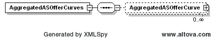
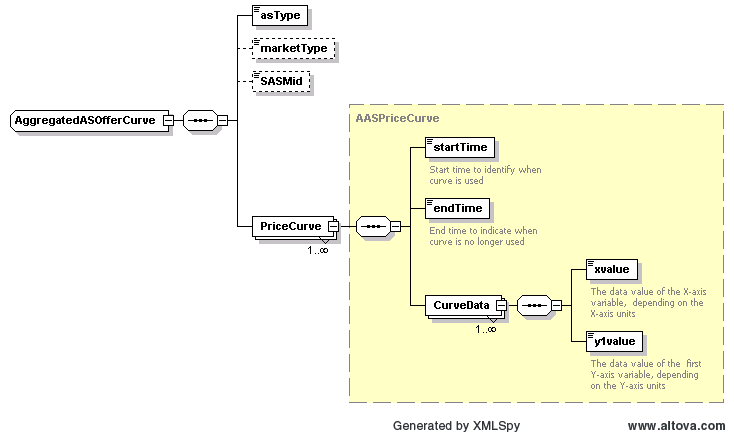

### Aggregated Ancillary Service Offer Curves

This section describes interfaces used to retrieve aggregated
ancillary service offer curves. This interface will return the 
full day data for DAM or requested SASM run for the requested 
operating day.

The request message would use the following message fields:

<table>
<colgroup>
<col style="width: 36%" />
<col style="width: 63%" />
</colgroup>
<thead>
<tr class="header">
<th><mark>Message Element</mark></th>
<th><mark>Value</mark></th>
</tr>
</thead>
<tbody>
<tr class="odd">
<td>Header/Verb</td>
<td>get</td>
</tr>
<tr class="even">
<td>Header/Noun</td>
<td>AggregatedASOfferCurves</td>
</tr>
<tr class="odd">
<td>Header/Source</td>
<td><em>Market participant ID</em></td>
</tr>
<tr class="even">
<td>Header/UserID</td>
<td><em>ID of user</em></td>
</tr>
<tr class="odd">
<td>Request/OperatingDate</td>
<td><em>Day of interest</em></td>
</tr>
<tr class="even">
<td>Request/MarketType</td>
<td><em>DAM or SASM</em></td>
</tr>
<tr class="odd">
<td>Request/Option</td>
<td>
<em>Optional: SASM ID (required for SASM)</em>

<em>Format: YYYYMMDDHHMMSS</em>
</td>
</tr>
</tbody>
</table>

The corresponding response messages would use the following message
fields:

| Message Element | Value                |
|-------------------------------------------|------------------------------------------------|
| Header/Verb                               | reply                                          |
| Header/Noun                               | AggregatedASOfferCurves                        |
| Header/Source                             | ERCOT                                          |
| Reply/ReplyCode                           | *Reply code, success=OK, error=ERROR or FATAL* |
| Reply/Error                               | *Error message, if error encountered*          |
| Payload/                                  | AggregatedASOfferCurves                        |

The payload structure is described by the following diagrams, where
there is one curve for each AS type per hour:

For each point on the AggregatedASOfferCurve, the xvalue identifies
price value and y1value indicates megawatt level.

The following is an XML example:

~~~
<ns1:AggregatedASOfferCurves xmlns:ns0="http://www.ercot.com/schema/2007-05/nodal/eip/il"
    xmlns:ns1="http://www.ercot.com/schema/2007-06/nodal/ews">
    <ns1:AggregatedASOfferCurve>
        <ns1:asType>Reg-Up</ns1:asType>
        <ns1:marketType>DAM</ns1:marketType>
        <ns1:PriceCurve>
            <ns1:startTime>2023-03-08T00:00:00-06:00</ns1:startTime>
            <ns1:endTime>2023-03-08T01:00:00-06:00</ns1:endTime>
            <ns1:CurveData>
                <ns1:xvalue>5.35</ns1:xvalue>
                <ns1:y1value>2125.0</ns1:y1value>
            </ns1:CurveData>
        </ns1:PriceCurve>
        <ns1:PriceCurve>
            <ns1:startTime>2023-03-08T01:00:00-06:00</ns1:startTime>
            <ns1:endTime>2023-03-08T02:00:00-06:00</ns1:endTime>
            <ns1:CurveData>
                <ns1:xvalue>15.0</ns1:xvalue>
                <ns1:y1value>3108.0</ns1:y1value>
            </ns1:CurveData>
        </ns1:PriceCurve> 
        … 
    </ns1:AggregatedASOfferCurve>
    <ns1:AggregatedASOfferCurve>
        <ns1:asType>Reg-Down</ns1:asType>
         ... 
        </ns1:AggregatedASOfferCurve>
    <ns1:AggregatedASOfferCurve>
        <ns1:asType>On-Non-Spin</ns1:asType>
        ... 
    </ns1:AggregatedASOfferCurve>
    <ns1:AggregatedASOfferCurve>
        <ns1:asType>Off-Non-Spin</ns1:asType>
        ... 
    </ns1:AggregatedASOfferCurve>
    <ns1:AggregatedASOfferCurve>
        <ns1:asType>RRSUF</ns1:asType> 
        ... 
    </ns1:AggregatedASOfferCurve>
    <ns1:AggregatedASOfferCurve>
        <ns1:asType>RRSFF</ns1:asType> 
        ... 
    </ns1:AggregatedASOfferCurve>
    <ns1:AggregatedASOfferCurve>
        <ns1:asType>RRSPF</ns1:asType> 
        ... 
    </ns1:AggregatedASOfferCurve>
    <ns1:AggregatedASOfferCurve>
        <ns1:asType>ECRSS</ns1:asType> 
        ... 
    </ns1:AggregatedASOfferCurve>
    <ns1:AggregatedASOfferCurve>
        <ns1:asType>ECRSM</ns1:asType> 
        ... 
    </ns1:AggregatedASOfferCurve>
    <ns1:AggregatedASOfferCurve>
        <ns1:asType>OFFEC</ns1:asType> 
        ... 
    </ns1:AggregatedASOfferCurve>
</ns1:AggregatedASOfferCurves>
~~~
