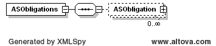
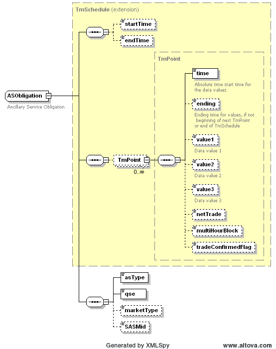

### Ancillary Service Obligation

The purpose of this interface is to provide ancillary service
obligation by service type for the requesting QSE. The request message
would use the following message fields:

<table>
<colgroup>
<col style="width: 36%" />
<col style="width: 63%" />
</colgroup>
<thead>
<tr class="header">
<th><mark>Message Element</mark></th>
<th><mark>Value</mark></th>
</tr>
</thead>
<tbody>
<tr class="odd">
<td>Header/Verb</td>
<td>get</td>
</tr>
<tr class="even">
<td>Header/Noun</td>
<td>ASObligations</td>
</tr>
<tr class="odd">
<td>Header/Source</td>
<td><em>Market participant ID</em></td>
</tr>
<tr class="even">
<td>Header/UserID</td>
<td><em>ID of user</em></td>
</tr>
<tr class="odd">
<td>Request/MarketType</td>
<td><em>DAM/SASM</em></td>
</tr>
<tr class="even">
<td>Request/TradingDate</td>
<td><em>Trading date</em></td>
</tr>
<tr class="odd">
<td>Request/ASType</td>
<td><em>Optional: AS type</em></td>
</tr>
<tr class="even">
<td>Request/Option</td>
<td>
<em>Optional: SASM ID (required for SASM)</em>

<em>Format: YYYYMMDDHHMMSS</em>
</td>
</tr>
</tbody>
</table>

If the AS type is not specified, all AS obligations will be returned.
The corresponding response messages would use the following message
fields:

| Message Element | Value                |
|-------------------------------------------|------------------------------------------------|
| Header/Verb                               | reply                                          |
| Header/Noun                               | ASObligations                                  |
| Header/Source                             | ERCOT                                          |
| Reply/ReplyCode                           | *Reply code, success=OK, error=ERROR or FATAL* |
| Reply/Error                               | *Error message, if error encountered*          |
| Payload/                                  | ASObligations                                  |

 The structure of the ASObligations payload is described by the
 following diagram, using a CIM RegularIntervalSchedule. The values of
 ‘value1’ would represent the MW obligation and the values of ‘value2’
 would represent a positive or negative difference from COP:

The following is an XML example:

~~~
<ns1:ASObligations xmlns:ns0="http://www.ercot.com/schema/2007-05/nodal/eip/il"
    xmlns:ns1="http://www.ercot.com/schema/2007-06/nodal/ews">
    <ns1:ASObligation>
        <ns1:startTime>2023-04-18T00:00:00-05:00</ns1:startTime>
        <ns1:endTime>2023-04-18T01:00:00-05:00</ns1:endTime>
        <ns1:TmPoint>
            <ns1:time>2023-04-18T00:00:00-05:00</ns1:time>
            <ns1:ending>2023-04-18T01:00:00-05:00</ns1:ending>
            <ns1:value1>112.2</ns1:value1>
        </ns1:TmPoint>
        <ns1:asType>ECRS</ns1:asType>
        <ns1:qse>QSAMP</ns1:qse>
        <ns1:marketType>DAM</ns1:marketType>
    </ns1:ASObligation>
    <ns1:ASObligation>
        <ns1:startTime>2023-04-18T00:00:00-05:00</ns1:startTime>
        <ns1:endTime>2023-04-18T01:00:00-05:00</ns1:endTime>
        <ns1:TmPoint>
            <ns1:time>2023-04-18T00:00:00-05:00</ns1:time>
            <ns1:ending>2023-04-18T01:00:00-05:00</ns1:ending>
            <ns1:value1>169.3</ns1:value1>
        </ns1:TmPoint>
        <ns1:asType>Non-Spin</ns1:asType>
        <ns1:qse>QSAMP</ns1:qse>
        <ns1:marketType>DAM</ns1:marketType>
    </ns1:ASObligation>
    <ns1:ASObligation>
        <ns1:startTime>2023-04-18T00:00:00-05:00</ns1:startTime>
        <ns1:endTime>2023-04-18T01:00:00-05:00</ns1:endTime>
        <ns1:TmPoint>
            <ns1:time>2023-04-18T00:00:00-05:00</ns1:time>
            <ns1:ending>2023-04-18T01:00:00-05:00</ns1:ending>
            <ns1:value1>66.1</ns1:value1>
        </ns1:TmPoint>
        <ns1:asType>Reg-Down</ns1:asType>
        <ns1:qse>QSAMP</ns1:qse>
        <ns1:marketType>DAM</ns1:marketType>
    </ns1:ASObligation>
    <ns1:ASObligation>
        <ns1:startTime>2023-04-18T00:00:00-05:00</ns1:startTime>
        <ns1:endTime>2023-04-18T01:00:00-05:00</ns1:endTime>
        <ns1:TmPoint>
            <ns1:time>2023-04-18T00:00:00-05:00</ns1:time>
            <ns1:ending>2023-04-18T01:00:00-05:00</ns1:ending>
            <ns1:value1>40.6</ns1:value1>
        </ns1:TmPoint>
        <ns1:asType>Reg-Up</ns1:asType>
        <ns1:qse>QSAMP</ns1:qse>
        <ns1:marketType>DAM</ns1:marketType>
    </ns1:ASObligation>
    <ns1:ASObligation>
        <ns1:startTime>2023-04-18T00:00:00-05:00</ns1:startTime>
        <ns1:endTime>2023-04-18T01:00:00-05:00</ns1:endTime>
        <ns1:TmPoint>
            <ns1:time>2023-04-18T00:00:00-05:00</ns1:time>
            <ns1:ending>2023-04-18T01:00:00-05:00</ns1:ending>
            <ns1:value1>446.7</ns1:value1>
        </ns1:TmPoint>
        <ns1:asType>RRS</ns1:asType>
        <ns1:qse>QSAMP</ns1:qse>
        <ns1:marketType>DAM</ns1:marketType>
    </ns1:ASObligation>
</ns1:ASObligations>
~~~

