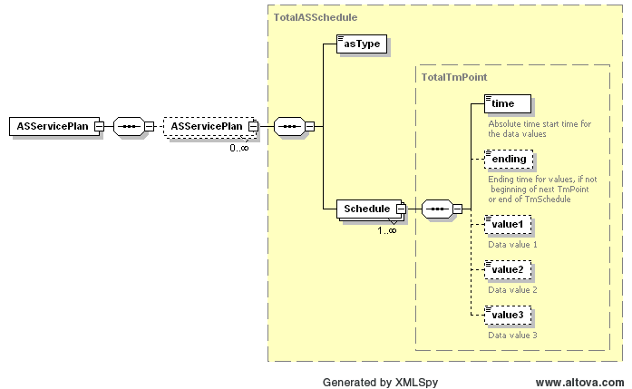

### Ancillary Service Plan

This section describes interfaces used to retrieve the Ancillary
Service Plan for the DAM market. The interface returns hourly values
for the next 7 days (168 hours)

The request message would use the following message fields:

| Message Element | Value |
|-------------------------------------------|---------------------------------|
| Header/Verb                               | get                             |
| Header/Noun                               | ASServicePlan                   |
| Header/Source                             | *Market participant ID*         |
| Header/UserID                             | *ID of user*                    |
| Request/EndTime                           | *End time of interest*          |

The corresponding response messages would use the following message
fields:

| Message Element | Value                |
|-------------------------------------------|------------------------------------------------|
| Header/Verb                               | reply                                          |
| Header/Noun                               | ASServicePlan                                  |
| Header/Source                             | ERCOT                                          |
| Reply/ReplyCode                           | *Reply code, success=OK, error=ERROR or FATAL* |
| Reply/Error                               | *Error message, if error encountered*          |
| Payload/                                  | *ASServicePlan*                                |

The payload structure is described by the following diagram:

The values of ‘value1’ identify the total scheduled MW capacity for the
given AS type.

The following is an XML example:

~~~
<ns1:ASServicePlan xmlns:ns0="http://www.ercot.com/schema/2007-05/nodal/eip/il"
    xmlns:ns1="http://www.ercot.com/schema/2007-06/nodal/ews">
    <ns1:ASServicePlan>
        <ns1:asType>Reg-Up</ns1:asType>
        <ns1:Schedule>
            <ns1:time>2023-04-19T00:00:00-05:00</ns1:time>
            <ns1:ending>2023-04-19T01:00:00-05:00</ns1:ending>
            <ns1:value1>271.0</ns1:value1>
        </ns1:Schedule>
        <ns1:Schedule>
            <ns1:time>2023-04-19T01:00:00-05:00</ns1:time>
            <ns1:ending>2023-04-19T02:00:00-05:00</ns1:ending>
            <ns1:value1>219.0</ns1:value1>
        </ns1:Schedule> … </ns1:ASServicePlan>
    <ns1:ASServicePlan>
        <ns1:asType>Reg-Down</ns1:asType>
        <ns1:Schedule> ... </ns1:Schedule>
    </ns1:ASServicePlan>
    <ns1:ASServicePlan>
        <ns1:asType>RRS</ns1:asType>
        <ns1:Schedule> ... </ns1:Schedule>
    </ns1:ASServicePlan>
    <ns1:ASServicePlan>
        <ns1:asType>Non-Spin</ns1:asType>
        <ns1:Schedule> ... </ns1:Schedule>
    </ns1:ASServicePlan>
    <ns1:ASServicePlan>
        <ns1:asType>ECRS</ns1:asType>
        <ns1:Schedule> ... </ns1:Schedule>
    </ns1:ASServicePlan>
</ns1:ASServicePlan>
~~~
