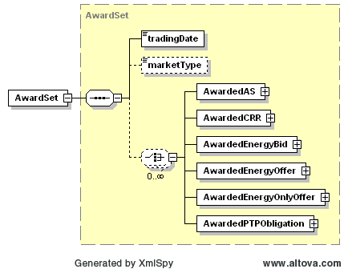

### AwardSet

The Get AwardSet interface provides the means for a market participant
to obtain awards. The following parameters are specified in the
RequestMessage:

<table>
<colgroup>
<col style="width: 34%" />
<col style="width: 65%" />
</colgroup>
<thead>
<tr class="header">
<th><mark>Message Element</mark></th>
<th><mark>Value</mark></th>
</tr>
</thead>
<tbody>
<tr class="odd">
<td>Header/Verb</td>
<td>get</td>
</tr>
<tr class="even">
<td>Header/Noun</td>
<td>AwardSet</td>
</tr>
<tr class="odd">
<td>Header/Source</td>
<td><em>Market participant ID</em></td>
</tr>
<tr class="even">
<td>Header/UserID</td>
<td><em>ID of user</em></td>
</tr>
<tr class="odd">
<td>Request/MarketType</td>
<td><em>DAM/SASM</em></td>
</tr>
<tr class="even">
<td>Request/TradingDate</td>
<td><em>Trading date</em></td>
</tr>
<tr class="odd">
<td>Request/Option</td>
<td>
<em>Optional: SASM ID (required for SASM)</em>

<em>Format: YYYYMMDDHHMMSS</em>
</td>
</tr>
</tbody>
</table>

The corresponding response messages would use the following message
fields:

| Message Element | Value                |
|-------------------------------------------|------------------------------------------------|
| Header/Verb                               | reply                                          |
| Header/Noun                               | AwardSet                                       |
| Header/Source                             | ERCOT                                          |
| Reply/ReplyCode                           | *Reply code, success=OK, error=ERROR or FATAL* |
| Reply/Error                               | *Error message, if error encountered*          |
| Payload/AwardSet                          | *AwardSet*                                     |

An AwardSet is returned in the payload of the ResponseMessage using
the following structure:

Within an AwardSet, there are a variety of different Award types. The
following diagram describes the basic structure for each type of
Award:

The specific structures for each type of Award are described in section
5.3.

The tables found in the sections for *AwardedAS*, *AwardedCRR*, *AwardedEnergyBid*, *AwardedEnergyOffer*, *AwardedEnergyOnlyOffer* and *AwardedPTPObligation* describes each Award
type elements.

The following is an XML example:

~~~
<AwardSet>
    <tradingDate>2008-04-30</tradingDate>
    <marketType>DAM</marketType>
    <AwardedEnergyOffer>
        <qse>LUMN</qse>
        <startTime>2008-04-30T23:00:00-05:00</startTime>
        <endTime>2008-05-01T00:00:00-05:00</endTime>
        <tradingDate>2008-04-30</tradingDate>
        <marketType>DAM</marketType>
        <resource> Resource1</resource>
        <awardedMWh>0</awardedMWh>
    </AwardedEnergyOffer>
    <AwardedAS>
        <qse>LUMN</qse>
        <startTime>2008-04-30T00:00:00-05:00</startTime>
        <endTime>2008-04-30T01:00:00-05:00</endTime>
        <tradingDate>2008-04-30</tradingDate>
        <marketType>DAM</marketType>
        <resource>Resource2</resource>
        <asType>On-Non-Spin</asType>
        <awardedMW>
            <startTime>2008-04-30T00:00:00-05:00</startTime>
            <endTime>2008-04-30T01:00:00-05:00</endTime>
            <OnLineReserves>
                <xvalue>0</xvalue>
                <block>1</block>
            </OnLineReserves>
            <OnLineReserves>
                <xvalue>0</xvalue>
                <block>2</block>
            </OnLineReserves>
            <OnLineReserves>
                <xvalue>0</xvalue>
                <block>3</block>
            </OnLineReserves>
            <OnLineReserves>
                <xvalue>0</xvalue>
                <block>4</block>
            </OnLineReserves>
            <OnLineReserves>
                <xvalue>0</xvalue>
                <block>5</block>
            </OnLineReserves>
        </awardedMW>
        <mcpc>2000</mcpc>
        <SASMid>20091108122027</SASMid>
    </AwardedAS>
    <AwardedPTPObligation>
        <qse>LUMN</qse>
        <startTime>2008-04-30T00:00:00-05:00</startTime>
        <endTime>2008-04-30T01:00:00-05:00</endTime>
        <tradingDate>2008-04-30</tradingDate>
        <marketType>DAM</marketType>
        <awardedMW>0</awardedMW>
        <source>Source1</source>
        <sink>SINK1</sink>
        <price>0</price>
        <bidId>01</bidId>
    </AwardedPTPObligation>
    <AwardedCRR>
        <qse>LUMN</qse>
        <startTime>2008-04-30T00:00:00-05:00</startTime>
        <endTime>2008-04-30T01:00:00-05:00</endTime>
        <tradingDate>2008-04-30</tradingDate>
        <marketType>DAM</marketType>
        <awardedMW>3</awardedMW>
        <price>0</price>
        <source>Source1</source>
        <sink>Sink1</sink>
        <crrId>12345</crrId>
        <offerId>1234</offerId>
    </AwardedCRR>
    <AwardedEnergyBid>
        <qse>LUMN</qse>
        <startTime>2008-04-30T00:00:00-05:00</startTime>
        <endTime>2008-04-30T01:00:00-05:00</endTime>
        <tradingDate>2008-04-30</tradingDate>
        <marketType>DAM</marketType>
        <awardedMWh>3</awardedMWh>
        <spp>34</spp>
        <bidId>1234</bidId>
        <sp>1234</sp>
    </AwardedEnergyBid>
    <AwardedEnergyOnlyOffer>
        <qse>LUMN</qse>
        <startTime>2008-04-30T00:00:00-05:00</startTime>
        <endTime>2008-04-30T01:00:00-05:00</endTime>
        <tradingDate>2008-04-30</tradingDate>
        <marketType>DAM</marketType>
        <awardedMWh>3</awardedMWh>
        <spp>34</spp>
        <bidId>456</bidId>
        <sp>123</sp>
    </AwardedEnergyOnlyOffer>
</AwardSet>
~~~
