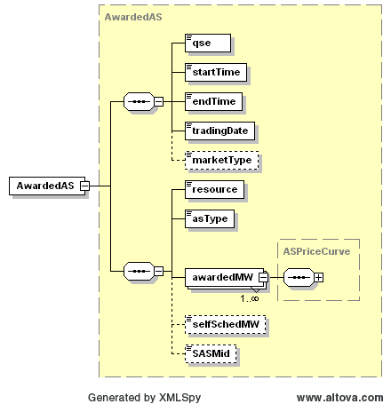
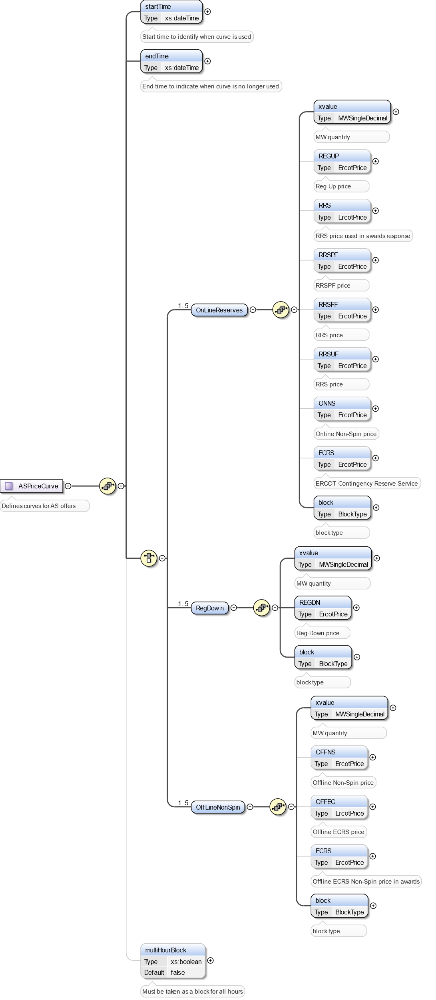

### AwardedAS

The Get AwardedAS interface provides the means for a market
participant to obtain awarded AS. The following parameters are
specified in the RequestMessage:

<table>
<colgroup>
<col style="width: 34%" />
<col style="width: 65%" />
</colgroup>
<thead>
<tr class="header">
<th><mark>Message Element</mark></th>
<th><mark>Value</mark></th>
</tr>
</thead>
<tbody>
<tr class="odd">
<td>Header/Verb</td>
<td>get</td>
</tr>
<tr class="even">
<td>Header/Noun</td>
<td>AwardedAS</td>
</tr>
<tr class="odd">
<td>Header/Source</td>
<td><em>Market participant ID</em></td>
</tr>
<tr class="even">
<td>Header/UserID</td>
<td><em>ID of user</em></td>
</tr>
<tr class="odd">
<td>Request/MarketType</td>
<td><em>DAM/SASM</em></td>
</tr>
<tr class="even">
<td>Request/TradingDate</td>
<td><em>Trading date</em></td>
</tr>
<tr class="odd">
<td>Request/Option</td>
<td>
<em>Optional: SASM ID (required for SASM)</em>

<em>Format: YYYYMMDDHHMMSS</em>
</td>
</tr>
</tbody>
</table>

The corresponding response messages would use the following message
fields:

| Message Element | Value                |
|-------------------------------------------|------------------------------------------------|
| Header/Verb                               | reply                                          |
| Header/Noun                               | AwardedAS                                      |
| Header/Source                             | ERCOT                                          |
| Reply/ReplyCode                           | *Reply code, success=OK, error=ERROR or FATAL* |
| Reply/Error                               | *Error message, if error encountered*          |
| Payload/AwardSet                          | *AwardedAS*                                    |

On retrieval AwardedAS is returned in the payload of the
ResponseMessage using the following structure:

The following table describes the AwardedAS elements.

<table>
<colgroup>
<col style="width: 38%" />
<col style="width: 16%" />
<col style="width: 17%" />
<col style="width: 27%" />
</colgroup>
<thead>
<tr class="header">
<th><em>Element</em></th>
<th><em>Datatype</em></th>
<th><em>Description</em></th>
<th><em>Values</em></th>
</tr>
</thead>
<tbody>
<tr class="odd">
<td>qse</td>
<td>string</td>
<td>Participant ID</td>
<td></td>
</tr>
<tr class="even">
<td>startTime</td>
<td>DateTime</td>
<td>Start time for the award</td>
<td>Valid award dateTime</td>
</tr>
<tr class="odd">
<td>endTime</td>
<td>DateTime</td>
<td>End time for the award</td>
<td>Valid award dateTime</td>
</tr>
<tr class="even">
<td>tradingDate</td>
<td>Date</td>
<td>Award date</td>
<td>DAM/SASM execution date</td>
</tr>
<tr class="odd">
<td>marketType</td>
<td>string</td>
<td>Market type</td>
<td>DAM/SASM</td>
</tr>
<tr class="even">
<td>resource</td>
<td>string</td>
<td>Name of resource</td>
<td></td>
</tr>
<tr class="odd">
<td>asType</td>
<td>string</td>
<td>Ancillary services type</td>
<td>
Off-Non-Spin

On-Non-Spin

Reg-Down

Reg-Up

RRSUF

RRSPF

RRSFF

ECRSS

ECRSM

OFFEC
</td>
</tr>
<tr class="even">
<td>awardedMW/startTime</td>
<td>DateTime</td>
<td>Start time for the award</td>
<td>Valid award dateTime</td>
</tr>
<tr class="odd">
<td>awardedMW/endTime</td>
<td>dateTime</td>
<td>End time for the award</td>
<td>Valid award dateTime</td>
</tr>
<tr class="even">
<td>awardedMW/OnlineReserve/xvalue</td>
<td>float</td>
<td>Awarded quantity</td>
<td>Awarded MW</td>
</tr>
<tr class="odd">
<td>awardedMW/OnlineReserve/REGUP</td>
<td>float</td>
<td>Price</td>
<td>Note: Also provided by get MCPC for price</td>
</tr>
<tr class="even">
<td>awardedMW/OnlineReserve/RRS</td>
<td>float</td>
<td>Price</td>
<td>Note: Also provided by get MCPC for price</td>
</tr>
<tr class="odd">
<td>awardedMW/OnlineReserve/ONNS</td>
<td>float</td>
<td>Price</td>
<td>Note: Also provided by get MCPC for price</td>
</tr>
<tr class="even">
<td>awardedMW/OnlineReserve/ECRS</td>
<td>float</td>
<td>Price</td>
<td>Note: Also provided by get MCPC for price</td>
</tr>
<tr class="odd">
<td>awardedMW/OnlineReserve/block</td>
<td>string</td>
<td>Block number</td>
<td>1 through 5</td>
</tr>
<tr class="even">
<td>awardedMW/RegDown/xvalue</td>
<td>float</td>
<td>Awarded quantity</td>
<td>Awarded MW</td>
</tr>
<tr class="odd">
<td>awardedMW/RegDown/REGDN</td>
<td>float</td>
<td>Price</td>
<td>Note: Also provided by get MCPC for price</td>
</tr>
<tr class="even">
<td>awardedMW/RegDown/block</td>
<td>string</td>
<td>Block number</td>
<td>1 through 5</td>
</tr>
<tr class="odd">
<td>awardedMW/OffLineNonSpin/xvalue</td>
<td>float</td>
<td>Awarded quantity</td>
<td>Awarded MW</td>
</tr>
<tr class="even">
<td>awardedMW/OffLineNonSpin/ OFFNS</td>
<td>float</td>
<td>Price</td>
<td>Note: Also provided by get MCPC for price</td>
</tr>
<tr class="odd">
<td>awardedMW/OffLineNonSpin/ECRS</td>
<td>float</td>
<td>Price</td>
<td>Note: Also provided by get MCPC for price</td>
</tr>
<tr class="even">
<td>awardedMW/OffLineNonSpin/block</td>
<td>string</td>
<td>Block number</td>
<td>1 through 5</td>
</tr>
<tr class="odd">
<td>awardedMW/multiHourBlock</td>
<td>Boolean</td>
<td>Indicates if offer must be taken as a block for all hours.</td>
<td>Place Holder Not Used</td>
</tr>
<tr class="even">
<td>selfSchedMW</td>
<td>Integer</td>
<td></td>
<td>Place Holder Not Used</td>
</tr>
<tr class="odd">
<td>SASMid</td>
<td>String</td>
<td>SASM Identifier</td>
<td>
provided by MMS

Format: YYYYMMDDHHMMSS
</td>
</tr>
</tbody>
</table>

The following is an XML example:

~~~
<ns0:AwardedAS>  
    <ns0:qse>QSAMP</ns0:qse>  
    <ns0:startTime>2023-03-08T00:00:00-06:00</ns0:startTime>  
    <ns0:endTime>2023-03-08T01:00:00-06:00</ns0:endTime>  
    <ns0:tradingDate>2023-03-08</ns0:tradingDate>  
    <ns0:resource>RES1 </ns0:resource>  
    <ns0:asType>ECRSM</ns0:asType>  
    <ns0:awardedMW>  
        <ns0:startTime>2023-03-08T00:00:00-06:00</ns0:startTime>  
        <ns0:endTime>2023-03-08T01:00:00-06:00</ns0:endTime>  
        <ns0:OnLineReserves>  
            <ns0:xvalue>0</ns0:xvalue>  
            <ns0:ECRS>0.01</ns0:ECRS>  
            <ns0:block>1</ns0:block>  
        </ns0:OnLineReserves>
         ...
</ns0:AwardedAS>  
<ns0:AwardedAS>  
    <ns0:qse> QSAMP </ns0:qse>  
    <ns0:startTime>2023-03-08T00:00:00-06:00</ns0:startTime>  
    <ns0:endTime>2023-03-08T01:00:00-06:00</ns0:endTime>  
    <ns0:tradingDate>2023-03-08</ns0:tradingDate>  
    <ns0:resource>RES1 </ns0:resource>  
    <ns0:asType>ECRSS</ns0:asType>  
    <ns0:awardedMW>  
        <ns0:startTime>2023-03-08T00:00:00-06:00</ns0:startTime>  
        <ns0:endTime>2023-03-08T01:00:00-06:00</ns0:endTime>  
        <ns0:OnLineReserves>  
            <ns0:xvalue>3.7</ns0:xvalue>  
            <ns0:ECRS>0.01</ns0:ECRS>  
            <ns0:block>1</ns0:block>  
        </ns0:OnLineReserves>
         ...
<ns0:AwardedAS>  
    <ns0:qse>QLUMN</ns0:qse>  
    <ns0:startTime>2023-03-08T00:00:00-06:00</ns0:startTime>  
    <ns0:endTime>2023-03-08T01:00:00-06:00</ns0:endTime>  
    <ns0:tradingDate>2023-03-08</ns0:tradingDate>  
    <ns0:resource>DCSES_CT10</ns0:resource>  
    <ns0:asType>OFFEC</ns0:asType>  
    <ns0:awardedMW>  
        <ns0:startTime>2023-03-08T00:00:00-06:00</ns0:startTime>  
        <ns0:endTime>2023-03-08T01:00:00-06:00</ns0:endTime>  
        <ns0:OffLineNonSpin>  
            <ns0:xvalue>0</ns0:xvalue>  
            <ns0:ECRS>0.01</ns0:ECRS>  
            <ns0:block>1</ns0:block>  
        </ns0:OffLineNonSpin>                
        ...
</ns0:AwardedAS>
~~~

