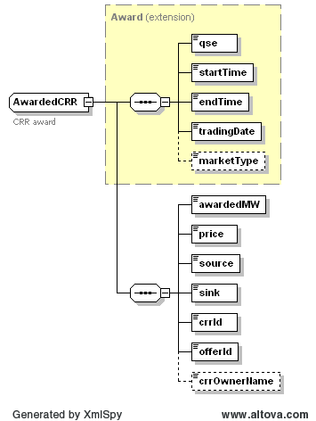

### AwardedCRR

The Get AwardedCRR interface provides the means for a market
participant to obtain awarded CRRs from the DAM market, not the CRR
auction. The following parameters are specified in the RequestMessage:

| Message Element | Value |
|-------------------------------------------|---------------------------------|
| Header/Verb                               | get                             |
| Header/Noun                               | AwardedCRR                      |
| Header/Source                             | *Market participant ID*         |
| Header/UserID                             | *ID of user*                    |
| Request/TradingDate                       | *Trading date*                  |

The corresponding response messages would use the following message
fields:

| Message Element | Value                |
|-------------------------------------------|------------------------------------------------|
| Header/Verb                               | reply                                          |
| Header/Noun                               | AwardedCRR                                     |
| Header/Source                             | ERCOT                                          |
| Reply/ReplyCode                           | *Reply code, success=OK, error=ERROR or FATAL* |
| Reply/Error                               | *Error message, if error encountered*          |
| Payload/AwardSet                          | *AwardedCRR*                                   |

An AwardedCRR is returned in the payload of the ResponseMessage using
the following structure:

The following table describes the AwardedCRR elements.

| *Element*    | *Datatype* | *Description*            | *Values*                    |
|--------------|------------|--------------------------|-----------------------------|
| qse          | string     | Participant ID           |                             |
| startTime    | DateTime   | Start time for the award | Valid award dateTime        |
| endTime      | DateTime   | End time for the award   | Valid award dateTime        |
| tradingDate  | Date       | Award date               | Valid award date            |
| marketType   | string     | Market type              | DAM                         |
| awardedMW    | Float      | Awarded quantity         | Awarded MW                  |
| price        | Float      | Awarded Price            |                             |
| source       | string     | Source settlement point  | Valid settlement point name |
| sink         | string     | Sink settlement point    | Valid settlement point name |
| crrId        | string     | CRR ID                   | ID of CRR                   |
| offerId      | string     | Offer ID                 | QSE supplied                |
| crrOwnerName | string     | CRR Owner                |                             |

The following is an XML example:

~~~
<AwardSet>
    <tradingDate>2008-04-30</tradingDate>
    <marketType>DAM</marketType>
    <AwardedCRR>
        <qse>LUMN</qse>
        <startTime>2008-04-30T00:00:00-05:00</startTime>
        <endTime>2008-04-30T01:00:00-05:00</endTime>
        <tradingDate>2008-04-30</tradingDate>
        <marketType>DAM</marketType>
        <awardedMW>3</awardedMW>
        <price>0</price>
        <source>BBSES_UNIT1</source>
        <sink>BBSES_UNIT2</sink>
        <crrId>12345</crrId>
        <offerId>1234</offerId>
    </AwardedCRR>
</AwardSet>
~~~
