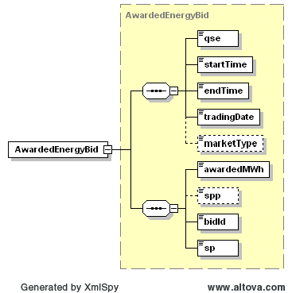

### AwardedEnergyBid

The Get AwardedEnergyBid interface provides the means for a market
participant to obtain EnergyBid awards. The following parameters are
specified in the RequestMessage:

| Message Element | Value |
|-------------------------------------------|---------------------------------|
| Header/Verb                               | get                             |
| Header/Noun                               | AwardedEnergyBid                |
| Header/Source                             | *Market participant ID*         |
| Header/UserID                             | *ID of user*                    |
| Request/TradingDate                       | *Trading date*                  |

The corresponding response messages would use the following message
fields:

| Message Element | Value                |
|-------------------------------------------|------------------------------------------------|
| Header/Verb                               | reply                                          |
| Header/Noun                               | AwardedEnergyBid                               |
| Header/Source                             | ERCOT                                          |
| Reply/ReplyCode                           | *Reply code, success=OK, error=ERROR or FATAL* |
| Reply/Error                               | *Error message, if error encountered*          |
| Payload/AwardSet                          | *AwardedEnergyBid*                             |

An AwardedEnergyBid is returned in the payload of the ResponseMessage
using the following structure:

The following table describes the AwardedEnergyBid elements.

| *Element*   | *Datatype* | *Description*            | *Values*                    |
|-------------|------------|--------------------------|-----------------------------|
| qse         | string     | Participant ID           |                             |
| startTime   | DateTime   | Start time for the award | Valid award dateTime        |
| endTime     | DateTime   | End time for the award   | Valid award dateTime        |
| tradingDate | Date       | Award date               | Valid award date            |
| marketType  | string     | Market type              | DAM                         |
| awardedMW   | Float      | Awarded quantity         | Awarded MWh                 |
| spp         | Float      | SPP value                | Place Holder                |
| bidId[1]   | string     | Bid ID                   | MP supplied bid ID          |
| sp          | string     | Settlement point         | Valid settlement point name |

The following is an XML example:

~~~
<AwardSet>
    <tradingDate>2008-04-30</tradingDate>
    <marketType>DAM</marketType>
    <AwardedEnergyBid>
        <qse>LUMN</qse>
        <startTime>2008-04-30T00:00:00-05:00</startTime>
        <endTime>2008-04-30T01:00:00-05:00</endTime>
        <tradingDate>2008-04-30</tradingDate>
        <marketType>DAM</marketType>
        <awardedMWh>3</awardedMWh>
        <spp>34</spp>
        <bidId>1234</bidId>
        <sp>1234</sp>
    </AwardedEnergyBid>
</AwardSet>
~~~

[1] Note that the bidID element isn’t defined with consistent letter
    case across all submission and award types. To verify the letter
    case, please refer to the corresponding XSD.
