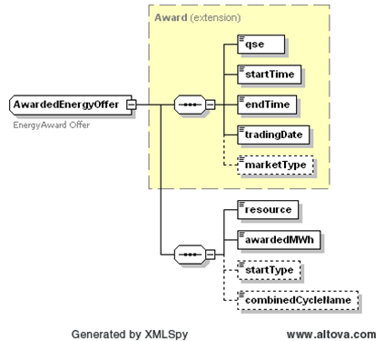

### AwardedEnergyOffer

The Get AwardedEnergyOffer interface provides the means for a market
participant to obtain EnergyOffer awards. The following parameters are
specified in the RequestMessage:

| Message Element | Value |
|-------------------------------------------|---------------------------------|
| Header/Verb                               | get                             |
| Header/Noun                               | AwardedEnergyOffer              |
| Header/Source                             | *Market participant ID*         |
| Header/UserID                             | *ID of user*                    |
| Request/TradingDate                       | *Trading date*                  |

The corresponding response messages would use the following message
fields:

| Message Element | Value                |
|-------------------------------------------|------------------------------------------------|
| Header/Verb                               | reply                                          |
| Header/Noun                               | AwardedEnergyOffer                             |
| Header/Source                             | ERCOT                                          |
| Reply/ReplyCode                           | *Reply code, success=OK, error=ERROR or FATAL* |
| Reply/Error                               | *Error message, if error encountered*          |
| Payload/AwardSet                          | *AwardedEnergyOffer*                           |

An AwardedEnergyOffer is returned in the payload of the
ResponseMessage using the following structure:

The following table describes the AwardedEnergyOffer elements.

| *Element*         | *Datatype* | *Description*            | *Values*             |
|-------------------|------------|--------------------------|----------------------|
| Qse               | string     | Participant ID           |                      |
| startTime         | DateTime   | Start time for the award | Valid award dateTime |
| endTime           | DateTime   | End time for the award   | Valid award dateTime |
| tradingDate       | Date       | Award date               | Valid award date     |
| marketType        | string     | Market type              | DAM                  |
| Resource          | string     | Resource                 | Valid resource name  |
| awardedMWh        | Float      | Awarded quantity         | Awarded MWh          |
| startType         | string     |                          | HOT or INTER or COLD |
| combinedCycleName | string     |                          |                      |

The following is an XML example:

~~~
<AwardSet>
    <tradingDate>2008-04-30</tradingDate>
    <marketType>DAM</marketType>
    <AwardedEnergyOffer>
        <qse>TestQSE</qse>
        <startTime>2008-04-30T23:00:00-05:00</startTime>
        <endTime>2008-05-01T00:00:00-05:00</endTime>
        <tradingDate>2008-04-30</tradingDate>
        <marketType>DAM</marketType>
        <resource>Resource1</resource>
        <awardedMWh>126.6</awardedMWh>
        <startType>HOT</startType>
        <combinedCycleName>CC1</combinedCycleName>
    </AwardedEnergyOffer>
</AwardSet>
~~~

