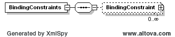
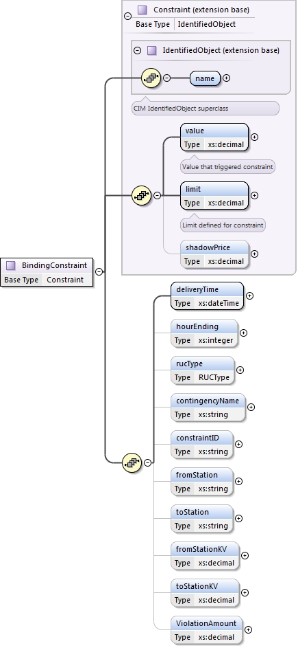

### Binding Constraints

This section describes interfaces used to retrieve binding
constraints. There are several options for retrieval of binding
constraints:

- Binding constraints related to DRUC

  - Requested Operating Day

- Binding constraints related to HRUC

  - Requested End Hour

- DAM shadow prices for binding constraints

The request message would use the following message fields:

<table>
<colgroup>
<col style="width: 39%" />
<col style="width: 60%" />
</colgroup>
<thead>
<tr class="header">
<th><mark>Message Element</mark></th>
<th><mark>Value</mark></th>
</tr>
</thead>
<tbody>
<tr class="odd">
<td>Header/Verb</td>
<td>get</td>
</tr>
<tr class="even">
<td>Header/Noun</td>
<td>BindingConstraints</td>
</tr>
<tr class="odd">
<td>Header/Source</td>
<td><em>Market participant ID</em></td>
</tr>
<tr class="even">
<td>Header/UserID</td>
<td><em>ID of user</em></td>
</tr>
<tr class="odd">
<td>Request/OperatingDate</td>
<td>
<em>Day of the Report</em>

<em>For DRUC &amp; DAM MarketType</em>
</td>
</tr>
<tr class="even">
<td>Request/MarketType</td>
<td><em>DAM/DRUC/HRUC</em></td>
</tr>
<tr class="odd">
<td>Request/EndTime</td>
<td>
<em>End time of interest</em>

<em>For HRUC MarketType</em>
</td>
</tr>
</tbody>
</table>

The corresponding response messages would use the following message
fields:

| Message Element | Value                |
|-------------------------------------------|------------------------------------------------|
| Header/Verb                               | reply                                          |
| Header/Noun                               | BindingConstraints                             |
| Header/Source                             | ERCOT                                          |
| Reply/ReplyCode                           | *Reply code, success=OK, error=ERROR or FATAL* |
| Reply/Error                               | *Error message, if error encountered*          |
| Payload/                                  | *BindingConstraints*                           |

The following diagram describes the structures that are used for the
retrieval of binding constraints and shadow prices:

The following elements are used to report binding constraints:

- Name of the constraint

- Value that exceeded limit

- Limit defined for constraint

- Maximum shadow price

- Delivery time

- RUC type (DRUC, HRUC, and DAM)

- Contingency Name

- Contraint ID

- Station name which contingency is from

- Station name which contingency is to

- Station voltage which contingency is from

- Station voltage which contingency is to

- Violation amount

The following is an XML example:

~~~
<ns1:BindingConstraints xmlns:ns0="http://www.ercot.com/schema/2007-05/nodal/eip/il"
    xmlns:ns1="http://www.ercot.com/schema/2007-06/nodal/ews">
    <ns1:BindingConstraint>
        <ns1:name>PNHNDL</ns1:name>
        <ns1:value>3063.0</ns1:value>
        <ns1:limit>3063.0</ns1:limit>
        <ns1:shadowPrice>0.655</ns1:shadowPrice>
        <ns1:deliveryTime>2017-09-21T01:00:00-05:00</ns1:deliveryTime>
        <ns1:hourEnding>1</ns1:hourEnding>
        <ns1:rucType>DAM</ns1:rucType>
        <ns1:contingencyName>BASE CASE</ns1:contingencyName>
        <ns1:constraintID>1</ns1:constraintID>
        <ns1:fromStationKV>0.0</ns1:fromStationKV>
        <ns1:toStationKV>0.0</ns1:toStationKV>
        <ns1:ViolationAmount>0.0</ns1:ViolationAmount>
    </ns1:BindingConstraint>
</ns1:BindingConstraints>
~~~
