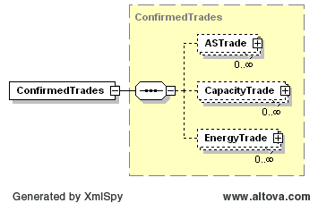

### ConfirmedTrades 

This section describes interfaces used to retrieve the list if trades
that the submitting QSE have been identified as the counter party in a
trade and have received a matching energy, capacity, or ancillary
services trade.

| Message Element | Value |
|-------------------------------------------|---------------------------------|
| Header/Verb                               | get                             |
| Header/Noun                               | ConfirmedTrades                 |
| Header/Source                             | *Market participant ID*         |
| Header/UserID                             | *ID of user*                    |
| Request/TradingDate                       | *Trading date*                  |

The corresponding response messages would use the following message
fields:

| Message Element | Value                |
|-------------------------------------------|------------------------------------------------|
| Header/Verb                               | reply                                          |
| Header/Noun                               | ConfirmedTrades                                |
| Header/Source                             | ERCOT                                          |
| Reply/ReplyCode                           | *Reply code, success=OK, error=ERROR or FATAL* |
| Reply/Error                               | *Error message, if error encountered*          |
| Payload                                   | ConfirmedTrades                                |

The payload structure is described by the following diagram:

The following is an XML of a confirmed trade’s payload:

~~~
<ConfirmedTrades>
    <ASTrade>
        <mRID>ACME.20080101.AST.*ASType*.*BuyerQSE*.*SellerQSE*</mRID>
    </ASTrade>
    <CapacityTrade>
        <mRID>XYZ.20080101.CT.*BuyerQSE*.*SellerQSE*</mRID>
    </CapacityTrade>
    <EnergyTrade>
        <mRID>ACME.20080101.ET.*SettlementPoint*.*BuyerQSE*.*SellerQSE*</mRID>
    </EnergyTrade>
</ConfirmedTrades>
~~~

The mRID used in the message is the mRID for the trade that was
submitted by the counterparty.
