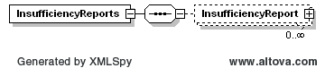
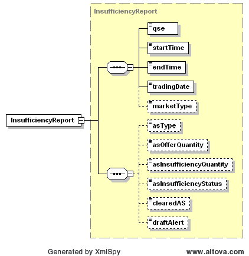

### DAM Ancillary Service Offer Insufficiency Report

This section describes interfaces used to retrieve the DAM AS Offer
Insufficiency Report. DAM AS Offer Insufficiency Report reflects
available and insufficient AS Offer quantities. The request message
would use the following message fields:

| Message Element | Value |
|-------------------------------------------|---------------------------------|
| Header/Verb                               | get                             |
| Header/Noun                               | InsufficiencyReport             |
| Header/Source                             | *Market participant ID*         |
| Header/UserID                             | *ID of user*                    |
| Request/TradingDate                       | *Trading date*                  |

The corresponding response messages would use the following message
fields:

| Message Element | Value                |
|-------------------------------------------|------------------------------------------------|
| Header/Verb                               | reply                                          |
| Header/Noun                               | InsufficiencyReport                            |
| Header/Source                             | ERCOT                                          |
| Reply/ReplyCode                           | *Reply code, success=OK, error=ERROR or FATAL* |
| Reply/Error                               | *Error message, if error encountered*          |
| Payload                                   | InsufficiencyReports                           |

The payload structure is described by the following diagram:

The following is an XML example for DAM AS Offer Insufficiency Report:

~~~
<InsufficiencyReports
    xsi:schemaLocation="http://www.ercot.com/schema/2007-06/nodal/ews    ErcotAwards.xsd"
    xmlns="http://www.ercot.com/schema/2007-06/nodal/ews"
    xmlns:xsi="http://www.w3.org/2001/XMLSchema-instance">
    <InsufficiencyReport>
        <qse>ERCOT</qse>
        <startTime>2008-01-01T10:00:00-06:00</startTime>
        <endTime>2008-01-01T12:00:00-06:00</endTime>
        <tradingDate>2008-01-01</tradingDate>
        <marketType>DAM</marketType>
        <asType>Reg-Up</asType>
        <asOfferQuantity>3.1</asOfferQuantity>
        <asInsufficiencyQuantity>3.1</asInsufficiencyQuantity>
        <asInsufficiencyStatus>3.1</asInsufficiencyStatus>
        <clearedAS>String</clearedAS>
        <draftAlert>String</draftAlert>
    </InsufficiencyReport>
</InsufficiencyReports>
~~~

