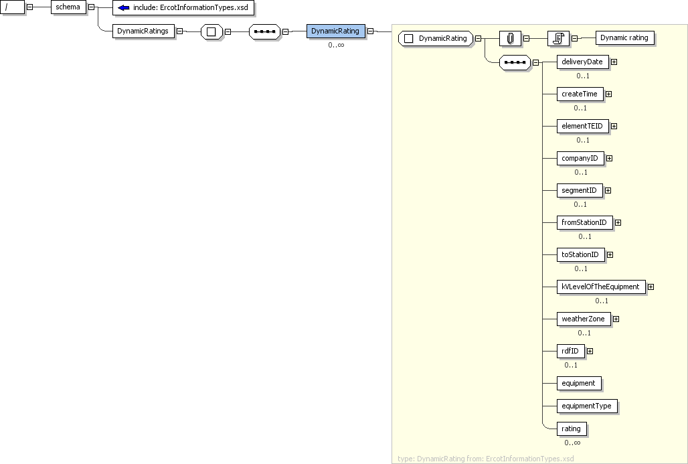

### Dynamic Ratings

This section describes interfaces used to retrieve thermal ratings for
conducting equipment. This interface provides current(realtime)
Dynamic Ratings information for all equipments. The request message
would use the following message fields:

| Message Element   | Value                    |
|-------------------|--------------------------|
| Header/Verb       | get                      |
| Header/Noun       | DynamicRatings           |
| Header/Source     | *Market participant ID*  |
| Header/UserID     | *ID of user*             |
| Request/StartTime | *Start time of interest* |
| Request/EndTime   | *End time of interest*   |

The corresponding response messages would use the following message
fields:

| Message Element | Value                                          |
|-----------------|------------------------------------------------|
| Header/Verb     | reply                                          |
| Header/Noun     | DynamicRatings                                 |
| Header/Source   | ERCOT                                          |
| Reply/ReplyCode | *Reply code, success=OK, error=ERROR or FATAL* |
| Reply/Error     | *Error message, if error encountered*          |
| Payload/        | DynamicRatings                                 |

The payload structure is described by the following diagram:

The ‘equipment’ tag identifies the name of the transmission element.
The types of ratings that are currently defined include:

- Normal (in MVA)

  - The rating at which a Transmission Element can operate without
    reducing its normal life expectancy. 

- Emergency (in MVA)

  - Two-hour MVA rating of a Transmission Element.

- 15-min (in MVA)

  - The 15-Minute MVA rating of a Transmission Element.

Note: createTime is dynamic ratings report created time.

The following is an XML example of payload:

~~~
<DynamicRatings>
    <DynamicRating>
        <deliveryDate>2006-05-04</deliveryDate>
        <createTime>2006-05-04T18:13:51-06:00</createTime>
        <elementTEID>7105</elementTEID>
        <companyID>TESTQSE</companyID>
        <segmentID>O</segmentID>
        <fromStationID>XYZ</fromStationID>
        <toStationID>TUV</toStationID>
        <kVLevelOfTheEquipment>69</kVLevelOfTheEquipment>
        <weatherZone>NORTH</weatherZone>
        <rdfID>_{00A00A0A-0AA0-0AA0-A0A0-00A0AA00000A}</rdfID>
        <equipment>1990_TST</equipment>
        <equipmentType>LN</equipmentType>
        <rating>
            <ratingType>Normal</ratingType>
            <ratingValue>48</ratingValue>
        </rating>
        <rating>
            <ratingType>Emergency</ratingType>
            <ratingValue>48</ratingValue>
        </rating>
        <rating>
            <ratingType>15-min</ratingType>
            <ratingValue>55</ratingValue>
        </rating>
    </DynamicRating>
</DynamicRatings>
~~~
