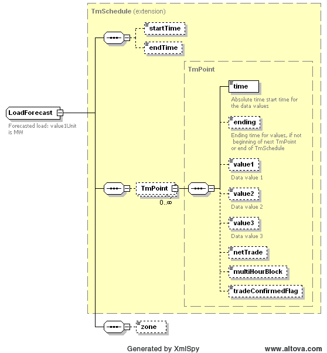

### Forecasted Load 

The purpose of this interface is to provide the means to obtain last
available forecasted load values for next 7 days (168 hours) from
ERCOT. The forecasted loads will be medium-term (MT). The input
parameters to this request include:

Possible values for “Zone” are:

1. "WEATHER" - Load forecast for each weather zone 
	* Coast 
	* East 
	* FarWest 
	* North 
	* NorthCentral 
	* SouthCentral 
	* Southern 
	* West 
2. "LOAD" - Load forecast for each load zone 
	* North 
	* South 
	* West 
	* Houston 
3. "SYSTEM" – Total load forecast for all zones combined (one value) 

The request message would use the following message fields:

| Message Element | Value              |
|-------------------------------------------|----------------------------------------------|
| Header/Verb                               | get                                          |
| Header/Noun                               | LoadForecasts                                |
| Header/Source                             | *Market participant ID*                      |
| Header/UserID                             | *ID of user*                                 |
| Request/Zone                              | *Zone Type: "WEATHER" or "LOAD" or "SYSTEM"* |

The corresponding response messages would use the following message
fields:

| Message Element | Value                |
|-------------------------------------------|------------------------------------------------|
| Header/Verb                               | reply                                          |
| Header/Noun                               | LoadForecasts                                  |
| Header/Source                             | ERCOT                                          |
| Reply/ReplyCode                           | *Reply code, success=OK, error=ERROR or FATAL* |
| Reply/Error                               | *Error message, if error encountered*          |
| Payload                                   | LoadForecasts                                  |

The following diagram describes the structure of a load forecast,
which is based upon a TmSchedule. For medium term load forecasts, the
values of ‘value1’ indicate the hourly forecasted megawatts:

The following is an XML example for load forecast for *<u>WEATHER</u>*
zone

~~~
<ns0:LoadForecasts xmlns:ns0="http://www.ercot.com/schema/2007-06/nodal/ews">
    <ns0:LoadForecast>
        <ns0:TmPoint>
            <ns0:time>2009-06-10T00:00:00-05:00</ns0:time>
            <ns0:ending>2009-06-10T01:00:00-05:00</ns0:ending>
            <ns0:value1>31259.3</ns0:value1>
        </ns0:TmPoint>
        <ns0:TmPoint>
            <ns0:time>2009-06-10T01:00:00-05:00</ns0:time>
            <ns0:ending>2009-06-10T02:00:00-05:00</ns0:ending>
            <ns0:value1>33056.3</ns0:value1>
        </ns0:TmPoint>
        <ns0:TmPoint>
            <ns0:time>2009-06-10T02:00:00-05:00</ns0:time>
            <ns0:ending>2009-06-10T03:00:00-05:00</ns0:ending>
            <ns0:value1>31692.5</ns0:value1>
        </ns0:TmPoint>
        <ns0:TmPoint>
            <ns0:time>2009-06-10T03:00:00-05:00</ns0:time>
            <ns0:ending>2009-06-10T04:00:00-05:00</ns0:ending>
            <ns0:value1>30107.5</ns0:value1>
        </ns0:TmPoint>
        <ns0:TmPoint>
            <ns0:time>2009-06-10T04:00:00-05:00</ns0:time>
            <ns0:ending>2009-06-10T05:00:00-05:00</ns0:ending>
            <ns0:value1>30132.2</ns0:value1>
        </ns0:TmPoint>
            ...
        <ns0:TmPoint>
            <ns0:time>2009-06-16T22:00:00-05:00</ns0:time>
            <ns0:ending>2009-06-16T23:00:00-05:00</ns0:ending>
            <ns0:value1>38358</ns0:value1>
        </ns0:TmPoint>
        <ns0:TmPoint>
            <ns0:time>2009-06-16T23:00:00-05:00</ns0:time>
            <ns0:ending>2009-06-17T00:00:00-05:00</ns0:ending>
            <ns0:value1>34050.8</ns0:value1>
        </ns0:TmPoint>
        <ns0:zone>Coast</ns0:zone>
            ...
        <ns0:TmPoint>
            <ns0:time>2009-06-16T22:00:00-05:00</ns0:time>
            <ns0:ending>2009-06-16T23:00:00-05:00</ns0:ending>
            <ns0:value1>11193.6</ns0:value1>
        </ns0:TmPoint>
        <ns0:TmPoint>
            <ns0:time>2009-06-16T23:00:00-05:00</ns0:time>
            <ns0:ending>2009-06-17T00:00:00-05:00</ns0:ending>
            <ns0:value1>9952.9</ns0:value1>
        </ns0:TmPoint>
        <ns0:zone>East</ns0:zone>
            ...
        <ns0:TmPoint>
            <ns0:time>2009-06-16T22:00:00-05:00</ns0:time>
            <ns0:ending>2009-06-16T23:00:00-05:00</ns0:ending>
            <ns0:value1>5550.2</ns0:value1>
        </ns0:TmPoint>
        <ns0:TmPoint>
            <ns0:time>2009-06-16T23:00:00-05:00</ns0:time>
            <ns0:ending>2009-06-17T00:00:00-05:00</ns0:ending>
            <ns0:value1>4791.5</ns0:value1>
        </ns0:TmPoint>
        <ns0:zone>West</ns0:zone>
    </ns0:LoadForecast>
</ns0:LoadForecasts>
~~~

The following is an XML example for load forecast for *<u>LOAD</u>*
zone:

~~~
<ns0:LoadForecasts xmlns:ns0="http://www.ercot.com/schema/2007-06/nodal/ews">
    <ns0:LoadForecast>
        <ns0:TmPoint>
            <ns0:time>2009-06-10T00:00:00-05:00</ns0:time>
            <ns0:ending>2009-06-10T01:00:00-05:00</ns0:ending>
            <ns0:value1>14085</ns0:value1>
        </ns0:TmPoint>
        <ns0:TmPoint>
            <ns0:time>2009-06-10T01:00:00-05:00</ns0:time>
            <ns0:ending>2009-06-10T02:00:00-05:00</ns0:ending>
            <ns0:value1>14338.6</ns0:value1>
        </ns0:TmPoint>
            ...
        <ns0:TmPoint>
            <ns0:time>2009-06-16T22:00:00-05:00</ns0:time>
            <ns0:ending>2009-06-16T23:00:00-05:00</ns0:ending>
            <ns0:value1>18145.2</ns0:value1>
        </ns0:TmPoint>
        <ns0:TmPoint>
            <ns0:time>2009-06-16T23:00:00-05:00</ns0:time>
            <ns0:ending>2009-06-17T00:00:00-05:00</ns0:ending>
            <ns0:value1>15799.2</ns0:value1>
        </ns0:TmPoint>
        <ns0:zone>North</ns0:zone>
            ...
        <ns0:TmPoint>
            <ns0:time>2009-06-16T22:00:00-05:00</ns0:time>
            <ns0:ending>2009-06-16T23:00:00-05:00</ns0:ending>
            <ns0:value1>12060</ns0:value1>
        </ns0:TmPoint>
        <ns0:TmPoint>
            <ns0:time>2009-06-16T23:00:00-05:00</ns0:time>
            <ns0:ending>2009-06-17T00:00:00-05:00</ns0:ending>
            <ns0:value1>10513</ns0:value1>
        </ns0:TmPoint>
        <ns0:zone>South</ns0:zone>
            ...
        <ns0:TmPoint>
            <ns0:time>2009-06-16T22:00:00-05:00</ns0:time>
            <ns0:ending>2009-06-16T23:00:00-05:00</ns0:ending>
            <ns0:value1>9257</ns0:value1>
        </ns0:TmPoint>
        <ns0:TmPoint>
            <ns0:time>2009-06-16T23:00:00-05:00</ns0:time>
            <ns0:ending>2009-06-17T00:00:00-05:00</ns0:ending>
            <ns0:value1>8217.2</ns0:value1>
        </ns0:TmPoint>
        <ns0:zone>Houston</ns0:zone>
    </ns0:LoadForecast>
</ns0:LoadForecasts>
~~~

The following is an XML example for load forecast for *<u>SYSTEM</u>*
zone:

~~~
<ns1:LoadForecasts xmlns:ns0="http://www.ercot.com/schema/2007-05/nodal/eip/il"
    xmlns:ns1="http://www.ercot.com/schema/2007-06/nodal/ews"
    xmlns:xsi="http://www.w3.org/2001/XMLSchema-instance"
    xsi:schemaLocation="http://www.ercot.com/schema/2007-06/nodal/ews    ErcotInformation.xsd">
    <ns1:LoadForecast>
        <ns1:TmPoint>
            <ns1:time>2009-06-10T00:00:00-05:00</ns1:time>
            <ns1:ending>2009-06-10T01:00:00-05:00</ns1:ending>
            <ns1:value1>33407.8</ns1:value1>
        </ns1:TmPoint>
        <ns1:TmPoint>
            <ns1:time>2009-06-10T01:00:00-05:00</ns1:time>
            <ns1:ending>2009-06-10T02:00:00-05:00</ns1:ending>
            <ns1:value1>34466.1</ns1:value1>
        </ns1:TmPoint>
        ...
        <ns1:TmPoint>
            <ns1:time>2009-06-16T22:00:00-05:00</ns1:time>
            <ns1:ending>2009-06-16T23:00:00-05:00</ns1:ending>
            <ns1:value1>42035.6</ns1:value1>
        </ns1:TmPoint>
        <ns1:TmPoint>
            <ns1:time>2009-06-16T23:00:00-05:00</ns1:time>
            <ns1:ending>2009-06-17T00:00:00-05:00</ns1:ending>
            <ns1:value1>36952.8</ns1:value1>
        </ns1:TmPoint>
        <ns1:zone>System</ns1:zone>
    </ns1:LoadForecast>
</ns1:LoadForecasts>
~~~

