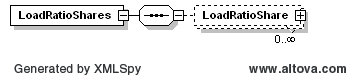
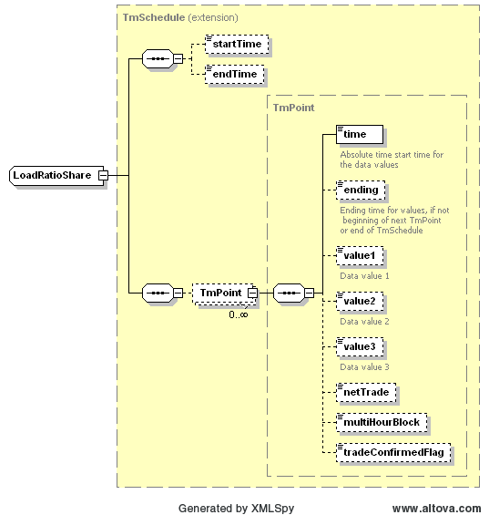

### Load Ratio Share

This section describes interfaces used to retrieve the load ratio
share for each QSE. This is a daily report and will return the full
day data for the requested day.

The request message would use the following message fields:

| Message Element | Value |
|-------------------------------------------|---------------------------------|
| Header/Verb                               | get                             |
| Header/Noun                               | LoadRatioShares                 |
| Header/Source                             | *Market participant ID*         |
| Header/UserID                             | *ID of user*                    |
| Request/OperatingDate                     | *Day of the report*             |

The corresponding response messages would use the following message
fields:

| Message Element | Value                |
|-------------------------------------------|------------------------------------------------|
| Header/Verb                               | reply                                          |
| Header/Noun                               | LoadRatioShares                                |
| Header/Source                             | ERCOT                                          |
| Reply/ReplyCode                           | *Reply code, success=OK, error=ERROR or FATAL* |
| Reply/Error                               | *Error message, if error encountered*          |
| Payload/                                  | *LoadRatioShares*                              |

The LoadRatioShares payload structure is described by the following
diagram:

The values of ‘value1’ would be used to identify the proportion
assigned to the requesting QSE for each hour.

The following is an XML example:

~~~
<LoadRatioShares
    xsi:schemaLocation="http://www.ercot.com/schema/2007-06/nodal/ews    ErcotInformation.xsd"
    xmlns="http://www.ercot.com/schema/2007-06/nodal/ews"
    xmlns:xsi="http://www.w3.org/2001/XMLSchema-instance">
    <LoadRatioShare>
        <startTime>2007-07-25T00:00:00-06:00</startTime>
        <endTime>2007-07-25T00:00:00-06:00</endTime>
        <TmPoint>
            <time>2007-07-25T00:00:00-06:00</time>
            <ending>2007-07-25T00:00:00-06:00</ending>
            <value1>4.14</value1>
        </TmPoint>
    </LoadRatioShare>
</LoadRatioShares>
~~~
