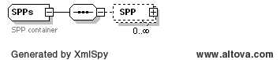
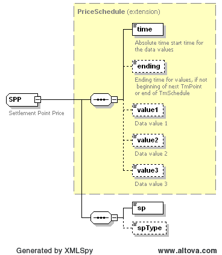
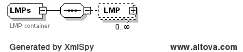
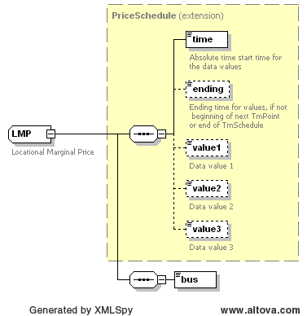

### Market LMPs, SPPs, Price Corrected LMPs and Price Corrected SPPs 

The purpose of this interface is to provide a query for market LMPs,
LMPsPC (price corrected LMPs), SPPs and SPPsPC (price corrected SPPs).
The request message would use the following message fields:

<table>
<colgroup>
<col style="width: 36%" />
<col style="width: 63%" />
</colgroup>
<thead>
<tr class="header">
<th><mark>Message Element</mark></th>
<th><mark>Value</mark></th>
</tr>
</thead>
<tbody>
<tr class="odd">
<td>Header/Verb</td>
<td>get</td>
</tr>
<tr class="even">
<td>Header/Noun</td>
<td>LMPs (or LMPsPC, SPPs, SPPsPC)</td>
</tr>
<tr class="odd">
<td>Header/Source</td>
<td><em>Market participant ID</em></td>
</tr>
<tr class="even">
<td>Header/UserID</td>
<td><em>ID of user</em></td>
</tr>
<tr class="odd">
<td>Request/OperatingDate</td>
<td>
<em>Day of the Report</em>

<em>For DAM MarketType</em>
</td>
</tr>
<tr class="even">
<td>Request/StartTime</td>
<td>
<em>Start time of interest</em>

<em>For RTM MarketType</em>
</td>
</tr>
<tr class="odd">
<td>Request/EndTime</td>
<td>
<em>End time of interest</em>

<em>For RTM MarketType</em>
</td>
</tr>
<tr class="even">
<td>Request/MarketType</td>
<td><em>DAM or RTM</em></td>
</tr>
</tbody>
</table>

The corresponding response messages would use the following message
fields:

| Message Element | Value                |
|-------------------------------------------|------------------------------------------------|
| Header/Verb                               | reply                                          |
| Header/Noun                               | LMPs (or LMPsPC, SPPs, SPPsPC)                 |
| Header/Source                             | ERCOT                                          |
| Reply/ReplyCode                           | *Reply code, success=OK, error=ERROR or FATAL* |
| Reply/Error                               | *Error message, if error encountered*          |
| Payload/                                  | *LMPs (or SPPs)*                               |

Please note that requesting LMPs and LMPsPC for DAM market is not
supported at this time due to its large response payload size. LMPs
and LMPsPC values for DAM market can be retrieved via CDR reports or
“get Reports” interface specified in section 9.0.

For RTM Market type, the last SCED run time is returned in the
TmPoint/time element. The structure of a LMPs/LMPsPC/SPPs/SPPsPC
payload is shown by the following diagram, where each LMP/SPP uses a
TmSchedule type for each bus or SettlementPoint:

In both cases the data structure is based upon a TmSchedule, where
values of ‘value1’ and ‘value2’ are in \$/MWh and values of ‘time’ is
the absolute start time for the data values.
The last point on the schedule is valid until the endTime. For LMPsPC
and SPPsPC responses, ‘value1’ represents the original price and
‘value2’ represents the corrected price. The ‘value2’ element will
only be populated for LMPsPC and SPPsPC responses and is not
applicable to LMPs and SPPs responses.

For SPPs and SPPsPC the Settlement Point Type (spType) is an optional
field and it is not applicable to DAM market but it is populated for
the RTM market.  It’s possible values are: RES, LZ, HUB.

The following is an XML example for SPPs:

~~~
<ns0:SPPs xmlns:ns0="http://www.ercot.com/schema/2007-06/nodal/ews">
    <ns0:SPP>
        <ns0:time>2009-06-20T00:00:00-05:00</ns0:time>
        <ns0:ending>2009-06-20T01:00:00-05:00</ns0:ending>
        <ns0:value1>43</ns0:value1>
        <ns0:sp>PSA_CC1</ns0:sp>
    </ns0:SPP>
    <ns0:SPP>
        <ns0:time>2009-06-20T00:00:00-05:00</ns0:time>
        <ns0:ending>2009-06-20T01:00:00-05:00</ns0:ending>
        <ns0:value1>43</ns0:value1>
        <ns0:sp>FORMOSA_CC1</ns0:sp>
    </ns0:SPP>
    <ns0:SPP>
        <ns0:time>2009-06-20T00:00:00-05:00</ns0:time>
        <ns0:ending>2009-06-20T01:00:00-05:00</ns0:ending>
        <ns0:value1>43</ns0:value1>
        <ns0:sp>LZ_SOUTH</ns0:sp>
    </ns0:SPP>
    <ns0:SPP>
        <ns0:time>2009-06-20T00:00:00-05:00</ns0:time>
        <ns0:ending>2009-06-20T01:00:00-05:00</ns0:ending>
        <ns0:value1>43</ns0:value1>
        <ns0:sp>LZ_WEST</ns0:sp>
    </ns0:SPP>
</ns0:SPPs>
~~~

And the following is an XML example for LMPs:

~~~
<ns0:LMPs xmlns:ns0="http://www.ercot.com/schema/2007-06/nodal/ews">
    <ns0:LMP>
        <ns0:time>2008-06-19T17:15:22-05:00</ns0:time>
        <ns0:value1>716.1</ns0:value1>
        <ns0:bus>0ABEC_0001</ns0:bus>
    </ns0:LMP>
    <ns0:LMP>
        <ns0:time>2008-06-19T17:15:22-05:00</ns0:time>
        <ns0:value1>716.1</ns0:value1>
        <ns0:bus>0ABEC_0002</ns0:bus>
    </ns0:LMP>
    <ns0:LMP>
        <ns0:time>2008-06-19T17:15:22-05:00</ns0:time>
        <ns0:value1>716.1</ns0:value1>
        <ns0:bus>0AMIST_0001</ns0:bus>
    </ns0:LMP>
    <ns0:LMP>
        <ns0:time>2008-06-19T17:15:22-05:00</ns0:time>
        <ns0:value1>716.1</ns0:value1>
        <ns0:bus>AB_0004</ns0:bus>
    </ns0:LMP>
</ns0:LMPs>
~~~
