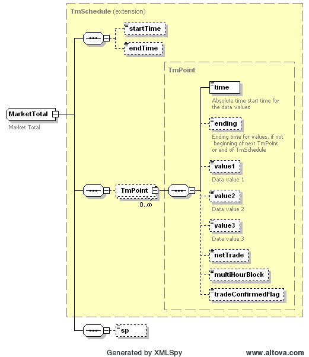

### Market Totals - Same as Total DAM Energy

The purpose of this interface is to provide a query for market totals.
Market totals supported by this interface include:

- Total energy bought in DAM

- Total energy sold in DAM

The request message would use the following message fields:

<table>
<colgroup>
<col style="width: 36%" />
<col style="width: 63%" />
</colgroup>
<thead>
<tr class="header">
<th><mark>Message Element</mark></th>
<th><mark>Value</mark></th>
</tr>
</thead>
<tbody>
<tr class="odd">
<td>Header/Verb</td>
<td>get</td>
</tr>
<tr class="even">
<td>Header/Noun</td>
<td>MarketTotals</td>
</tr>
<tr class="odd">
<td>Header/Source</td>
<td><em>Market participant ID</em></td>
</tr>
<tr class="even">
<td>Header/UserID</td>
<td><em>ID of user</em></td>
</tr>
<tr class="odd">
<td>Request/option</td>
<td>
<em>One of:</em>

<ul>
<li>
<em>EnergyBoughtInDAM</em>
</li>
<li>
<em>EnergySoldInDAM</em>
</li>
</ul></td>
</tr>
<tr class="even">
<td>Request/OperatingDate</td>
<td><em>Day of the report</em></td>
</tr>
</tbody>
</table>

The corresponding response messages would use the following message
fields:

| Message Element | Value                |
|-------------------------------------------|------------------------------------------------|
| Header/Verb                               | reply                                          |
| Header/Noun                               | MarketTotals                                   |
| Header/Source                             | ERCOT                                          |
| Reply/ReplyCode                           | *Reply code, success=OK, error=ERROR or FATAL* |
| Reply/Error                               | *Error message, if error encountered*          |
| Payload                                   | MarketTotals                                   |

The Totals structure is based upon a CIM RegularIntervalSchedules,
where the values of ‘value1’ are total megawatt values.

The structure of a MarketTotals payload is shown by the following
diagram:

The following is an XML example:

~~~
<ns0:MarketTotals xmlns:ns0="http://www.ercot.com/schema/2007-06/nodal/ews">
    <ns0:MarketTotal>
        <ns0:TmPoint>
            <ns0:time>2009-06-13T00:00:00-05:00</ns0:time>
            <ns0:ending>2009-06-13T01:00:00-05:00</ns0:ending>
            <ns0:value1>0</ns0:value1>
        </ns0:TmPoint>
        <ns0:sp>ABC_DEF1</ns0:sp>
    </ns0:MarketTotal>
    <ns0:MarketTotal>
        <ns0:TmPoint>
            <ns0:time>2009-06-13T00:00:00-05:00</ns0:time>
            <ns0:ending>2009-06-13T01:00:00-05:00</ns0:ending>
            <ns0:value1>0</ns0:value1>
        </ns0:TmPoint>
        <ns0:sp>ABCD_CC1</ns0:sp>
    </ns0:MarketTotal>
    <ns0:MarketTotal>
        <ns0:TmPoint>
            <ns0:time>2009-06-13T00:00:00-05:00</ns0:time>
            <ns0:ending>2009-06-13T01:00:00-05:00</ns0:ending>
            <ns0:value1>0</ns0:value1>
        </ns0:TmPoint>
        <ns0:sp>ABC_PUN1</ns0:sp>
    </ns0:MarketTotal>
    <ns0:MarketTotal>
        <ns0:TmPoint>
            <ns0:time>2009-06-13T00:00:00-05:00</ns0:time>
            <ns0:ending>2009-06-13T01:00:00-05:00</ns0:ending>
            <ns0:value1>37</ns0:value1>
        </ns0:TmPoint>
        <ns0:sp>ABC_ABC_G1</ns0:sp>
    </ns0:MarketTotal>
    ...
    <ns0:MarketTotal>
        <ns0:TmPoint>
            <ns0:time>2009-06-13T23:00:00-05:00</ns0:time>
            <ns0:ending>2009-06-14T00:00:00-05:00</ns0:ending>
            <ns0:value1>0</ns0:value1>
        </ns0:TmPoint>
        <ns0:sp>EFG_CC1</ns0:sp>
    </ns0:MarketTotal>
    <ns0:MarketTotal>
        <ns0:TmPoint>
            <ns0:time>2009-06-13T23:00:00-05:00</ns0:time>
            <ns0:ending>2009-06-14T00:00:00-05:00</ns0:ending>
            <ns0:value1>0</ns0:value1>
        </ns0:TmPoint>
        <ns0:sp>A_SB_PUN1</ns0:sp>
    </ns0:MarketTotal>
</ns0:MarketTotals>
~~~

