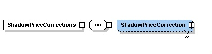
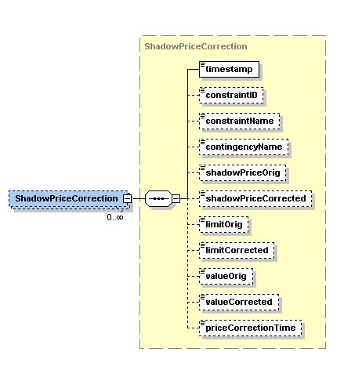

### Price Corrected SCED Violated Constraints

This section describes interfaces used to retrieve price corrected
binding constraint in SCED. Price Corrected SCED Violated Constraints
are only provided for RTM market. The request message would use the
following message fields:

| Message Element | Value |
|-------------------------------------------|---------------------------------|
| Header/Verb                               | get                             |
| Header/Noun                               | SCEDViolatedConstraintsPC       |
| Header/Source                             | *Market participant ID*         |
| Header/UserID                             | *ID of user*                    |
| Request/StartTime                         | *Start time of interest*        |
| Request/EndTime                           | *End time of interest*          |

The corresponding response messages would use the following message
fields:

| Message Element | Value                |
|-------------------------------------------|------------------------------------------------|
| Header/Verb                               | reply                                          |
| Header/Noun                               | SCEDViolatedConstraintsPC                      |
| Header/Source                             | ERCOT                                          |
| Reply/ReplyCode                           | *Reply code, success=OK, error=ERROR or FATAL* |
| Reply/Error                               | *Error message, if error encountered*          |
| Payload/                                  | ShadowPriceCorrections                         |

The structure of ShadowPriceCorrections are described by the following
diagram:

The following elements are used to report price corrections for
real-time shadow prices:

- SCED Timestamp

- Constraint ID

- Constraint Name

- Contingency Name

- Original Shadow Price

- Corrected Shadow Price

- Original Limit

- Corrected Limit

- Original Value

- Corrected Value

- Price Correction Timestamp

The following is an XML example:

~~~
<ns1:ShadowPriceCorrections xmlns:ns0="http://www.ercot.com/schema/2007-05/nodal/eip/il"
    xmlns:ns1="http://www.ercot.com/schema/2007-06/nodal/ews">
    <ns1:ShadowPriceCorrection>
        <ns1:timestamp>2012-01-05T11:00:00-06:00</ns1:timestamp>
        <ns1:constraintID>1</ns1:constraintID>
        <ns1:constraintName>ABC</ns1:constraintName>
        <ns1:contingencyName>DEFGHIJ1</ns1:contingencyName>
        <ns1:shadowPriceOrig>995.45</ns1:shadowPriceOrig>
        <ns1:shadowPriceCorrected>786.59</ns1:shadowPriceCorrected>
        <ns1:limitOrig>32.3</ns1:limitOrig>
        <ns1:limitCorrected>32.3</ns1:limitCorrected>
        <ns1:valueOrig>32.3</ns1:valueOrig>
        <ns1:valueCorrected>32.3</ns1:valueCorrected>
        <ns1:priceCorrectionTime>2012-01-10T14:06:42-06:00</ns1:priceCorrectionTime>
    </ns1:ShadowPriceCorrection>
</ns1:ShadowPriceCorrections>
~~~

