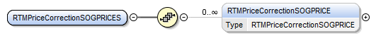
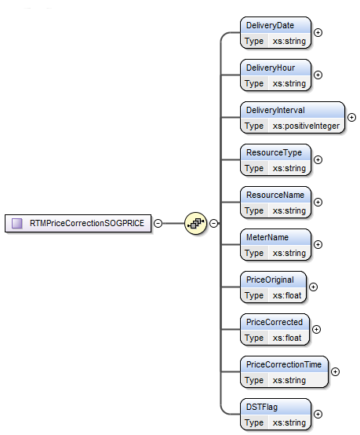

### Price Corrected SOTG/SODG 15-min Prices

This section describes interfaces used to retrieve price corrected
SOTG/SODG 15 minute settlement meter prices. The request message would
use the following message fields:

| Message Element | Value |
|-------------------------------------------|---------------------------------|
| Header/Verb                               | get                             |
| Header/Noun                               | SOGPricesPC                     |
| Header/Source                             | *Market participant ID*         |
| Header/UserID                             | *ID of user*                    |
| Request/StartTime                         | *Start time of interest*        |
| Request/EndTime                           | *End time of interest*          |

The corresponding response messages would use the following message
fields:

| Message Element | Value                |
|-------------------------------------------|------------------------------------------------|
| Header/Verb                               | reply                                          |
| Header/Noun                               | SOGPricesPC                                    |
| Header/Source                             | ERCOT                                          |
| Reply/ReplyCode                           | *Reply code, success=OK, error=ERROR or FATAL* |
| Reply/Error                               | *Error message, if error encountered*          |
| Payload/                                  | RTMPriceCorrectionSOGPRICES                    |

The structure of RTMPriceCorrectionSOGPRICES are described by the
following diagram:

The following elements are used to report price corrections for
SOTG/SODG 15-min settlement meter prices:

- Delivery Date

- Delivery Hour

- Delivery Interval

- Resource Type

- Resource Name

- Meter Name

- Price Original

- Price Corrected

- Price Correction Time

- DST Flag

The following is an XML example:

~~~
<ns1:RTMPriceCorrectionSOGPRICES xmlns:ns0="http://www.ercot.com/schema/2007-05/nodal/eip/il"
    xmlns:ns1="http://www.ercot.com/schema/2007-06/nodal/ews">
    <ns1:RTMPriceCorrectionSOGPRICE>
        <ns1:DeliveryDate>07/28/2021</ns1:DeliveryDate>
        <ns1:DeliveryHour>11</ns1:DeliveryHour>
        <ns1:DeliveryInterval>3</ns1:DeliveryInterval>
        <ns1:ResourceType>SOTG</ns1:ResourceType>
        <ns1:ResourceName>RES_XXXX2</ns1:ResourceName>
        <ns1:MeterName>METER0002</ns1:MeterName>
        <ns1:PriceOriginal>38.22</ns1:PriceOriginal>
        <ns1:PriceCorrected>38.16</ns1:PriceCorrected>
        <ns1:PriceCorrectionTime>07/30/2021 16:00:00</ns1:PriceCorrectionTime>
        <ns1:DSTFlag>N</ns1:DSTFlag>
    </ns1:RTMPriceCorrectionSOGPRICE>
    <ns1:RTMPriceCorrectionSOGPRICE>
        <ns1:DeliveryDate>07/28/2021</ns1:DeliveryDate>
        <ns1:DeliveryHour>11</ns1:DeliveryHour>
        <ns1:DeliveryInterval>3</ns1:DeliveryInterval>
        <ns1:ResourceType>SOTG</ns1:ResourceType>
        <ns1:ResourceName>RES_XXXX2</ns1:ResourceName>
        <ns1:MeterName>METER0003</ns1:MeterName>
        <ns1:PriceOriginal>38.22</ns1:PriceOriginal>
        <ns1:PriceCorrected>38.16</ns1:PriceCorrected>
        <ns1:PriceCorrectionTime>07/30/2021 16:00:00</ns1:PriceCorrectionTime>
        <ns1:DSTFlag>N</ns1:DSTFlag>
    </ns1:RTMPriceCorrectionSOGPRICE>
</ns1:RTMPriceCorrectionSOGPRICES>
~~~
