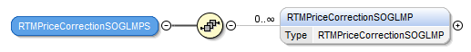
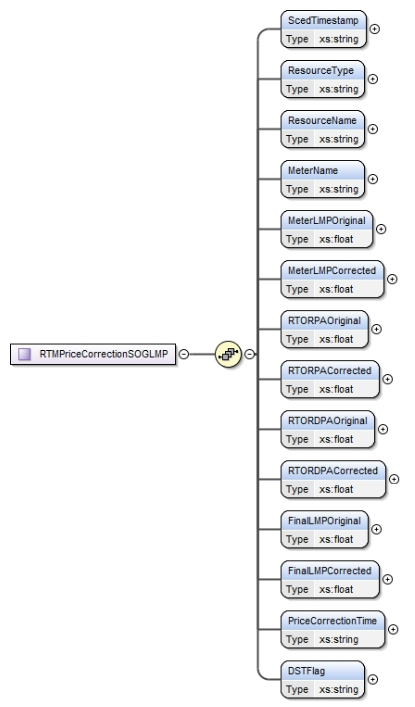

### Price Corrected SOTG/SODG LMPs

This section describes interfaces used to retrieve price corrected
SOTG/SODG 5-min SCED LMPs. The request message would use the following
message fields:

| Message Element | Value |
|-------------------------------------------|---------------------------------|
| Header/Verb                               | get                             |
| Header/Noun                               | SOGLMPsPC                       |
| Header/Source                             | *Market participant ID*         |
| Header/UserID                             | *ID of user*                    |
| Request/StartTime                         | *Start time of interest*        |
| Request/EndTime                           | *End time of interest*          |

The corresponding response messages would use the following message
fields:

| Message Element | Value                |
|-------------------------------------------|------------------------------------------------|
| Header/Verb                               | reply                                          |
| Header/Noun                               | SOGLMPsPC                                      |
| Header/Source                             | ERCOT                                          |
| Reply/ReplyCode                           | *Reply code, success=OK, error=ERROR or FATAL* |
| Reply/Error                               | *Error message, if error encountered*          |
| Payload/                                  | *RTMPriceCorrectionSOGLMPS*                    |

The structure of RTMPriceCorrectionSOGLMPS are described by the
following diagram:

The following elements are used to report price corrections for
SOTG/SODG 5-min SCED LMPs:

- SCED Timestamp

- Resource Type

- Resource Name

- Meter Name

- Meter LMP Original

- Meter LMP Corrected

- RTORPA Original

- RTORPA Corrected

- RTORDPA Original

- RTORDPA Corrected

- Final LMP Original

- Final LMP Corrected

- Price Correction Time

- DST Flag

The following is an XML example:

~~~
<RTMPriceCorrectionSOGLMPS>
    <RTMPriceCorrectionSOGLMP>
        <ScedTimestamp>07/28/2021 10:41:51</ScedTimestamp>
        <ResourceType>SOTG</ResourceType>
        <ResourceName>RES_XXXX1</ResourceName>
        <MeterName>METER0000</MeterName>
        <MeterLMPOriginal>38.84</MeterLMPOriginal>
        <MeterLMPCorrected>38.57</MeterLMPCorrected>
        <RTORPAOriginal>0</RTORPAOriginal>
        <RTORPACorrected>0</RTORPACorrected>
        <RTORDPAOriginal>0</RTORDPAOriginal>
        <RTORDPACorrected>0</RTORDPACorrected>
        <FinalLMPOriginal>38.84</FinalLMPOriginal>
        <FinalLMPCorrected>38.57</FinalLMPCorrected>
        <PriceCorrectionTime>07/30/2021 16:00:00</PriceCorrectionTime>
        <DSTFlag>N</DSTFlag>
    </RTMPriceCorrectionSOGLMP>
    <RTMPriceCorrectionSOGLMP>
        <ScedTimestamp>07/28/2021 10:41:51</ScedTimestamp>
        <ResourceType>SOTG</ResourceType>
        <ResourceName>RES_XXXX1</ResourceName>
        <MeterName>METER0001</MeterName>
        <MeterLMPOriginal>38.84</MeterLMPOriginal>
        <MeterLMPCorrected>38.57</MeterLMPCorrected>
        <RTORPAOriginal>0</RTORPAOriginal>
        <RTORPACorrected>0</RTORPACorrected>
        <RTORDPAOriginal>0</RTORDPAOriginal>
        <RTORDPACorrected>0</RTORDPACorrected>
        <FinalLMPOriginal>38.84</FinalLMPOriginal>
        <FinalLMPCorrected>38.57</FinalLMPCorrected>
        <PriceCorrectionTime>07/30/2021 16:00:00</PriceCorrectionTime>
        <DSTFlag>N</DSTFlag>
    </RTMPriceCorrectionSOGLMP>
</RTMPriceCorrectionSOGLMPS>
~~~
