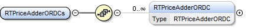
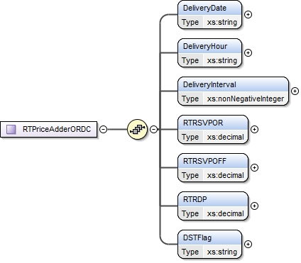

### RT Price Adder ORDC

This section describes interfaces used to retrieve Real-Time Reserve
Prices Based on ORDC for 15-minute Settlement Interval. The request
message would use the following message fields:

| Message Element | Value |
|-------------------------------------------|---------------------------------|
| Header/Verb                               | get                             |
| Header/Noun                               | RT15minORDCReservePrices        |
| Header/Source                             | *Market participant ID*         |
| Header/UserID                             | *ID of user*                    |
| Request/StartTime                         | *Start time of interest*        |
| Request/EndTime                           | *End time of interest*          |

The corresponding response messages would use the following message
fields:

| Message Element | Value                |
|-------------------------------------------|------------------------------------------------|
| Header/Verb                               | reply                                          |
| Header/Noun                               | RT15minORDCReservePrices                       |
| Header/Source                             | ERCOT                                          |
| Reply/ReplyCode                           | *Reply code, success=OK, error=ERROR or FATAL* |
| Reply/Error                               | *Error message, if error encountered*          |
| Payload/                                  | RTPriceAdderORDCs                              |

The structure of RTPriceAddersORDCs is described by the following
diagram:

The following elements are used to report RT Price Adder ORDC:

- DeliveryDate

- DeliveryHour

- DeliveryInterval

- RTRSVPOR

- RTRSVPOFF

- RTRDP

- DSTFlag

The following is an XML example:

~~~
<ns1:RTPriceAdderORDCs xmlns:ns0="http://www.ercot.com/schema/2007-05/nodal/eip/il"
    xmlns:ns1="http://www.ercot.com/schema/2007-06/nodal/ews">
    <ns1:RTPriceAdderORDC>
        <ns1:DeliveryDate>08/14/2014</ns1:DeliveryDate>
        <ns1:DeliveryHour>9</ns1:DeliveryHour>
        <ns1:DeliveryInterval>4</ns1:DeliveryInterval>
        <ns1:RTRSVPOR>0.0</ns1:RTRSVPOR>
        <ns1:RTRSVPOFF>0.0</ns1:RTRSVPOFF>
        <ns1:RTRDP>0.0</ns1:RTRDP>
        <ns1:DSTFlag>N</ns1:DSTFlag>
    </ns1:RTPriceAdderORDC>
</ns1:RTPriceAdderORDCs>
~~~
