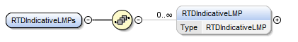
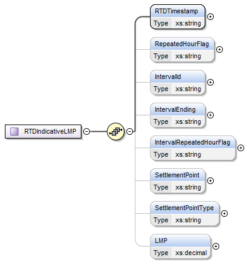

### RTD Indicative LMPs

This section describes interfaces used to retrieve RTD Indicative
LMPs. This report will provide the final LMP at every settlement point
for every interval in a particular RTD Study Period. The request
message would use the following message fields:

| Message Element | Value |
|-------------------------------------------|---------------------------------|
| Header/Verb                               | get                             |
| Header/Noun                               | RTDIndicativeLMPs               |
| Header/Source                             | *Market participant ID*         |
| Header/UserID                             | *ID of user*                    |
| Request/StartTime                         | *Start time of interest*        |
| Request/EndTime                           | *End time of interest*          |

The corresponding response messages would use the following message
fields:

| Message Element | Value                |
|-------------------------------------------|------------------------------------------------|
| Header/Verb                               | reply                                          |
| Header/Noun                               | RTDIndicativeLMPs                              |
| Header/Source                             | ERCOT                                          |
| Reply/ReplyCode                           | *Reply code, success=OK, error=ERROR or FATAL* |
| Reply/Error                               | *Error message, if error encountered*          |
| Payload/                                  | RTDIndicativeLMPs                              |

The structure of RTD Indicative LMPs are described by the following
diagram:

The following elements are used to report RTD Indicative LMPs:

- RTD Timestamp

- Repeated Hour Flag which indicates the extra hour on the DST long day

- Interval ID

- Interval Ending

- Interval Repeated Hour Flag

- Settlement Point

- Settlement Point Type

- LMP

The following is an XML example:

~~~
<ns1:RTDIndicativeLMPs xmlns:ns0="http://www.ercot.com/schema/2007-05/nodal/eip/il"
    xmlns:ns1="http://www.ercot.com/schema/2007-06/nodal/ews">
    <ns1:RTDIndicativeLMP>
        <ns1:RTDTimestamp>03/21/2012 16:19:01</ns1:RTDTimestamp>
        <ns1:RepeatedHourFlag>N</ns1:RepeatedHourFlag>
        <ns1:IntervalId>1</ns1:IntervalId>
        <ns1:IntervalEnding>03/21/2012 16:25:00</ns1:IntervalEnding>
        <ns1:IntervalRepeatedHourFlag>N</ns1:IntervalRepeatedHourFlag>
        <ns1:SettlementPoint>STLP_ALL</ns1:SettlementPoint>
        <ns1:SettlementPointType>RN</ns1:SettlementPointType>
        <ns1:LMP>17.73</ns1:LMP>
    </ns1:RTDIndicativeLMP>
</ns1:RTDIndicativeLMPs>
~~~

