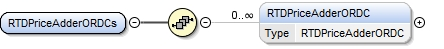
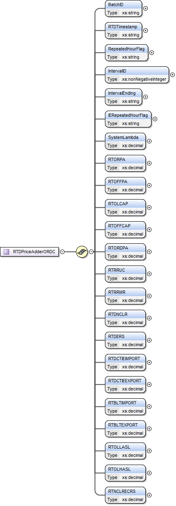

### RTD Indicative ORDC Price Adders

This section describes interfaces used to retrieve RTD Indicative
Total Available Reserves and Price Adders Based on ORDC. The request
message would use the following message fields:

| Message Element | Value |
|-------------------------------------------|---------------------------------|
| Header/Verb                               | get                             |
| Header/Noun                               | RTDIndicativeORDCPriceAdders    |
| Header/Source                             | *Market participant ID*         |
| Header/UserID                             | *ID of user*                    |
| Request/StartTime                         | *Start time of interest*        |
| Request/EndTime                           | *End time of interest*          |

The corresponding response messages would use the following message
fields:

| Message Element | Value                |
|-------------------------------------------|------------------------------------------------|
| Header/Verb                               | reply                                          |
| Header/Noun                               | RTDIndicativeORDCPriceAdders                   |
| Header/Source                             | ERCOT                                          |
| Reply/ReplyCode                           | *Reply code, success=OK, error=ERROR or FATAL* |
| Reply/Error                               | *Error message, if error encountered*          |
| Payload/                                  | RTDPriceAdderORDCs                             |

The structure of RTDPriceAdderORDCs is described by the following
diagram:

The following is an XML example:

~~~
<ns1:RTDPriceAdderORDCs xmlns:ns0="http://www.ercot.com/schema/2007-05/nodal/eip/il"
    xmlns:ns1="http://www.ercot.com/schema/2007-06/nodal/ews">
    <ns1:RTDPriceAdderORDC>
        <ns1:BatchID>5612622</ns1:BatchID>
        <ns1:RTDTimestamp>04/18/2023 16:01:25</ns1:RTDTimestamp>
        <ns1:RepeatedHourFlag>N</ns1:RepeatedHourFlag>
        <ns1:IntervalID>1</ns1:IntervalID>
        <ns1:IntervalEnding>04/18/2023 16:05:00</ns1:IntervalEnding>
        <ns1:IERepeatedHourFlag>N</ns1:IERepeatedHourFlag>
        <ns1:SystemLambda>5000.0</ns1:SystemLambda>
        <ns1:RTORPA>0.0</ns1:RTORPA>
        <ns1:RTOFFPA>0.0</ns1:RTOFFPA>
        <ns1:RTOLCAP>0.0</ns1:RTOLCAP>
        <ns1:RTOFFCAP>4618.0</ns1:RTOFFCAP>
        <ns1:RTORDPA>0.0</ns1:RTORDPA>
        <ns1:RTRRUC>0.0</ns1:RTRRUC>
        <ns1:RTRRMR>0.0</ns1:RTRRMR>
        <ns1:RTDNCLR>31.13</ns1:RTDNCLR>
        <ns1:RTDERS>0.0</ns1:RTDERS>
        <ns1:RTDCTIEIMPORT>0.0</ns1:RTDCTIEIMPORT>
        <ns1:RTDCTIEEXPORT>0.0</ns1:RTDCTIEEXPORT>
        <ns1:RTBLTIMPORT>0.0</ns1:RTBLTIMPORT>
        <ns1:RTBLTEXPORT>0.0</ns1:RTBLTEXPORT>
        <ns1:RTOLLASL>13567.49</ns1:RTOLLASL>
        <ns1:RTOLHASL>33682.31</ns1:RTOLHASL>
        <ns1:RTNCLRECRS>54.0</ns1:RTNCLRECRS>
    </ns1:RTDPriceAdderORDC>
</ns1:RTDPriceAdderORDCs>
~~~
