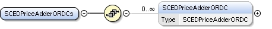
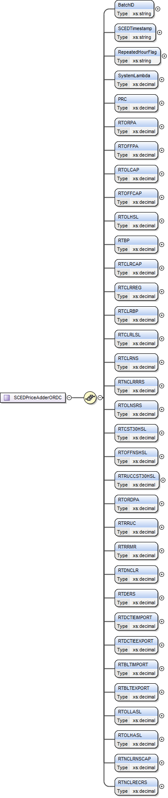

### SCED ORDC Price Adders

This section describes interfaces used to retrieve SCED Total
Available Reserves and Price Adders Based on ORDC. The request message
would use the following message fields:

| Message Element | Value |
|-------------------------------------------|---------------------------------|
| Header/Verb                               | get                             |
| Header/Noun                               | SCEDORDCPriceAdders             |
| Header/Source                             | *Market participant ID*         |
| Header/UserID                             | *ID of user*                    |
| Request/StartTime                         | *Start time of interest*        |
| Request/EndTime                           | *End time of interest*          |

The corresponding response messages would use the following message
fields:

| Message Element | Value                |
|-------------------------------------------|------------------------------------------------|
| Header/Verb                               | reply                                          |
| Header/Noun                               | SCEDORDCPriceAdders                            |
| Header/Source                             | ERCOT                                          |
| Reply/ReplyCode                           | *Reply code, success=OK, error=ERROR or FATAL* |
| Reply/Error                               | *Error message, if error encountered*          |
| Payload/                                  | SCEDPriceAdderORDCs                            |

The structure of SCEDPriceAdderORDCs is described by the following
diagram:

The following is an XML example:

~~~
<ns1:SCEDPriceAdderORDCs xmlns:ns0="http://www.ercot.com/schema/2007-05/nodal/eip/il"
    xmlns:ns1="http://www.ercot.com/schema/2007-06/nodal/ews">
    <ns1:SCEDPriceAdderORDC>
        <ns1:BatchID>5612621</ns1:BatchID>
        <ns1:SCEDTimestamp>04/18/2023 16:01:34</ns1:SCEDTimestamp>
        <ns1:RepeatedHourFlag>N</ns1:RepeatedHourFlag>
        <ns1:SystemLambda>1500.0007</ns1:SystemLambda>
        <ns1:PRC>6266.18</ns1:PRC>
        <ns1:RTORPA>0.0</ns1:RTORPA>
        <ns1:RTOFFPA>0.0</ns1:RTOFFPA>
        <ns1:RTOLCAP>18130.98</ns1:RTOLCAP>
        <ns1:RTOFFCAP>4940.0</ns1:RTOFFCAP>
        <ns1:RTOLHSL>41347.11</ns1:RTOLHSL>
        <ns1:RTBP>23872.18</ns1:RTBP>
        <ns1:RTCLRCAP>22.72</ns1:RTCLRCAP>
        <ns1:RTCLRREG>0.0</ns1:RTCLRREG>
        <ns1:RTCLRBP>51.72</ns1:RTCLRBP>
        <ns1:RTCLRLSL>0.02</ns1:RTCLRLSL>
        <ns1:RTCLRNS>30.3</ns1:RTCLRNS>
        <ns1:RTNCLRRRS>713.32</ns1:RTNCLRRRS>
        <ns1:RTOLNSRS>138.0</ns1:RTOLNSRS>
        <ns1:RTCST30HSL>2459.59</ns1:RTCST30HSL>
        <ns1:RTOFFNSHSL>2265.52</ns1:RTOFFNSHSL>
        <ns1:RTRUCCST30HSL>0.0</ns1:RTRUCCST30HSL>
        <ns1:RTORDPA>0.0</ns1:RTORDPA>
        <ns1:RTRRUC>0.0</ns1:RTRRUC>
        <ns1:RTRRMR>0.0</ns1:RTRRMR>
        <ns1:RTDNCLR>3.0</ns1:RTDNCLR>
        <ns1:RTDERS>0.0</ns1:RTDERS>
        <ns1:RTDCTIEIMPORT>0.0</ns1:RTDCTIEIMPORT>
        <ns1:RTDCTIEEXPORT>0.0</ns1:RTDCTIEEXPORT>
        <ns1:RTBLTIMPORT>0.0</ns1:RTBLTIMPORT>
        <ns1:RTBLTEXPORT>0.0</ns1:RTBLTEXPORT>
        <ns1:RTOLLASL>19127.94</ns1:RTOLLASL>
        <ns1:RTOLHASL>61551.2</ns1:RTOLHASL>
        <ns1:RTNCLRNSCAP>46.59</ns1:RTNCLRNSCAP>
        <ns1:RTNCLRECRS>46.59</ns1:RTNCLRECRS>
    </ns1:SCEDPriceAdderORDC>
</ns1:SCEDPriceAdderORDCs>
~~~
