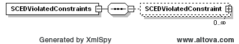
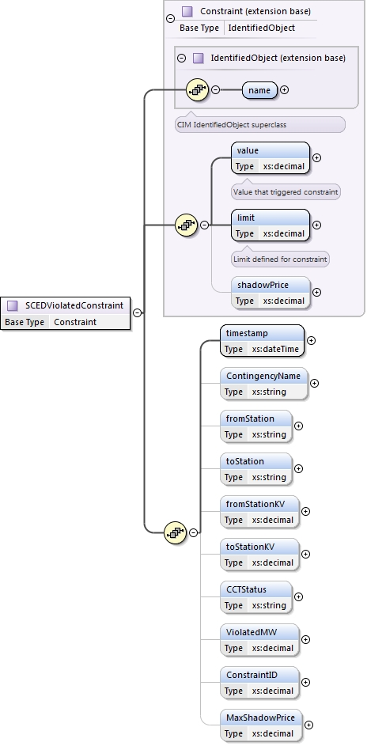

### SCED Violated Constraints 

This section describes interfaces used to retrieve binding constraint
in SCED. SCED Violated Constraints are only provided for RTM market.
The request message would use the following message fields:

| Message Element | Value |
|-------------------------------------------|---------------------------------|
| Header/Verb                               | get                             |
| Header/Noun                               | SCEDViolatedConstraints         |
| Header/Source                             | *Market participant ID*         |
| Header/UserID                             | *ID of user*                    |
| Request/StartTime                         | *Start time of interest*        |
| Request/EndTime                           | *End time of interest*          |

The corresponding response messages would use the following message
fields:

| Message Element | Value                |
|-------------------------------------------|------------------------------------------------|
| Header/Verb                               | reply                                          |
| Header/Noun                               | SCEDViolatedConstraints                        |
| Header/Source                             | ERCOT                                          |
| Reply/ReplyCode                           | *Reply code, success=OK, error=ERROR or FATAL* |
| Reply/Error                               | *Error message, if error encountered*          |
| Payload/                                  | SCEDViolatedConstraints                        |

The structure of SCED violated constraints are described by the
following diagram:

The following elements are used to report violated constraints:

- Name of the constraint

- Value that exceeded limit

- Defined limit for constraint

- Timestamp of violation

- Contingency Name

- Station name which contingency is from

- Station name which contingency is to

- Station voltage which contingency is from

- Station voltage which contingency is to

- Constraint is competitive or not

- Violated MW

- Constraint ID

- Max shadow price

The following is an XML example:

~~~
<ns1:SCEDViolatedConstraints xmlns:ns0="http://www.ercot.com/schema/2007-05/nodal/eip/il"
    xmlns:ns1="http://www.ercot.com/schema/2007-06/nodal/ews">
    <ns1:SCEDViolatedConstraint>
        <ns1:name>6485__A</ns1:name>
        <ns1:value>156.8</ns1:value>
        <ns1:limit>156.8</ns1:limit>
        <ns1:shadowPrice>431.39862</ns1:shadowPrice>
        <ns1:timestamp>2017-09-20T10:55:12-05:00</ns1:timestamp>
        <ns1:ContingencyName>SMNHODE8</ns1:ContingencyName>
        <ns1:fromStation>MOSSW</ns1:fromStation>
        <ns1:toStation>PBSES</ns1:toStation>
        <ns1:fromStationKV>138.0</ns1:fromStationKV>
        <ns1:toStationKV>138.0</ns1:toStationKV>
        <ns1:CCTStatus>NONCOMP</ns1:CCTStatus>
        <ns1:ViolatedMW>0.0</ns1:ViolatedMW>
        <ns1:ConstraintID>3.0</ns1:ConstraintID>
        <ns1:MaxShadowPrice>3500.0</ns1:MaxShadowPrice>
    </ns1:SCEDViolatedConstraint>
</ns1:SCEDViolatedConstraints>
~~~

