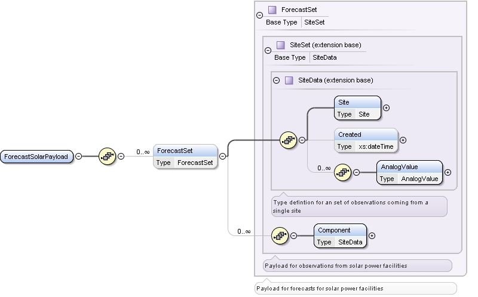

### Short-Term Photovoltaic Power Forecast

The purpose of this interface is to provide a query for fetching
short-term photovoltaic power forecast (STPPF) for each PVGR and STPPF
forecast for all PVGRs. This interface will return the last hour data
for the requesting hour-end.

The request message would use the following message fields:

<table>
<colgroup>
<col style="width: 34%" />
<col style="width: 65%" />
</colgroup>
<thead>
<tr class="header">
<th><mark>Message Element</mark></th>
<th><mark>Value</mark></th>
</tr>
</thead>
<tbody>
<tr class="odd">
<td>Header/Verb</td>
<td><em>get</em></td>
</tr>
<tr class="even">
<td>Header/Noun</td>
<td>STPPF</td>
</tr>
<tr class="odd">
<td>Header/Source</td>
<td><em>MARKET PARTICIPANT ID</em></td>
</tr>
<tr class="even">
<td>Header/UserID</td>
<td><em>ID of user</em></td>
</tr>
<tr class="odd">
<td>Request/endTime</td>
<td><em>End time of interest</em></td>
</tr>
<tr class="even">
<td>Request/ID</td>
<td>
<em>Optional: PVGR identity</em>

<em>If No PVGR provided then</em> STPPF <em>for all PVGRs is
returned</em>
</td>
</tr>
</tbody>
</table>

The corresponding response messages would use the following message
fields:

| Message Element | Value       |
|-------------------------------------------|---------------------------------------|
| Header/Verb                               | *reply*                               |
| Header/Noun                               | STPPF                                 |
| Header/Source                             | *ERCOT*                               |
| Reply/ReplyCode                           | *Reply code, success=OK*              |
| Reply/Error                               | *Error message, if error encountered* |
| Payload/                                  | *STPPF*                               |

The following diagram defines the ForecastSolarPayload structure in
the STPPF response:

The following is an abbreviated XML example of an STPPF response:

~~~
<ns1:ForecastSolarPayload xmlns:ns0="http://www.ercot.com/schema/2007-05/nodal/eip/il"
    xmlns:ns1="http://www.ercot.com/schema/2007-06/nodal/ews">
    <ns1:ForecastSet>
        <ns1:Site duns="1234567890000" name="SOLAR1" qseid="QSE1">SITE1</ns1:Site>
        <ns1:Created>2015-12-18T14:00:01-06:00</ns1:Created>
        <ns1:AnalogValue statistic="MEAN" timeStamp="2015-12-18T14:00:00-06:00" type="STPPF"
            units="MW">0.0E0</ns1:AnalogValue>
        <ns1:AnalogValue statistic="MEAN" timeStamp="2015-12-18T15:00:00-06:00" type="STPPF"
            units="MW">0.0E0</ns1:AnalogValue>
    </ns1:ForecastSet>
</ns1:ForecastSolarPayload>
~~~

