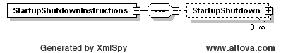
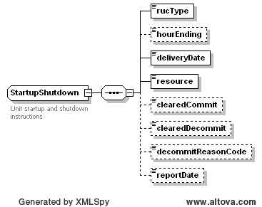

### Startup and Shutdown Instructions

This section describes interfaces used to retrieve unit startup and
shutdown instructions. The request message would use the following
message fields:

| Message Element | Value                  |
|-------------------------------------------|--------------------------------------------------|
| Header/Verb                               | get                                              |
| Header/Noun                               | StartupShutdownInstructions                      |
| Header/Source                             | *Market participant ID*                          |
| Header/UserID                             | *ID of user*                                     |
| Request/MarketType                        | *Market Type (HRUC or DRUC)*                     |
| Request/TradingDate                       | *Trading date*                                   |
| Request/Option                            | *Optional: Hour Ending (Required for HRUC)* [1]   |

To request for repeating hour on long day(DST change day), Hour Ending
value should be 2\*.

The corresponding response messages would use the following message
fields:

| Message Element | Value                |
|-------------------------------------------|------------------------------------------------|
| Header/Verb                               | reply                                          |
| Header/Noun                               | StartupShutdownInstructions                    |
| Header/Source                             | ERCOT                                          |
| Reply/ReplyCode                           | *Reply code, success=OK, error=ERROR or FATAL* |
| Reply/Error                               | *Error message, if error encountered*          |
| Payload/                                  | StartupShutdownInstructions                    |

The payload structure is described by the following diagram:

For each startup or shutdown instruction, the following elements are
provided:

- RUC type (DRUC, HRUC)

- RUC Ending hour for the instructions. On long day(DST change day),
  hourEnding is represented as 2\* for repeating hour.

- Delivery date

- Resource name

- Cleared commit

- Cleared decommit

- Reason code for decommit

- Report Generation Time

The following is an XML example:

~~~
<StartupShutdownInstructions xmlns="http://www.ercot.com/schema/2007-06/nodal/ews"
    xmlns:xsi="http://www.w3.org/2001/XMLSchema-instance">
    <StartupShutdown>
        <rucType>DRUC</rucType>
        <hourEnding>6</hourEnding>
        <deliveryDate>2007-07-25</deliveryDate>    <resource>Resource1</resource>
        <clearedCommit>true</clearedCommit>
        <clearedDecommit>false</clearedDecommit>
        <decommitReasonCode>50 characters of free form text</decommitReasonCode>
        <reportDate>2007-07-25T11:00:00-06:00</reportDate>
    </StartupShutdown>
</StartupShutdownInstructions>
~~~

[1]The hour ending specified in the StartupShutdownInstruction
request is the hour the report was \*generated\*, not the hour that the
report is awarding. Therefore, the report returned can contain multiple
hours as one HRUC run is capable of awarding more than one hour of the
day.