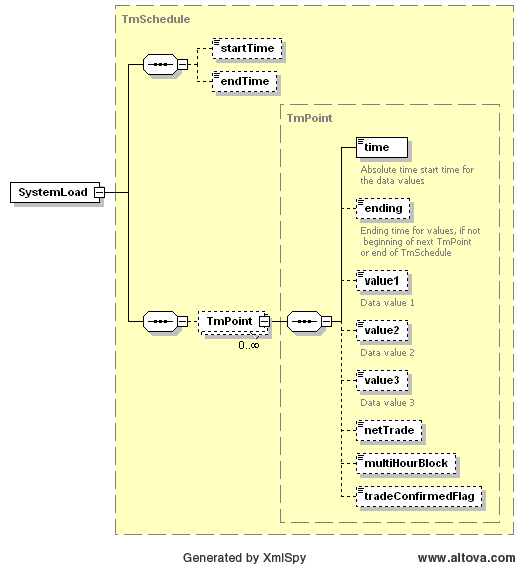

### System Load - Same as Total ERCOT Load

The purpose of this interface is to provide the means to obtain
real-time system load from ERCOT. The request message would use the
following message fields:

| Message Element | Value |
|-------------------------------------------|---------------------------------|
| Header/Verb                               | get                             |
| Header/Noun                               | SystemLoad                      |
| Header/Source                             | *Market participant ID*         |
| Header/UserID                             | *ID of user*                    |
| Request/StartTime                         | *Start time of interest*        |
| Request/EndTime                           | *End time of interest*          |

The corresponding response messages would use the following message
fields:

| Message Element | Value                |
|-------------------------------------------|------------------------------------------------|
| Header/Verb                               | reply                                          |
| Header/Noun                               | SystemLoad                                     |
| Header/Source                             | ERCOT                                          |
| Reply/ReplyCode                           | *Reply code, success=OK, error=ERROR or FATAL* |
| Reply/Error                               | *Error message, if error encountered*          |
| Payload                                   | SystemLoad                                     |

The structure of SystemLoad is described by the following diagram.
This used a TmSchedule:

The following is an XML example:

~~~
<SystemLoad xsi:schemaLocation="http://www.ercot.com/schema/2007-06/nodal/ewsErcotInformation.xsd"
    xmlns="http://www.ercot.com/schema/2007-06/nodal/ews"
    xmlns:xsi="http://www.w3.org/2001/XMLSchema-instance">
    <startTime>2007-07-25T00:00:00-06:00</startTime>
    <endTime>2007-07-25T00:00:00-06:00</endTime>
    <TmPoint>
        <time>2007-07-25T00:00:00-06:00</time>
        <ending>2007-07-25T00:00:00-06:00</ending>
        <value1>12.14</value1>
    </TmPoint>
</SystemLoad>
~~~
