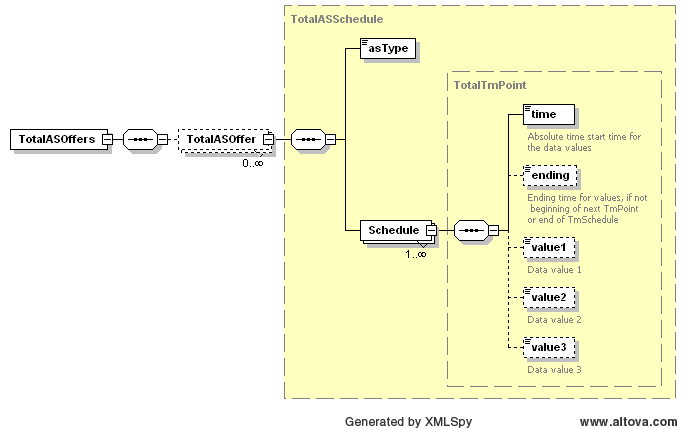

### Total Ancillary Service Offers

This section describes interfaces used to retrieve total ancillary
services offers for DAM Market. This interface will return the full
day data for DAM market for the requesting day.

The request message would use the following message fields:

| Message Element | Value |
|-------------------------------------------|---------------------------------|
| Header/Verb                               | get                             |
| Header/Noun                               | TotalASOffers                   |
| Header/Source                             | *Market participant ID*         |
| Header/UserID                             | *ID of user*                    |
| Request/OperatingDate                     | *Day of interest*               |

The corresponding response messages would use the following message
fields:

| Message Element | Value                |
|-------------------------------------------|------------------------------------------------|
| Header/Verb                               | reply                                          |
| Header/Noun                               | TotalASOffers                                  |
| Header/Source                             | ERCOT                                          |
| Reply/ReplyCode                           | *Reply code, success=OK, error=ERROR or FATAL* |
| Reply/Error                               | *Error message, if error encountered*          |
| Payload/                                  | TotalASOffers                                  |

The payload structure is described by the following diagrams:

The values of ‘value1’ identify the total MW offers for the given AS
type. There is no consideration given to linked offers.

The following is an XML example:

~~~
<ns1:TotalASOffers xmlns:ns0="http://www.ercot.com/schema/2007-05/nodal/eip/il"
    xmlns:ns1="http://www.ercot.com/schema/2007-06/nodal/ews">
    <ns1:TotalASOffer>
        <ns1:asType>Reg-Up</ns1:asType>
        <ns1:Schedule>
            <ns1:time>2023-03-08T00:00:00-06:00</ns1:time>
            <ns1:ending>2023-03-08T01:00:00-06:00</ns1:ending>
            <ns1:value1>7262.6</ns1:value1>
        </ns1:Schedule>
        ... 
    </ns1:TotalASOffer>
    <ns1:TotalASOffer>
        <ns1:asType>Reg-Down</ns1:asType>
        <ns1:Schedule>
            <ns1:time>2023-03-08T00:00:00-06:00</ns1:time>
            <ns1:ending>2023-03-08T01:00:00-06:00</ns1:ending>
            <ns1:value1>6744.6</ns1:value1>
        </ns1:Schedule> 
        ... 
    </ns1:TotalASOffer>
    <ns1:TotalASOffer>
        <ns1:asType>Non-Spin</ns1:asType>
        <ns1:Schedule>
            <ns1:time>2023-03-08T00:00:00-06:00</ns1:time>
            <ns1:ending>2023-03-08T01:00:00-06:00</ns1:ending>
            <ns1:value1>38163.2</ns1:value1>
        </ns1:Schedule> 
        ... 
    </ns1:TotalASOffer>
    <ns1:TotalASOffer>
        <ns1:asType>RRSUF</ns1:asType>
        <ns1:Schedule>
            <ns1:time>2023-03-08T00:00:00-06:00</ns1:time>
            <ns1:ending>2023-03-08T01:00:00-06:00</ns1:ending>
            <ns1:value1>31086.0</ns1:value1>
        </ns1:Schedule> 
        ... 
    </ns1:TotalASOffer>
    <ns1:TotalASOffer>
        <ns1:asType>RRSFF</ns1:asType>
        <ns1:Schedule>
            <ns1:time>2023-03-08T00:00:00-06:00</ns1:time>
            <ns1:ending>2023-03-08T01:00:00-06:00</ns1:ending>
            <ns1:value1>31086.0</ns1:value1>
        </ns1:Schedule> 
        ... 
    </ns1:TotalASOffer>
    <ns1:TotalASOffer>
        <ns1:asType>RRSPF</ns1:asType>
        <ns1:Schedule>
            <ns1:time>2023-03-08T00:00:00-06:00</ns1:time>
            <ns1:ending>2023-03-08T01:00:00-06:00</ns1:ending>
            <ns1:value1>32038.8</ns1:value1>
        </ns1:Schedule> 
        ... 
    </ns1:TotalASOffer>
    <ns1:TotalASOffer>
        <ns1:asType>ECRSS</ns1:asType>
        <ns1:Schedule>
            <ns1:time>2023-03-08T00:00:00-06:00</ns1:time>
            <ns1:ending>2023-03-08T01:00:00-06:00</ns1:ending>
            <ns1:value1>49578.7</ns1:value1>
        </ns1:Schedule> 
        ... 
    </ns1:TotalASOffer>
    <ns1:TotalASOffer>
        <ns1:asType>ECRSM</ns1:asType>
        <ns1:Schedule>
            <ns1:time>2023-03-08T00:00:00-06:00</ns1:time>
            <ns1:ending>2023-03-08T01:00:00-06:00</ns1:ending>
            <ns1:value1>2967.0</ns1:value1>
        </ns1:Schedule> 
        ... 
    </ns1:TotalASOffer>
</ns1:TotalASOffers>
~~~

