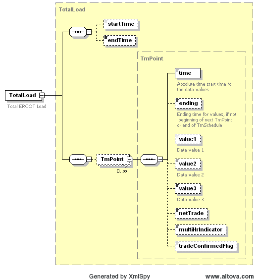

### Total ERCOT Load - Same as System Load

This section describes interfaces used to retrieve the total amount of
ERCOT load. The request message would use the following message
fields:

| Message Element | Value |
|-------------------------------------------|---------------------------------|
| Header/Verb                               | get                             |
| Header/Noun                               | TotalLoad                       |
| Header/Source                             | *Market participant ID*         |
| Header/UserID                             | *ID of user*                    |
| Request/startTime                         | *Start time*                    |
| Request/endTime                           | *End time*                      |

The corresponding response messages would use the following message
fields:

| Message Element | Value       |
|-------------------------------------------|---------------------------------------|
| Header/Verb                               | reply                                 |
| Header/Noun                               | TotalLoad                             |
| Header/Source                             | ERCOT                                 |
| Reply/ReplyCode                           | *Reply code, success=OK, error=ERROR* |
| Reply/Error                               | *Error message, if error encountered* |
| Payload                                   | TotalLoad                             |

The payload structure is described by the following diagram:

The following is an XML example for total amount of ERCOT load:

~~~
<TotalLoad xmlns="http://www.ercot.com/schema/2007-06/nodal/ews"
    xmlns:xsi="http://www.w3.org/2001/XMLSchema-instance"
    xsi:schemaLocation="http://www.ercot.com/schema/2007-06/nodal/ews
    ErcotInformation2.xsd">
    <startTime>2008-01-01T00:00:00-06:00</startTime>
    <endTime>2008-01-02T00:00:00-06:00</endTime>
    <TmPoint>
        <time>2008-01-01T00:00:00-06:00</time>
        <value1>15000</value1>
    </TmPoint>
    <TmPoint>
        <time>2008-01-01T03:00:00-06:00</time>
        <value1>16000</value1>
    </TmPoint>
</TotalLoad>
~~~
