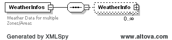
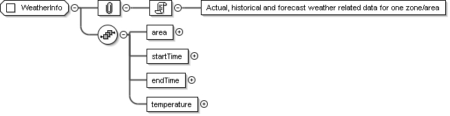

### Weather Data

The purpose of this interface is to provide a query for fetching the
Actual, historical, and forecast weather related information from EMS
system. EMS gets its weather feeds directly from national weather
service. This interface will return the full day data for the
requesting day.

The request message would use the following message fields:

<table>
<colgroup>
<col style="width: 37%" />
<col style="width: 62%" />
</colgroup>
<thead>
<tr class="header">
<th>Message Element</th>
<th>Value</th>
</tr>
</thead>
<tbody>
<tr class="odd">
<td>Header/Verb</td>
<td>get</td>
</tr>
<tr class="even">
<td>Header/Noun</td>
<td>WeatherInfos</td>
</tr>
<tr class="odd">
<td>Header/Source</td>
<td>MARKET PARTICIPANT ID</td>
</tr>
<tr class="even">
<td>Header/UserID</td>
<td>ID of user</td>
</tr>
<tr class="odd">
<td>Request/OperatingDate</td>
<td>Day of Interest</td>
</tr>
<tr class="even">
<td>Request/Option</td>
<td>
Optional: Zone of interest

If not provided Info for all Zones is returned
</td>
</tr>
</tbody>
</table>

The corresponding response messages would use the following message
fields:

| Message Element | Value                               |
|-----------------|-------------------------------------|
| Header/Verb     | reply                               |
| Header/Noun     | WeatherInfos                        |
| Header/Source   | ERCOT                               |
| Reply/ReplyCode | Reply code, success=OK, error=ERROR |
| Reply/Error     | Error message, if error encountered |
| Payload         | WeatherInfos                        |

A list of available zones are provided below. If request for no
specific zones is submitted, weather information for all zones are
returned.

1.  Coast

2.  East

3.  FarWest

4.  North

5.  NorthCentral

6.  SouthCentral

7.  Southern

8.  West

The structure of a reply for weather payload is shown by the following
diagrams:

The following is an XML example for a response for forecast weather
related information from EMS system

~~~
<WeatherInfos xmlns="http://www.ercot.com/schema/2007-06/nodal/ews" xmlns:xsi="http://www.w3.org/2001/XMLSchema-instance" xsi:schemaLocation="http://www.ercot.com/schema/2007-06/nodal/ewsErcotInformation2.xsd">
    <WeatherInfo>
        <area>North Austin</area>
        <startTime>2008-01-01T00:00:00-06:00</startTime>
        <endTime>2008-01-02T00:00:00-06:00</endTime>
        <temperature>72</temperature>
    </WeatherInfo>
</WeatherInfos>
~~~

