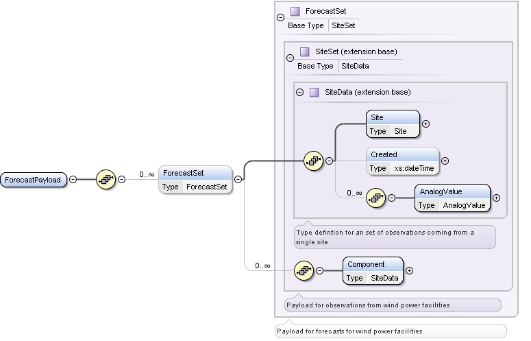

### Wind-Powered Generation Resource Production Potential

The purpose of this interface is to provide a query for fetching
Wind-Powered Generation Resource Production Potential (WGRPP) for each
Wind Generation Resource (WGR) as well as WGRPP forecast for all WGRs.
This interface will return the last hour data for the requesting
hour-end.

The request message would use the following message fields:

<table>
<colgroup>
<col style="width: 34%" />
<col style="width: 65%" />
</colgroup>
<thead>
<tr class="header">
<th>Message Element</th>
<th>Value</th>
</tr>
</thead>
<tbody>
<tr class="odd">
<td>Header/Verb</td>
<td>get</td>
</tr>
<tr class="even">
<td>Header/Noun</td>
<td>WGRPP</td>
</tr>
<tr class="odd">
<td>Header/Source</td>
<td>MARKET PARTICIPANT ID</td>
</tr>
<tr class="even">
<td>Header/UserID</td>
<td>ID of user</td>
</tr>
<tr class="odd">
<td>Request/endTime</td>
<td>End time of interest</td>
</tr>
<tr class="even">
<td>Request/ID</td>
<td>
Optional: WGR identity

If No WGR is provided, WGRPP for all WGRs is returned.
</td>
</tr>
</tbody>
</table>

The corresponding response messages would use the following message
fields:

| Message Element | Value                               |
|-----------------|-------------------------------------|
| Header/Verb     | reply                               |
| Header/Noun     | WGRPP                               |
| Header/Source   | ERCOT                               |
| Reply/ReplyCode | Reply code, success=OK              |
| Reply/Error     | Error message, if error encountered |
| Payload/        | WGRPP                               |

The following diagram defines the ForecastPayload structure in the WGRPP
response

The following is an abbreviated XML example of a WGRPP response:

~~~
<ns1:ForecastPayload xmlns:ns0="http://www.ercot.com/schema/2007-05/nodal/eip/il"
    xmlns:ns1="http://www.ercot.com/schema/2007-06/nodal/ews">
    <ns1:ForecastSet>
        <ns1:Site duns="1234567890000" name="WIND_1" qseid="QSE1">SITE1</ns1:Site>
        <ns1:Created>2016-01-14T09:10:59-06:00</ns1:Created>
        <ns1:AnalogValue statistic="MEAN" timeStamp="2016-01-14T10:00:00-06:00" type="WGRPP"
            units="MW">5.63E1</ns1:AnalogValue>
        <ns1:AnalogValue statistic="MEAN" timeStamp="2016-01-21T09:00:00-06:00" type="WGRPP"
            units="MW">2.46E1</ns1:AnalogValue>
    </ns1:ForecastSet>
    <ns1:ForecastSet>
        <ns1:Site duns="1234567890000" name="WIND_2" qseid="QSE1">SITE2</ns1:Site>
        <ns1:Created>2016-01-14T09:10:59-06:00</ns1:Created>
        <ns1:AnalogValue statistic="MEAN" timeStamp="2016-01-14T10:00:00-06:00" type="WGRPP"
            units="MW">7.65E1</ns1:AnalogValue>
        <ns1:AnalogValue statistic="MEAN" timeStamp="2016-01-21T09:00:00-06:00" type="WGRPP"
            units="MW">4.19E1</ns1:AnalogValue>
    </ns1:ForecastSet>
</ns1:ForecastPayload>
~~~
