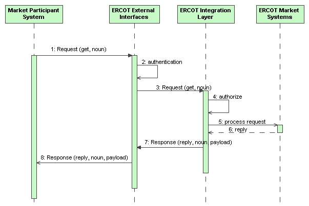

# Market Information 

This service is used to request specific types of market-related
information. These are read-only interfaces, as opposed to transactional
interfaces.

## Interfaces Provided

Specific interfaces using specific combinations of verbs and nouns (i.e.
payload types) are defined to permit a market participant to
programmatically access market information. The verb to be used for
requests would in all cases be ‘get’. The noun would identify the type
of information being requested. Each request could use a message
‘Request’ package to specify one or more parameters that would qualify
the request.

The processing sequence is shown in the following sequence diagram:

## Interfaces Required

The messages for market information requests would use the following
message fields:

| Message Element | Value                                 |
|-------------------------------------------|-----------------------------------------------------------------|
| Header/Verb                               | get                                                             |
| Header/Noun                               | *Name of payload type*                                          |
| Header/Source                             | *Market participant ID*                                         |
| Header/UserID                             | *ID of user*                                                    |
| Request/?                                 | *Optional: Other request parameters may be specified as needed* |
| Payload                                   | *Message payload data with type defined by Noun*                |

The corresponding response messages would use the following message
fields:

| Message Element | Value                |
|-------------------------------------------|------------------------------------------------|
| Header/Verb                               | reply                                          |
| Header/Noun                               | *Defined payload type name*                    |
| Header/Source                             | ERCOT                                          |
| Reply/ReplyCode                           | *Reply code, success=OK, error=ERROR or FATAL* |
| Reply/Error                               | *May be any number of error messages*          |
| Payload                                   | *Defined payload type*                         |

In the cases of payloads that would otherwise exceed 1 megabyte, the
payloads would be zipped, base64 encoded and stored within the
‘Payload/Compressed’ tag.

[AwardSet](./Market%20Information%20Messages/AwardSet.md) 
[AwardedAS](./Market%20Information%20Messages/AwardedAS.md) 
[AwardedCRR](./Market%20Information%20Messages/AwardedCRR.md) 
[AwardedEnergyBid](./Market%20Information%20Messages/AwardedEnergyBid.md) 
[AwardedEnergyOffer](./Market%20Information%20Messages/AwardedEnergyOffer.md) 
[AwardedEnergyOnlyOffer](./Market%20Information%20Messages/AwardedEnergyOnlyOffer.md) 
[AwardedPTPObligation](./Market%20Information%20Messages/AwardedPTPObligation.md) 
[Forecasted Load](./Market%20Information%20Messages/Forecasted%20Load.md) 
[System Load - *Same as Total ERCOT Load*](./Market%20Information%20Messages/System%20Load.md) 
[Market Totals - *Same as Total DAM Energy*](./Market%20Information%20Messages/Market%20Totals.md) 
[Market LMPs, SPPs and Price Corrections](./Market%20Information%20Messages/Market%20LMPs,%20SPPs,%20Price%20Corrected%20LMPs%20and%20Price%20Corrected%20SPPs.md) 
[Market MCPCs](./Market%20Information%20Messages/Market%20MCPCs.md) 
[Binding Constraints](./Market%20Information%20Messages/Binding%20Constraints.md) 
[SCED Violated Constraints](./Market%20Information%20Messages/SCED%20Violated%20Constraints.md) 
[Price Corrected SCED Violated Constraints](./Market%20Information%20Messages/Price%20Corrected%20SCED%20Violated%20Constraints.md) 
[Ancillary Service Obligation](./Market%20Information%20Messages/Ancillary%20Service%20Obligation.md) 
[Dynamic Ratings](./Market%20Information%20Messages/Dynamic%20Ratings.md) 
[Load Ratio Share](./Market%20Information%20Messages/Load%20Ratio%20Share.md) 
[Aggregated Ancillary Service Offer Curves](./Market%20Information%20Messages/Aggregated%20Ancillary%20Service%20Offer%20Curves.md) 
[Ancillary Service Plan](./Market%20Information%20Messages/Ancillary%20Service%20Plan.md) 
[Startup and Shutdown Instructions](./Market%20Information%20Messages/Startup%20and%20Shutdown%20Instructions.md) 
[Total Ancillary Service Offers](./Market%20Information%20Messages/Total%20Ancillary%20Service%20Offers.md) 
[Total DAM Energy - *Same as Market Totals*](./Market%20Information%20Messages/Total%20DAM%20Energy.md) 
[Weather Data](./Market%20Information%20Messages/Weather%20Data.md) 
[Responsive Reserve Capacity - *See System Parameters*](./Market%20Information%20Messages/Responsive%20Reserve%20Capacity.md) 
[Non-Spinning Reserve - *See System Parameters*](./Market%20Information%20Messages/Non-Spinning%20Reserve.md) 
[Undeployed Reg-Up and Reg-Down - *See System Parameters*](./Market%20Information%20Messages/Undeployed%20Reg-Up%20and%20Reg-Down.md) 
[Available Capacity - *See System Parameters*](./Market%20Information%20Messages/Available%20Capacity.md) 
[Wind-Powered Generation Resource Production Potential](./Market%20Information%20Messages/Wind-Powered%20Generation%20Resource%20Production%20Potential.md) 
[Short-Term Wind Power Forecast](./Market%20Information%20Messages/Short-Term%20Wind%20Power%20Forecast.md) 
[Total ERCOT Load - *Same as System Load*](./Market%20Information%20Messages/Total%20ERCOT%20Load%20-%20Same%20as%20System%20Load.md) 
[Total ERCOT Generation Operating Reserve - *See System Parameters*](./Market%20Information%20Messages/Total%20ERCOT%20Generation%20Operating%20Reserve.md) 
[UnconfirmedTrades](./Market%20Information%20Messages/UnconfirmedTrades.md) 
[ConfirmedTrades](./Market%20Information%20Messages/ConfirmedTrades.md) 
[DAM Ancillary Service Offer Insufficiency Report](./Market%20Information%20Messages/DAM%20Ancillary%20Service%20Offer%20Insufficiency%20Report.md) 
[End of Adjustment Period Results](./Market%20Information%20Messages/End%20of%20Adjustment%20Period%20Results.md) 
[Two Hour Warning Results](./Market%20Information%20Messages/Two%20Hour%20Warning%20Results.md) 
[DAM Phase II Validation Results](./Market%20Information%20Messages/DAM%20Phase%20II%20Validation%20Results.md) 
[System Parameters](./Market%20Information%20Messages/System%20Parameters.md) 
[RTD Indicative Base Points](./Market%20Information%20Messages/RTD%20Indicative%20Base%20Points.md) 
[RTD Indicative LMPs](./Market%20Information%20Messages/RTD%20Indicative%20LMPs.md) 
[SCED ORDC Price Adders](./Market%20Information%20Messages/SCED%20ORDC%20Price%20Adders.md) 
[RT Price Adder ORDC](./Market%20Information%20Messages/RT%20Price%20Adder%20ORDC.md) 
[RTD Indicative ORDC Price Adders](./Market%20Information%20Messages/RTD%20Indicative%20ORDC%20Price%20Adders.md) 
[Photovoltaic Generation Resource Production Potential](./Market%20Information%20Messages/Photovoltaic%20Generation%20Resource%20Production%20Potential.md) 
[Short-Term Photovoltaic Power Forecast](./Market%20Information%20Messages/Short-Term%20Photovoltaic%20Power%20Forecast.md) 
[Price Corrected SOTG/SODG 15-min Prices](./Market%20Information%20Messages/Price%20Corrected%20SOTG_SODG%2015-min%20Prices.md) 
[Price Corrected SOTG/SODG LMPs](./Market%20Information%20Messages/Price%20Corrected%20SOTG_SODG%20LMPs.md) 