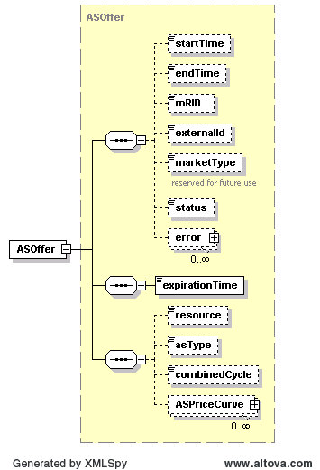
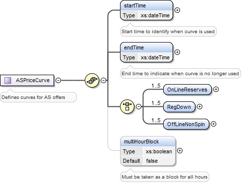
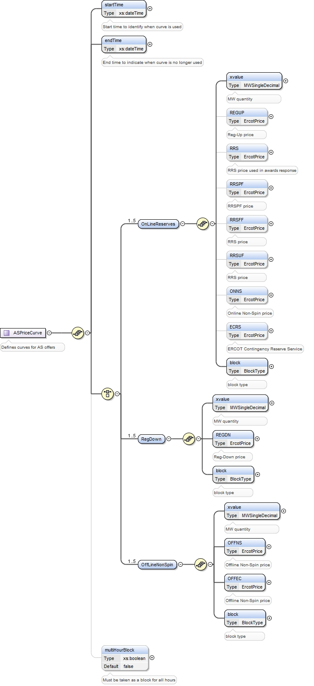

### Ancillary Service Offer (ASO)

An Ancillary Service Offer is used to offer ancillary services from a
specified resource. The following diagram describes the structure of
an Ancillary Service Offer (ASOffer):

The ASPriceCurve structure when used for ASOffers uses OnLineReserves
(to provide price points for Reg-Up, RRS, and/or Online Non-Spin),
RegDown elements (to provide price points for Reg-Down), or
OffLineNonSpin elements (for Offline Non-Spin and/or OFFEC). The
choice depends upon the value of asType, where the values provided can
be one of REGUP-RRS-ONNS, Reg-Down or Off-Non-Spin. Up to five points
can be specified for OnLineReserves, RegDown, or OffLineNonSpin. This
structure is described in the following figure:

The following diagram provides details of the OnLineReserves, RegDown,
and OffLineNonSpin structures:

On submission, the following table describes the items used for an ASOffer:

<table>
<colgroup>
<col style="width: 38%" />
<col style="width: 12%" />
<col style="width: 15%" />
<col style="width: 16%" />
<col style="width: 16%" />
</colgroup>
<thead>
<tr class="header">
<th><em>Element</em></th>
<th><em>Req?</em></th>
<th><em>Datatype</em></th>
<th><em>Description</em></th>
<th><em>Values</em></th>
</tr>
</thead>
<tbody>
<tr class="odd">
<td>startTime</td>
<td>K</td>
<td>dateTime</td>
<td>Start time for bid</td>
<td>Valid start hour boundary for trade date</td>
</tr>
<tr class="even">
<td>endTime</td>
<td>K</td>
<td>dateTime</td>
<td>End time for bid</td>
<td>Valid end hour boundary for trade date</td>
</tr>
<tr class="odd">
<td>externalId</td>
<td>N</td>
<td>string</td>
<td>External ID</td>
<td>QSE supplied</td>
</tr>
<tr class="even">
<td>expirationTime</td>
<td>Y</td>
<td>dateTime</td>
<td>Time of offer expiration</td>
<td>Valid time before trade date</td>
</tr>
<tr class="odd">
<td>resource</td>
<td>K</td>
<td>string</td>
<td>Resource</td>
<td>Valid resource name</td>
</tr>
<tr class="even">
<td>asType</td>
<td>K</td>
<td>string</td>
<td>AS key code</td>
<td>
Off-Non-Spin

Reg-Down

REGUP-RRS-ONNS
</td>
</tr>
<tr class="odd">
<td>combinedCycle</td>
<td>N</td>
<td>string</td>
<td>Combined cycle</td>
<td>Not required. Value ignored if provided.</td>
</tr>
<tr class="even">
<td>PriceCurve/startTime</td>
<td>Y</td>
<td>dateTime</td>
<td>Start time for curve</td>
<td>Valid hour boundary</td>
</tr>
<tr class="odd">
<td>PriceCurve/endTime</td>
<td>Y</td>
<td>dateTime</td>
<td>End time for curve</td>
<td>Valid hour boundary</td>
</tr>
<tr class="even">
<td>
ASPriceCurve/OnLineReserves/xvalue

(Required if

asType = REGUP-RRS-ONNS)
</td>
<td>Y</td>
<td>float</td>
<td>Megawatts</td>
<td>Quantity in MW</td>
</tr>
<tr class="odd">
<td>ASPriceCurve/OnLineReserves/REGUP</td>
<td>N</td>
<td>float</td>
<td>$/MWh</td>
<td>Price in $/MWh</td>
</tr>
<tr class="even">
<td>ASPriceCurve/OnLineReserves /RRSPF</td>
<td>N</td>
<td>float</td>
<td>$/MWh</td>
<td>Price in $/MWh</td>
</tr>
<tr class="odd">
<td>ASPriceCurve/ OnLineReserves /RRSFF</td>
<td>N</td>
<td>float</td>
<td>$/MWh</td>
<td>Price in $/MWh</td>
</tr>
<tr class="even">
<td>ASPriceCurve/ OnLineReserves /RRSUF</td>
<td>N</td>
<td>float</td>
<td>$/MWh</td>
<td>Price in $/MWh</td>
</tr>
<tr class="odd">
<td>ASPriceCurve/ OnLineReserves /ONNS</td>
<td>N</td>
<td>float</td>
<td>$/MWh</td>
<td>Price in $/MWh</td>
</tr>
<tr class="even">
<td>ASPriceCurve/ OnLineReserves /ECRS</td>
<td>N</td>
<td>float</td>
<td>$/MWh</td>
<td>Price in $/MWh</td>
</tr>
<tr class="odd">
<td>
ASPriceCurve/ OnLineReserves /block

(Required if

asType = REGUP-RRS-ONNS)
</td>
<td>Y</td>
<td>string</td>
<td>Used as an indicator to describe the type of block</td>
<td>FIXED or VARIABLE</td>
</tr>
<tr class="even">
<td>
ASPriceCurve/RegDown/xvalue or
ASPriceCurve/OffLineNonSpin/xvalue

(Required if

asType = Reg-Down or Off-Non-Spin)
</td>
<td>Y</td>
<td>float</td>
<td>Megawatts</td>
<td>Quantity in MW</td>
</tr>
<tr class="odd">
<td>
ASPriceCurve/RegDown/REGDN

(Required if asType=Reg-Down)
</td>
<td>Y</td>
<td>float</td>
<td>$/MWh</td>
<td>Price in $/MWh</td>
</tr>
<tr class="even">
<td>
ASPriceCurve/OffLineNonSpin/OFFNS

(asType=Off-Non-Spin)
</td>
<td>N</td>
<td>float</td>
<td>$/MWh</td>
<td>Price in $/MWh</td>
</tr>
<tr class="odd">
<td>
ASPriceCurve/OffLineNonSpin/OFFEC

(asType=Off-Non-Spin)
</td>
<td>N</td>
<td>float</td>
<td>$/MWh</td>
<td>Price in $/MWh</td>
</tr>
<tr class="even">
<td>
ASPriceCurve/RegDown/block or
ASPriceCurve/OffLineNonSpin/block

(Required if

asType = Reg-Down or Off-Non-Spin)
</td>
<td>Y</td>
<td>String</td>
<td>Used as an indicator to describe the type of block</td>
<td>FIXED or VARIABLE</td>
</tr>
<tr class="odd">
<td>ASPriceCurve/multiHourBlock</td>
<td>N</td>
<td>Boolean</td>
<td>Indicates if offer must be taken as a block for all hours.</td>
<td>Default is false</td>
</tr>
</tbody>
</table>

The following is an XML example for an ASOffer, for the AS types of
Reg-Up, RRS, and online Non-Spin:
~~~
    <BidSet>
       <tradingDate>2021-11-16</tradingDate>
       <ASOffer>
          <startTime>2021-11-16T00:00:00-06:00</startTime>
          <endTime>2021-11-17T00:00:00-06:00</endTime>
          <externalId>ERCOTTEST</externalId>
          <expirationTime>2021-11-16T23:59:59-06:00</expirationTime>
          <resource>RES_1</resource>
          <asType>REGUP-RRS-ONNS</asType>
          <ASPriceCurve>
              <startTime>2021-11-16T00:00:00.000-06:00</startTime>
              <endTime>2021-11-17T00:00:00.000-06:00</endTime>
              <OnLineReserves>
                <xvalue>11</xvalue>
                <REGUP>23.00</REGUP>
                <RRSPF>20.00</RRSPF>
                <RRSFF>19.00</RRSFF>
                <RRSUF>18.00</RRSUF>
                <ONNS>1</ONNS>
                <ECRS>10</ECRS>
                <block>VARIABLE</block>
             </OnLineReserves>
           </ASPriceCurve>
         </ASOffer>
    </BidSet>
~~~

The following is another XML example for an ASOffer, where the AS type
is only Reg-Down:

~~~
    <ASOffer>
		<startTime>2008-01-01T00:00:00-06:00</startTime>
	    <endTime>2008-01-02T00:00:00-06:00</endTime>
		<externalId>MyExternalID12345</externalId>
	    <expirationTime>2007-12-31T22:00:00-06:00</expirationTime>
	    <resource>Resource1</resource>
	    <asType>Reg-Down</asType>
	    <ASPriceCurve>
		    <startTime>2008-01-01T00:00:00-06:00</startTime>
		    <endTime>2008-01-01T03:00:00-06:00</endTime>
		    <RegDown>
		    	<xvalue>60</xvalue>
			    <REGDN>20.00</REGDN>
			    <block>FIXED</block>
		    </RegDown>
		    <multiHourBlock>false</multiHourBlock>
	    </ASPriceCurve>
	    <ASPriceCurve>
		    <startTime>2008-01-01T03:00:00-06:00</startTime>
		    <endTime>2008-01-02T00:00:00-06:00</endTime>
		    <RegDown>
		    	<xvalue>80</xvalue>
		    	<REGDN>23.00</REGDN>
		    	<block>FIXED</block>
		    </RegDown>
		    <multiHourBlock>false</multiHourBlock>
	    </ASPriceCurve>
    </ASOffer>
~~~

The following is another XML example for an ASOffer, where the AS type is Off-Non-Spin:
~~~

    <ASOffer>
		<startTime>2008-01-01T00:00:00-06:00</startTime>
	    <endTime>2008-01-02T00:00:00-06:00</endTime>
		<externalId>MyExternalID12341</externalId>
	    <expirationTime>2007-12-31T22:00:00-06:00</expirationTime>
	    <resource>Resource1</resource>
	    <asType>Off-Non-Spin</asType>
	    <ASPriceCurve>
		    <startTime>2008-01-01T00:00:00-06:00</startTime>
		    <endTime>2008-01-01T03:00:00-06:00</endTime>
		    <OffLineNonSpin>
			    <xvalue>60</xvalue>
			    <OFFNS>20.00</OFFNS>
                <OFFEC>23.00</OFFEC>
			    <block>VARIABLE</block>
		    </OffLineNonSpin>
            <multiHourBlock>true</multiHourBlock>
	    </ASPriceCurve>
    </ASOffer>
~~~
And the corresponding response:
~~~
    <ns1:BidSet xmlns:ns1="http://www.ercot.com/schema/2007-06/nodal/ews">
        <ns1:tradingDate>2008-01-01</ns1:tradingDate>
        <ns1:ASOffer>
            <ns1:mRID>QSAMP.20080101.ASO.Resource1.Off-Non-Spin</ns1:mRID>
            <ns1:externalId/>
            <ns1:status>ACCEPTED</ns1:status>
            <ns1:error>
                <ns1:severity>INFORMATIVE</ns1:severity>
                <ns1:text>Successfully processed the ERCOT As Offer.</ns1:text>
            </ns1:error>
        </ns1:ASOffer>
    </ns1:BidSet>

