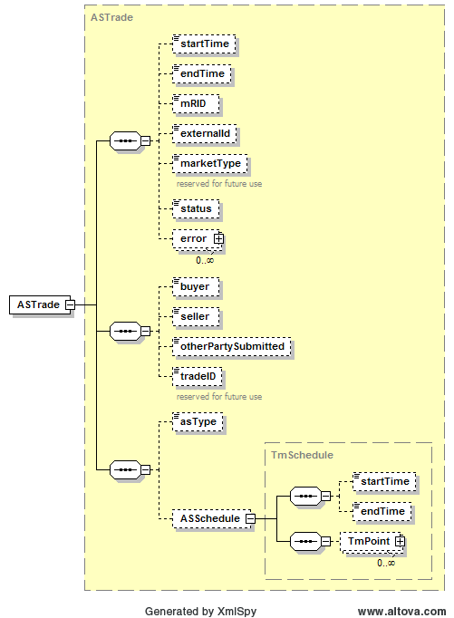

### Ancillary Service Trade (AST)

An Ancillary Service Trade is used to describe a scheduled trade of
ancillary services between a buyer and a seller. The following diagram
describes the structure of an Ancillary Service Trade (ASTrade):

The ASSchedule structure is based upon a TmSchedule as described
previously in this document. The submission of an ASTrade (or
generally any trade) requires a matching trade to be submitted by the
counter party before the close of the market. On submission, the
following table describes the items used for an ASTrade:

<table>
<colgroup>
<col style="width: 29%" />
<col style="width: 14%" />
<col style="width: 18%" />
<col style="width: 19%" />
<col style="width: 18%" />
</colgroup>
<thead>
<tr class="header">
<th><em>Element</em></th>
<th><em>Req?</em></th>
<th><em>Datatype</em></th>
<th><em>Description</em></th>
<th><em>Values</em></th>
</tr>
</thead>
<tbody>
<tr class="odd">
<td>startTime</td>
<td>K</td>
<td>dateTime</td>
<td>Start time for bid</td>
<td>Valid start hour boundary for trade date</td>
</tr>
<tr class="even">
<td>endTime</td>
<td>K</td>
<td>dateTime</td>
<td>End time for bid</td>
<td>Valid end hour boundary for trade date</td>
</tr>
<tr class="odd">
<td>externalId</td>
<td>N</td>
<td>string</td>
<td>External ID</td>
<td>QSE supplied</td>
</tr>
<tr class="even">
<td>asType</td>
<td>K</td>
<td>string</td>
<td>Ancillary service type</td>
<td>
Non-Spin

NSPNM

Reg-Down

Reg-Up

RRSUF

RRSPF

RRSFF

ECRSS

ECRSM
</td>
</tr>
<tr class="odd">
<td>buyer</td>
<td>K</td>
<td>string</td>
<td>Trade buyer</td>
<td>Valid QSE</td>
</tr>
<tr class="even">
<td>seller</td>
<td>K</td>
<td>string</td>
<td>Trade seller</td>
<td>Valid QSE</td>
</tr>
<tr class="odd">
<td>otherPartySubmitted</td>
<td>N</td>
<td>Boolean</td>
<td>
For querying purposes only:

True if trade was entered by other party
</td>
<td>
true (default)

or false
</td>
</tr>
<tr class="even">
<td>tradeID</td>
<td>N</td>
<td>string</td>
<td>reserved for future use</td>
<td></td>
</tr>
<tr class="odd">
<td>ASSchedule/startTime</td>
<td>N</td>
<td>dateTime</td>
<td>not used</td>
<td>not used</td>
</tr>
<tr class="even">
<td>ASSchedule/endTime</td>
<td>N</td>
<td>dateTime</td>
<td>not used</td>
<td>not used</td>
</tr>
<tr class="odd">
<td>
ASSchedule/

TmPoint/time
</td>
<td>Y</td>
<td>dateTime</td>
<td>Absolute time for beginning of interval</td>
<td>Valid time within the trading date</td>
</tr>
<tr class="even">
<td>
ASSchedule/

TmPoint/ending
</td>
<td>N</td>
<td>dateTime</td>
<td>Absolute time for end of interval</td>
<td>Valid time within the trading date</td>
</tr>
<tr class="odd">
<td>
ASSchedule/

TmPoint/value1
</td>
<td>Y</td>
<td>float</td>
<td>Megawatts</td>
<td>&gt;= 0</td>
</tr>
</tbody>
</table>

The following is an XML example for an ASTrade:

~~~
<BidSet xmlns="http://www.ercot.com/schema/2007-06/nodal/ews" xmlns:ns2="http://www.ercot.com/schema/2007-06/nodal/ews">
    <tradingDate>2022-01-12</tradingDate>
    <ASTrade>
        <startTime>2022-01-12T00:00:00-06:00</startTime>
        <endTime>2022-01-12T08:00:00-06:00</endTime>
        <externalId>123456</externalId>
        <buyer>QSAMP2</buyer>
        <seller>QSAMP1</seller>
        <asType>Non-Spin</asType>
        <ASSchedule>
            <TmPoint>
                <time>2022-01-12T00:00:00-06:00</time>
                <ending>2022-01-12T06:00:00-06:00</ending>
                <value1>38.0</value1>
            </TmPoint>
            <TmPoint>
                <time>2022-01-12T06:00:00-06:00</time>
                <ending>2022-01-12T08:00:00-06:00</ending>
                <value1>35.0</value1>
            </TmPoint>
        </ASSchedule>
    </ASTrade>
    <ASTrade>
        <startTime>2022-01-12T00:00:00-06:00</startTime>
        <endTime>2022-01-12T03:00:00-06:00</endTime>
        <externalId>123457</externalId>
        <buyer>QSAMP3</buyer>
        <seller>QSAMP1</seller>
        <asType>NSPNM</asType>
        <ASSchedule>
            <TmPoint>
                <time>2022-01-12T00:00:00-06:00</time>
                <ending>2022-01-12T03:00:00-06:00</ending>
                <value1>41.0</value1>
            </TmPoint>
        </ASSchedule>
    </ASTrade>
    <ASTrade>
        <startTime>2022-01-12T00:00:00-06:00</startTime>
        <endTime>2022-01-12T01:00:00-06:00</endTime>
        <buyer>QSAMP1</buyer>
        <seller>QSAMP2</seller>
        <otherPartySubmitted>false</otherPartySubmitted>
        <asType>RRSPF</asType>
        <ASSchedule>
            <TmPoint>
                <time>2021-11-02T00:00:00.000-05:00</time>
                <ending>2021-11-02T01:00:00.000-05:00</ending>
                <value1>22</value1>
            </TmPoint>
        </ASSchedule>
    </ASTrade>
    <ASTrade>
        <startTime>2022-01-12T00:00:00-06:00</startTime>
        <endTime>2022-01-12T01:00:00-06:00</endTime>
        <buyer>QSAMP1</buyer>
        <seller>QSAMP2</seller>
        <otherPartySubmitted>false</otherPartySubmitted>
        <asType>ECRSS</asType>
        <ASSchedule>
            <TmPoint>
                <time>2021-11-02T00:00:00.000-05:00</time>
                <ending>2021-11-02T01:00:00.000-05:00</ending>
                <value1>32</value1>
            </TmPoint>
        </ASSchedule>
    </ASTrade>
    <ASTrade>
        <startTime>2022-01-12T00:00:00-06:00</startTime>
        <endTime>2022-01-12T01:00:00-06:00</endTime>
        <buyer>QSAMP1</buyer>
        <seller>QSAMP2</seller>
        <otherPartySubmitted>false</otherPartySubmitted>
        <asType>ECRSM</asType>
        <ASSchedule>
            <TmPoint>
                <time>2021-11-02T00:00:00.000-05:00</time>
                <ending>2021-11-02T01:00:00.000-05:00</ending>
                <value1>25</value1>
            </TmPoint>
        </ASSchedule>
    </ASTrade>
</BidSet>
~~~

And the corresponding response:

~~~
<ns1:BidSet xmlns:ns1="http://www.ercot.com/schema/2007-06/nodal/ews">
    <ns1:tradingDate>2022-01-12</ns1:tradingDate>
    <ns1:submitTime>2022-01-10T15:33:03.456-06:00</ns1:submitTime>
    <ns1:ASTrade>
        <ns1:mRID>QSAMP1.20220112.AST.Non-Spin.QSAMP2.QSAMP1</ns1:mRID>
        <ns1:status>SUBMITTED</ns1:status>
    </ns1:ASTrade>
    <ns1:ASTrade>
        <ns1:mRID>QSAMP1.20220112.AST.NSPNM.QSAMP3.QSAMP1</ns1:mRID>
        <ns1:status>SUBMITTED</ns1:status>
    </ns1:ASTrade>
    <ns1:ASTrade>
        <ns1:mRID>QSAMP1.20220112.AST.RRSPF.QSAMP1.QSAMP2</ns1:mRID>
        <ns1:status>SUBMITTED</ns1:status>
    </ns1:ASTrade>
    <ns1:ASTrade>
        <ns1:mRID>QSAMP1.20220112.AST.ECRSS.QSAMP1.QSAMP2</ns1:mRID>
        <ns1:status>SUBMITTED</ns1:status>
    </ns1:ASTrade>
    <ns1:ASTrade>
        <ns1:mRID>QSAMP1.20220112.AST.ECRSM.QSAMP1.QSAMP2</ns1:mRID>
        <ns1:status>SUBMITTED</ns1:status>
    </ns1:ASTrade>
</ns1:BidSet>
~~~
