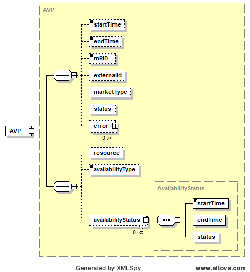

### Availability Plan (AVP)

The availability plan is an hourly representation of availability of
RMR or Synchronous Condenser units or an hourly representation of the
capability of Black Start Resources submitted to ERCOT by QSEs
representing RMR Units, Synchronous Condenser Units or Black Start
Resources. The following diagram describes the structure of an
Availability Plan (AVP):

The AVP submission contains the resource name and the availabilityType
(RMR, SYNCCOND, BLACKSTART and FFSS) and the availabilityStatus of the
resource (A for Available and U for Unavailable). If more than one
availabilityStatus block is provided, start and end times must not
overlap.

AVP submissions can be cancelled. A resubmission of an AVP overwrites
the previous submission. On submission, the following table describes
the items used for a AVP:

<table>
<colgroup>
<col style="width: 30%" />
<col style="width: 13%" />
<col style="width: 16%" />
<col style="width: 18%" />
<col style="width: 20%" />
</colgroup>
<thead>
<tr class="header">
<th><em>Element</em></th>
<th><em>Req?</em></th>
<th><em>Datatype</em></th>
<th><em>Description</em></th>
<th><em>Values</em></th>
</tr>
</thead>
<tbody>
<tr class="odd">
<td>startTime</td>
<td>N</td>
<td>dateTime</td>
<td>Start time for AVP</td>
<td>Valid start hour boundary for trade date</td>
</tr>
<tr class="even">
<td>endTime</td>
<td>N</td>
<td>dateTime</td>
<td>End time for AVP</td>
<td>Valid end hour boundary for trade date</td>
</tr>
<tr class="odd">
<td>externalId</td>
<td>N</td>
<td>string</td>
<td>External ID</td>
<td>QSE supplied</td>
</tr>
<tr class="even">
<td>resource</td>
<td>K</td>
<td>string</td>
<td>Resource</td>
<td>Valid resource name</td>
</tr>
<tr class="odd">
<td>availabilityType</td>
<td>K</td>
<td>string</td>
<td>Resource Availability Type</td>
<td>
RMR, SYNCCOND BLACKSTART

FFSS
</td>
</tr>
<tr class="even">
<td>availabilityStatus/startTime</td>
<td>Y</td>
<td>dateTime</td>
<td>Start time for status</td>
<td>Valid hour boundary</td>
</tr>
<tr class="odd">
<td>availabilityStatus/endTime</td>
<td>Y</td>
<td>dateTime</td>
<td>End time for status</td>
<td>Valid hour boundary</td>
</tr>
<tr class="even">
<td>availabilityStatus/status</td>
<td>Y</td>
<td>dateTime</td>
<td>Resource Availability Status</td>
<td>A (Available) 
U (Unavailable)</td>
</tr>
</tbody>
</table>

The following is an XML example for an AVP:

~~~
<BidSet xmlns="http://www.ercot.com/schema/2007-06/nodal/ews">
    <tradingDate>2012-11-08</tradingDate>
    <AVP xmlns="http://www.ercot.com/schema/2007-06/nodal/ews"
        xmlns:xsi="http://www.w3.org/2001/XMLSchema-instance"
        xsi:schemaLocation="http://www.ercot.com/schema/2007-06/nodal/ews”>
        <startTime>2012-11-08T00:00:00-05:00</startTime>
        <endTime>2012-11-09T00:00:00-05:00</endTime>
        <resource>RESOURCE1</resource>
        <availabilityType>FFSS</availabilityType>
        <availabilityStatus>
            <startTime>2012-11-08T00:00:00-05:00</startTime>
            <endTime>2012-11-08T01:00:00-05:00</endTime>
            <status>A</status>
        </availabilityStatus>
        <availabilityStatus>
            <startTime>2012-11-08T01:00:00-05:00</startTime>
            <endTime>2012-11-09T00:00:00-05:00</endTime>
            <status>U</status>
        </availabilityStatus>
    </AVP>
</BidSet>
~~~

And the corresponding response:

~~~
<ns1:BidSet xmlns:ns1="http://www.ercot.com/schema/2007-06/nodal/ews">
    <ns1:tradingDate>2012-11-08</ns1:tradingDate>
    <ns1:submitTime>2012-11-06T10:05:54.455-06:00</ns1:submitTime>
    <ns1:AVP>
        <ns1:mRID>QSE1.20121108.AVP.RESOURCE1.FFSS</ns1:mRID>
        <ns1:externalId/>
        <ns1:status>SUBMITTED</ns1:status>
    </ns1:AVP>
</ns1:BidSet>
~~~

