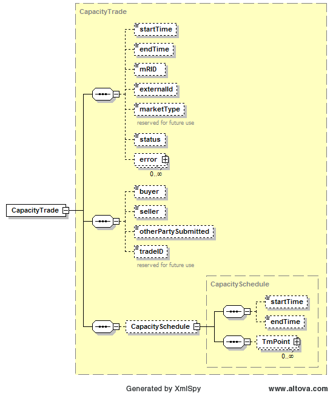

### Capacity Trade (CT)

The following diagram describes the structure of a Capacity Trade:

The CapacitySchedule structure is identical to the structure described
previously in this document. The submission of a trade requires a
patching trade to be submitted by the counter party. The following
table describes the required fields:

<table>
<colgroup>
<col style="width: 38%" />
<col style="width: 9%" />
<col style="width: 14%" />
<col style="width: 19%" />
<col style="width: 18%" />
</colgroup>
<thead>
<tr class="header">
<th><em>Element</em></th>
<th><em>Req?</em></th>
<th><em>Datatype</em></th>
<th><em>Description</em></th>
<th><em>Values</em></th>
</tr>
</thead>
<tbody>
<tr class="odd">
<td>startTime</td>
<td>K</td>
<td>dateTime</td>
<td>Start time for bid</td>
<td>Valid start hour boundary for trade date</td>
</tr>
<tr class="even">
<td>endTime</td>
<td>K</td>
<td>dateTime</td>
<td>End time for bid</td>
<td>Valid end hour boundary for trade date</td>
</tr>
<tr class="odd">
<td>externalId</td>
<td>N</td>
<td>string</td>
<td>External ID</td>
<td>QSE supplied</td>
</tr>
<tr class="even">
<td>buyer</td>
<td>K</td>
<td>string</td>
<td>Trade buyer</td>
<td>Valid QSE</td>
</tr>
<tr class="odd">
<td>seller</td>
<td>K</td>
<td>string</td>
<td>Trade seller</td>
<td>Valid QSE</td>
</tr>
<tr class="even">
<td>otherPartySubmitted</td>
<td>N</td>
<td>Boolean</td>
<td>
For querying purposes only:

True if trade was entered by other party
</td>
<td>true (default) or false</td>
</tr>
<tr class="odd">
<td>tradeID</td>
<td>N</td>
<td>string</td>
<td>reserved for future use</td>
<td></td>
</tr>
<tr class="even">
<td>CapacitySchedule/startTime</td>
<td>N</td>
<td>dateTime</td>
<td>not used</td>
<td>not used</td>
</tr>
<tr class="odd">
<td>CapacitySchedule/endTime</td>
<td>N</td>
<td>dateTime</td>
<td>not used</td>
<td>not used</td>
</tr>
<tr class="even">
<td>
CapacitySchedule/

TmPoint/time
</td>
<td>Y</td>
<td>dateTime</td>
<td>Absolute time for beginning of interval</td>
<td>Valid time within the trading date</td>
</tr>
<tr class="odd">
<td>
CapacitySchedule/

TmPoint/ending
</td>
<td>N</td>
<td>dateTime</td>
<td>Absolute time for end of interval</td>
<td>Valid time within the trading date</td>
</tr>
<tr class="even">
<td>
CapacitySchedule/

TmPoint/value1
</td>
<td>Y</td>
<td>float</td>
<td>Megawatts</td>
<td>&gt;= 0</td>
</tr>
</tbody>
</table>

The following is an XML example for a CapacityTrade:

~~~
<BidSet xmlns="http://www.ercot.com/schema/2007-06/nodal/ews" xmlns:xsi="http://www.w3.org/2001/XMLSchema-instance" xsi:schemaLocation="http://www.ercot.com/schema/2007-06/nodal/ews ErcotTransactions.xsd">
    <tradingDate>2008-01-01</tradingDate>
    <status/>
    <mode/>
    <CapacityTrade>
        <startTime>2008-01-01T00:00:00-05:00</startTime>
        <endTime>2008-01-02T00:00:00-05:00</endTime>
        <marketType>DAM</marketType>
        <buyer>AEN</buyer>
        <seller>LCRA</seller>
        <tradeID>TradeID234</tradeID>
        <CapacitySchedule>
            <TmPoint>
                <time>2008-01-01T00:00:00-05:00</time>
                <ending>2008-01-02T00:00:00-05:00</ending>
                <value1>88</value1>
            </TmPoint>
        </CapacitySchedule>
    </CapacityTrade>
</BidSet>
~~~

And the corresponding response:

~~~
<ns1:BidSet xmlns:ns1="http://www.ercot.com/schema/2007-06/nodal/ews">
    <ns1:tradingDate>2008-06-14</ns1:tradingDate>
    <ns1:CapacityTrade>
        <ns1:mRID>AEN.20080614.CT.AEN.LCRA</ns1:mRID>
        <ns1:status>ACCEPTED</ns1:status>
        <ns1:error>
            <ns1:severity>INFORMATIVE</ns1:severity>
            <ns1:text>Successfully processed the ERCOT Capacity Trade.</ns1:text>
        </ns1:error>
    </ns1:CapacityTrade>
</ns1:BidSet>
~~~

