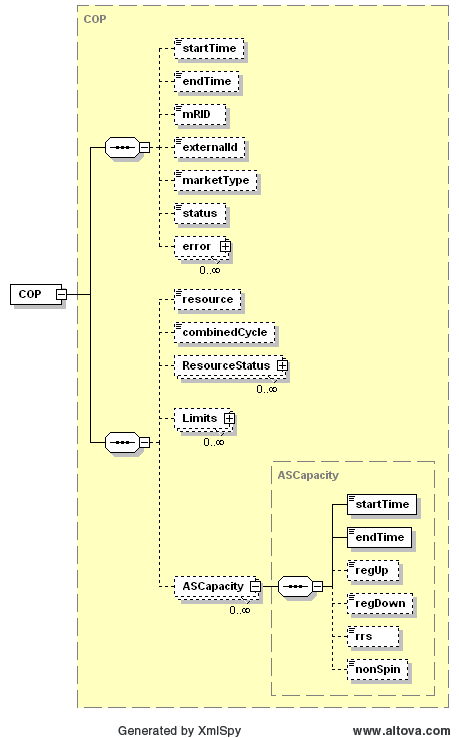
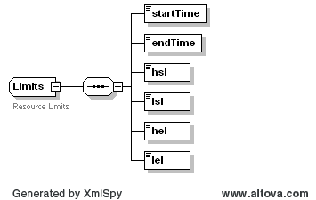
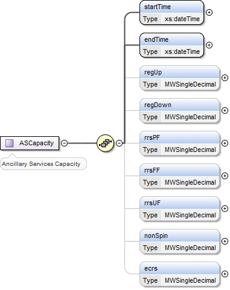

### Current Operating Plan (COP)

> The following diagram describes the structure of a Current Operating
> Plan (COP), where the COP provides a schedule for a resource:
>

The structures for Limits and ASCapacity are shown in the following
diagrams. If more than one ResourceStatus, Limits, or ASCapacity block
is provided, start and end times must not overlap:

COP submissions are never cancelled, as a COP must be submitted. A
resubmission of a COP overwrites the previous submission. On
submission, the following table describes the items used for a COP:

| *Element*                     | *Req?* | *Datatype* | *Description*                       | *Values*                                 |
|-------------------------------|--------|------------|-------------------------------------|------------------------------------------|
| startTime                     | N      | dateTime   | Start time for COP                  | Valid start hour boundary for trade date |
| endTime                       | N      | dateTime   | End time for COP                    | Valid end hour boundary for trade date   |
| externalId                    | N      | string     | External ID                         | QSE supplied                             |
| resource                      | K      | string     | Resource                            | Valid resource name                      |
| combinedCycle                 | N      | string     | Combined cycle                      | Not required. Value ignored if provided. |
| ResourceStatus/startTime      | Y      | dateTime   | Start time for status               | Valid hour boundary                      |
| ResourceStatus /endTime       | Y      | dateTime   | End time for status                 | Valid hour boundary                      |
| ResourceStatus /operatingMode | Y      | string     | status                              | Valid status code                        |
| Limits/startTime              | Y      | dateTime   | Start time for limits               | Valid hour boundary                      |
| Limits/endTime                | Y      | dateTime   | End time for limits                 | Valid hour boundary                      |
| Limits/hsl                    | Y      | float      | High sustained limit in MW          | \>=0                                     |
| Limits/lsl                    | Y      | float      | Low sustained limit in MW           | \>=0                                     |
| Limits/hel                    | Y      | float      | High emergency limit in MW          | \>=0                                     |
| Limits/lel                    | Y      | float      | Low sustained limit in MW           | \>=0                                     |
| ASCapacity/startTime          | Y      | dateTime   | Start time for AS capacity schedule | Valid hour boundary                      |
| ASCapacity/endTime            | Y      | dateTime   | End time for AS capacity schedule   | Valid hour boundary                      |
| ASCapacity/regUp              | Y      | float      | Regulation up MW                    | \>= 0                                    |
| ASCapacity/regDown            | Y      | float      | Regulation down MW                  | \>= 0                                    |
| ASCapacity/rrsPF              | Y      | float      | Responsive reserve MW               | \>= 0                                    |
| ASCapacity/rrsFF              | Y      | float      | Responsive reserve MW               | \>= 0                                    |
| ASCapacity/rrsUF              | Y      | float      | Responsive reserve MW               | \>= 0                                    |
| ASCapacity/nonSpin            | Y      | float      | Non-spinning MW                     | \>= 0                                    |
| ASCapacity/ecrs               | Y      | float      | ERCOT Contingency Reserve MW        | \>= 0                                    |

The following is an XML example for a COP:

~~~
<BidSet xmlns="http://www.ercot.com/schema/2007-06/nodal/ews" xmlns:ns2="http://www.ercot.com/schema/2007-06/nodal/ews">
  <tradingDate>2021-11-09</tradingDate>
  <COP>
    <startTime>2021-11-09T00:00:00-06:00</startTime>
    <endTime>2021-11-10T00:00:00-06:00</endTime>
    <resource>RES_1</resource>
    <ResourceStatus>
      <startTime>2021-11-09T23:00:00.000-06:00</startTime>
      <endTime>2021-11-10T00:00:00.000-06:00</endTime>
      <operatingMode>ONRL</operatingMode>
    </ResourceStatus>
    <Limits>
      <startTime>2021-11-09T23:00:00.000-06:00</startTime>
      <endTime>2021-11-10T00:00:00.000-06:00</endTime>
      <hsl>20</hsl>          
      <lsl>0</lsl>
      <hel>20</hl>
      <lel>0</lel>
    </Limits>
    <ASCapacity>
      <startTime>2021-11-09T23:00:00.000-06:00</startTime>
      <endTime>2021-11-10T00:00:00.000-06:00</endTime>
      <regUp>0</regUp>
      <regDown>0</regDown>
      <rrsPF>0</rrsPF>
      <rrsFF>0</rrsFF>
      <rrsUF>20</rrsUF>
      <nonSpin>0</nonSpin>
      <ecrs>0</ecrs>
    </ASCapacity>
  </COP>
</BidSet>
~~~

And the corresponding response:

~~~
<ns1:BidSet xmlns:ns1="http://www.ercot.com/schema/2007-06/nodal/ews">
  <ns1:tradingDate>2021-11-09</ns1:tradingDate>
  <ns1:COP>
    <ns1:mRID>QSAMP1.20211109.COP.RES_1</ns1:mRID>
    <ns1:externalId/>
    <ns1:status>ACCEPTED</ns1:status>
    <ns1:error>
      <ns1:severity>INFORMATIVE</ns1:severity>
      <ns1:text>Successfully processed the ERCOT COP.</ns1:text>
    </ns1:error>
  </ns1:COP>
</ns1:BidSet>
~~~ 

The terms maxEmergency, maximumEconomic, minEmergency, and
minimumEcononic are used to in order to be consistent with the IEC
CIM.

Currently defined resource operatingModes include:

- ONRUC – On-Line and the hour is a RUC-Committed Interval

- ONREG – On-Line Resource with Energy Offer Curve providing Regulation
  Service

- ON – On-Line Resource with Energy Offer Curve

- ONDSR – On-Line Dynamically Scheduled Resource

- ONOS – On-Line Resource with Output Schedule

- ONOSREG – On-Line Resource with Output Schedule providing Regulation
  Service

- ONDSRREG – On-Line Dynamically Scheduled Resource providing Regulation
  Service

- ONTEST – On-Line Test with Output Schedule

- ONEMR – On-Line EMR (available for commitment or dispatch only for
  ERCOT-declared Emergency Conditions; the QSE may appropriately set LSL
  and HSL to reflect operating limits)

- ONRR – On-Line as a synchronous condenser (hydro) providing Responsive
  Reserve but unavailable for dispatch by SCED and available for
  commitment by RUC

- OUT – Off-Line and unavailable

- OFFNS – Off -Line but reserved for Non-Spin

- OFF – Off-Line but available for commitment by DAM and RUC

- EMR – Available for commitment only for ERCOT-declared Emergency
  Condition events; the QSE may appropriately set LSL and HSL to reflect
  operating limits

- ONRGL – Available for Dispatch of Regulation Service by Load Frequency
  Control (LFC) and, for any remaining Dispatchable capacity, by SCED
  with an Real-Time Market (RTM) Energy Bid

- ONCLR – Available for Dispatch as a Controllable Load Resource by SCED
  with an RTM Energy Bid

- ONRL – Available for Dispatch of RRS Service, excluding Controllable
  Load Resources

- OUTL – Not available

- ONOPTOUT – On-Line and the hour is a RUC Buy-Back Hour

- OFFQS – Off-Line but available for SCED deployment. Only qualified
  Quick Start Generation Resources (QSGRs) may utilize this status.

- EMRSWGR - status can be submitted individually for qualified SWGRs
  only and Operating Hour(s) for which they are applicable during the
  Adjustment Period

- ONECRS – On-Line as a synchronous condenser providing ERCOT
  Contingency Response Service (ECRS) but unavailable for Dispatch by
  SCED and available for commitment by RUC

- ONECL - Available for Dispatch of ECRS, excluding Controllable Load
  Resources
