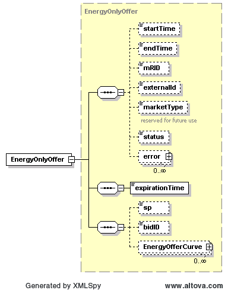

### DAM Energy-Only Offer (EOO)

The following diagram describes the structure of a DAM Energy-Only
Offer:

The EnergyOfferCurve structure uses the PriceCurve type structure
described previously in this document. On submission, the following
table describes the items used for an EnergyOnlyOffer:

<table>
<colgroup>
<col style="width: 30%" />
<col style="width: 5%" />
<col style="width: 11%" />
<col style="width: 32%" />
<col style="width: 0%" />
<col style="width: 18%" />
</colgroup>
<thead>
<tr class="header">
<th><em>Element</em></th>
<th><em>Req?</em></th>
<th><em>Datatype</em></th>
<th><em>Description</em></th>
<th colspan="2"><em>Values</em></th>
</tr>
</thead>
<tbody>
<tr class="odd">
<td>startTime</td>
<td>K</td>
<td>dateTime</td>
<td>Start time for bid</td>
<td colspan="2">Valid start hour boundary for trade date</td>
</tr>
<tr class="even">
<td>endTime</td>
<td>K</td>
<td>dateTime</td>
<td>End time for bid</td>
<td colspan="2">Valid end hour boundary for trade date</td>
</tr>
<tr class="odd">
<td>externalId</td>
<td>N</td>
<td>string</td>
<td colspan="2">External ID</td>
<td>QSE supplied</td>
</tr>
<tr class="even">
<td>sp</td>
<td>K</td>
<td>string</td>
<td>Settlement point</td>
<td colspan="2">Valid settlement point name</td>
</tr>
<tr class="odd">
<td>bidID<a href="#fn1" class="footnote-ref" id="fnref1"
role="doc-noteref">1</a></td>
<td>K</td>
<td>string</td>
<td>
Bid ID

ERCOT’s preference is for QSEs to submit the same Bid/Offer ID for
each hour in the submission, versus submitting a different Bid/Offer ID
for every hour.  The market system treats either submission format the
exact same way.  The purpose of this is to optimize system
performance.
</td>
<td colspan="2">
QSE supplied bid ID.

Value Restrictions:

Only alpha numeric, “_”(underscore) and “-“(dash) are valid
characters. First and last character should be alpha numeric.

Min Length: 2chars.

Max Length: 12 chars.
</td>
</tr>
<tr class="even">
<td>expirationTime</td>
<td>Y</td>
<td>dateTime</td>
<td>Time of offer expiration</td>
<td colspan="2">Valid time before trade date</td>
</tr>
<tr class="odd">
<td>EnergyOfferCurve/startTime</td>
<td>Y</td>
<td>dateTime</td>
<td>Start time for curve</td>
<td colspan="2">Valid hour boundary</td>
</tr>
<tr class="even">
<td>EnergyOfferCurve/endTime</td>
<td>Y</td>
<td>dateTime</td>
<td>End time for curve</td>
<td colspan="2">Valid hour boundary</td>
</tr>
<tr class="odd">
<td>EnergyOfferCurve/curveStyle</td>
<td>Y</td>
<td>string</td>
<td>Used as an indicator to describe the type of ‘curve’</td>
<td colspan="2">FIXED, VARIABLE or CURVE</td>
</tr>
<tr class="even">
<td>EnergyOfferCurve/CurveData/xvalue</td>
<td>Y</td>
<td>float</td>
<td>Quantity in megawatts</td>
<td colspan="2">MW</td>
</tr>
<tr class="odd">
<td>EnergyOfferCurve/CurveData/y1value</td>
<td>Y</td>
<td>float</td>
<td>Price in $/MWh</td>
<td colspan="2">$/MWh</td>
</tr>
<tr class="even">
<td>EnergyOfferCurve/incExcFlag</td>
<td>N</td>
<td>string</td>
<td>Not used</td>
<td colspan="2">Not used</td>
</tr>
<tr class="odd">
<td>EnergyOfferCurve/reason</td>
<td>N</td>
<td>string</td>
<td>Not used</td>
<td colspan="2">Not used</td>
</tr>
<tr class="even">
<td>EnergyOfferCurve/multiHourBlock</td>
<td>N</td>
<td>Boolean</td>
<td>Indicates if offer must be taken as a block for all hours</td>
<td colspan="2">true or false (default=false)</td>
</tr>
</tbody>
</table>
<aside id="footnotes" class="footnotes footnotes-end-of-document"
role="doc-endnotes">

<ol>
<li id="fn1">
Note that the bidID element isn’t defined with
consistent letter case across all submission and award types. To verify
the letter case, please refer to the corresponding XSD.
</ol>
</aside>

The following is an XML example for an EnergyOnlyOffer:

~~~
<BidSet xmlns="http://www.ercot.com/schema/2007-06/nodal/ews" xmlns:xsi="http://www.w3.org/2001/XMLSchema-instance" xsi:schemaLocation="http://www.ercot.com/schema/2007-06/nodal/ews ErcotTransactions.xsd">
    <tradingDate>2008-01-01</tradingDate>
    <EnergyOnlyOffer>
        <startTime>2008-01-01T00:00:00-05:00</startTime>
        <endTime>2008-01-02T00:00:00-05:00</endTime>
        <marketType>DAM</marketType>
        <expirationTime>2008-01-01T00:00:00-05:00</expirationTime>
        <sp>TNSCLP3___8X</sp>
        <bidID>338601</bidID>
        <EnergyOfferCurve>
            <startTime>2008-01-01T00:00:00-05:00</startTime>
            <endTime>2008-01-02T00:00:00-05:00</endTime>
            <curveStyle>FIXED</curveStyle>
            <CurveData>
                <xvalue>197</xvalue>
                <y1value>999</y1value>
            </CurveData>
            <multiHourBlock>false</multiHourBlock>
        </EnergyOfferCurve>
    </EnergyOnlyOffer>
</BidSet>
~~~

And the corresponding response:

~~~
<ns1:BidSet xmlns:ns1="http://www.ercot.com/schema/2007-06/nodal/ews">
    <ns1:tradingDate>2008-06-14</ns1:tradingDate>
    <ns1:EnergyOnlyOffer>
        <ns1:mRID>AEN.20080614.EOO.TNSCLP3___8X.338601</ns1:mRID>
        <ns1:externalId/>
        <ns1:status>ACCEPTED</ns1:status>
        <ns1:error>
            <ns1:severity>INFORMATIVE</ns1:severity>
            <ns1:text>Successfully processed the ERCOT Energy-Only Offer.</ns1:text>
        </ns1:error>
    </ns1:EnergyOnlyOffer>
</ns1:BidSet>
~~~

