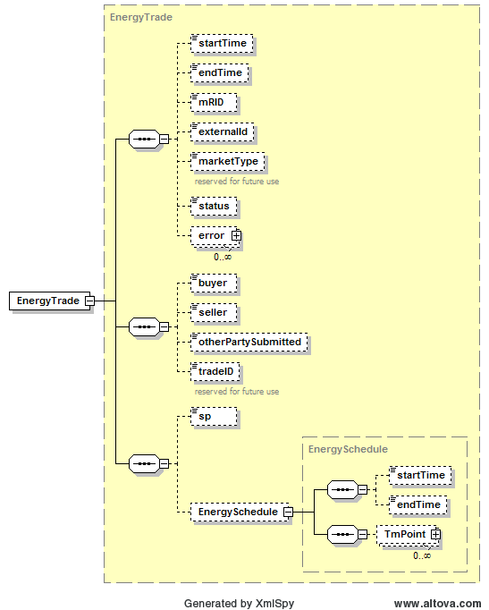
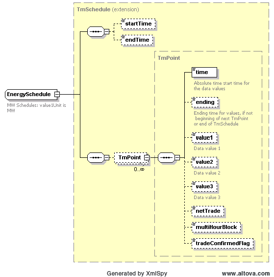

### Energy Trade (ET)

An EnergyTrade describes a scheduled trade of energy between a buyer
and a seller at a specified settlement point. The following diagram
describes the structure of an Energy Trade:

Within an EnergyTrade is an EnergySchedule. Energy Schedules are
defined using the TmSchedule type, where intervals may be up to 15
minutes in granularity. This is shown in the following diagram:

In order for a trade to be accepted, both the buyer and seller must
submit matching trades, as identified using the buyer and seller tags.
On submission, the following table describes the items used for an
EnergyTrade:

- startTime

- endTime

- buyer (QSE ID)

- seller (QSE ID)

- sp (settlement point name)

- EnergySchedule

<table>
<colgroup>
<col style="width: 31%" />
<col style="width: 14%" />
<col style="width: 17%" />
<col style="width: 18%" />
<col style="width: 18%" />
</colgroup>
<thead>
<tr class="header">
<th><em>Element</em></th>
<th><em>Req?</em></th>
<th><em>Datatype</em></th>
<th><em>Description</em></th>
<th><em>Values</em></th>
</tr>
</thead>
<tbody>
<tr class="odd">
<td>startTime</td>
<td>K</td>
<td>dateTime</td>
<td>Start time for bid</td>
<td>Valid start hour boundary for trade date</td>
</tr>
<tr class="even">
<td>endTime</td>
<td>K</td>
<td>dateTime</td>
<td>End time for bid</td>
<td>Valid end hour boundary for trade date</td>
</tr>
<tr class="odd">
<td>externalId</td>
<td>N</td>
<td>String</td>
<td>External ID</td>
<td>QSE supplied</td>
</tr>
<tr class="even">
<td>sp</td>
<td>K</td>
<td>String</td>
<td>Settlement point</td>
<td>Valid settlement point name</td>
</tr>
<tr class="odd">
<td>buyer</td>
<td>K</td>
<td>String</td>
<td>Trade buyer</td>
<td>Valid QSE</td>
</tr>
<tr class="even">
<td>seller</td>
<td>K</td>
<td>String</td>
<td>Trade seller</td>
<td>Valid QSE</td>
</tr>
<tr class="odd">
<td>tradeID</td>
<td>N</td>
<td>String</td>
<td>reserved for future use</td>
<td></td>
</tr>
<tr class="even">
<td>EnergySchedule/startTime</td>
<td>N</td>
<td>dateTime</td>
<td>not used</td>
<td>not used</td>
</tr>
<tr class="odd">
<td>EnergySchedule/endTime</td>
<td>N</td>
<td>dateTime</td>
<td>not used</td>
<td>not used</td>
</tr>
<tr class="even">
<td>
EnergySchedule/

TmPoint/time
</td>
<td>Y</td>
<td>dateTime</td>
<td>Absolute time for start of 15 minute interval</td>
<td>Valid time in the trading date</td>
</tr>
<tr class="odd">
<td>
EnergySchedule/

TmPoint/ending
</td>
<td>N</td>
<td>dateTime</td>
<td>Absolute time for end of 15 minute interval</td>
<td>Valid time in the trading date</td>
</tr>
<tr class="even">
<td>
EnergySchedule/

TmPoint/value1
</td>
<td>Y</td>
<td>float</td>
<td>Megawatts</td>
<td>&gt;= 0</td>
</tr>
<tr class="odd">
<td>
EnergySchedule/

TmPoint/netTrade
</td>
<td>N</td>
<td>string</td>
<td>Trade description</td>
<td>
Purchase (“P”) or

Sale (“S”)

for DSR resources.
</td>
</tr>
</tbody>
</table>

The following is an XML example for an EnergyTrade:

~~~
<BidSet xmlns="http://www.ercot.com/schema/2007-06/nodal/ews" xmlns:xsi="http://www.w3.org/2001/XMLSchema-instance" xsi:schemaLocation="http://www.ercot.com/schema/2007-06/nodal/ews ErcotTransactions.xsd">
    <tradingDate>2008-01-01</tradingDate>
    <status/>
    <mode/>
    <EnergyTrade>
        <startTime>2008-01-01T00:00:00-05:00</startTime>
        <endTime>2008-01-02T00:00:00-05:00</endTime>
        <marketType>DAM</marketType>
        <buyer>AEN</buyer>
        <seller>LCRA</seller>
        <tradeID>TradeID123</tradeID>
        <sp>JUDKINS_8</sp>
        <EnergySchedule>
            <TmPoint>
                <time>2008-01-01T00:00:00-05:00</time>
                <ending>2008-01-02T00:00:00-05:00</ending>
                <value1>89</value1>
            </TmPoint>
        </EnergySchedule>
    </EnergyTrade>
</BidSet>
~~~

And the corresponding response:

~~~
<ns1:BidSet xmlns:ns1="http://www.ercot.com/schema/2007-06/nodal/ews" xmlns:xsi="http://www.w3.org/2001/XMLSchema-instance" xsi:schemaLocation="http://www.ercot.com/schema/2007-06/nodal/ews ErcotTransactions.xsd">
    <ns1:tradingDate>2008-06-14</ns1:tradingDate>
    <ns1:EnergyTrade>
        <ns1:mRID>AEN.20080614.ET.JUDKINS_8.AEN.LCRA</ns1:mRID>
        <ns1:status>ACCEPTED</ns1:status>
        <ns1:error>
            <ns1:severity>INFORMATIVE</ns1:severity>
            <ns1:text>Successfully processed the ERCOT Energy Trade.</ns1:text>
        </ns1:error>
    </ns1:EnergyTrade>
</ns1:BidSet>
~~~
