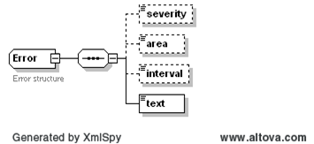

## Error Handling 

The purpose of this section is to describe the handling of errors
related to submissions, updates, queries, and cancellations. This is
especially important, as BidSets can be partially accepted, where some
bids, offers, trades, or schedules within a BidSet can be accepted,
and others rejected.

| *Condition*                                                                                              | *Action*                                                                                                                                                                                                                        | *Error Reported*                                                                                                   |
|----------------------------------------------------------------------------------------------------------|---------------------------------------------------------------------------------------------------------------------------------------------------------------------------------------------------------------------------------|--------------------------------------------------------------------------------------------------------------------|
| Bad parameters in message header                                                                         | Request is rejected                                                                                                                                                                                                             | ERROR: INVALID REQUEST                                                                                             |
| Invalid Source or UserID                                                                                 | Request is rejected                                                                                                                                                                                                             | ERROR: NOT AUTHORIZED                                                                                              |
| Payload can not be interpreted                                                                           | Request is rejected                                                                                                                                                                                                             | ERROR: BAD PAYLOAD                                                                                                 |
| Parameters within BidSet header are invalid, e.g. bad trading date                                       | No bids or updates are accepted                                                                                                                                                                                                 | ERROR: BAD BIDSET                                                                                                  |
| Request for a get, cancel or update identifies an unknown transaction (i.e. bid, offer, trade, schedule) | The request is processed only for the known transactions.                                                                                                                                                                       | WARNING: UNKNOWN ID: ……                                                                                            |
| Some transactions within a BidSet are rejected                                                           | For submissions containing multiple offers/bids, valid offers/bids are accepted as submitted, invalid offers/bids are rejected and marked with errors. An offer/bid will be rejected entirely if any hour within it is invalid. | BidSet on reply identifies errors for those transactions that were rejected on a transaction by transaction basis. |

Figure 60 - Error Handling

It is also important to note that the submission of a BidSet involves
multiple steps:

1.  BidSet is syntax scanned, where only basic validity checks are
    performed. The reply identifies where basic validity checks failed.
    Transactions within the BidSet that pass basic validation checks are
    marked as ‘SUBMITTED’ and a transaction ID (mRID) value is returned.

2.  A more thorough validity check is performed asynchronously by the
    Market Management System (MMS)

3.  After acceptance or rejection by MMS, a notification is issued that
    identified whether the transaction was ‘ACCEPTED’, is ‘PENDING’, or
    had an error.

The following structure is used to report errors, where the severity,
area of the error or the specific time can be identified.

The error structure is populated in the following manner:

- *severity* may be ‘error’, ‘warning’ or ‘informational’, as determined
  by the source system

- *area* may be used to indicate the tag or parent tag (e.g.
  EnergySchedule), where an error was identified

- *interval* may be used to identify the time of the data item of
  concern, where many data items may be related to a schedule
  submission. For market transaction interfaces, a market interval
  (using hour ending and minute ending) is used as opposed to a
  timestamp

- *text* as provided by the source system

When possible, the described error structure will be used. However,
there are many cases where error5 structure can not be used, as in
cases where schema validations fail and normal validation is not
possible. These are typically the result of programming errors.
Examples would include:

- XML is not well formed

- XML is not schema compliant, from the perspective of basic data
  structures

- XML is not schema compliant, from the perspective that values provided
  are invalid (e.g. invalid time strings, nulls where values are
  required, non-numeric values where numeric values are required,
  obviously out of range values, invalid enumerations)
