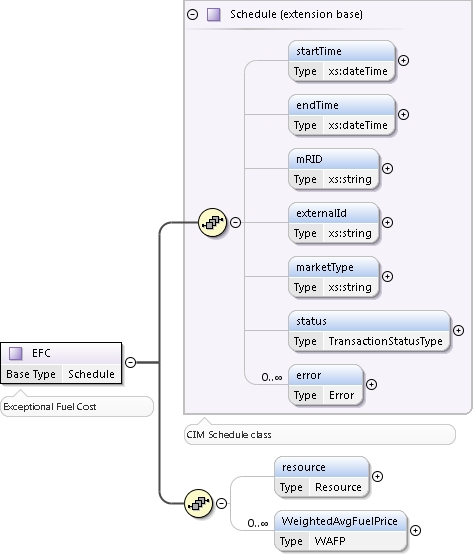

### Exceptional Fuel Cost (EFC)

During the Adjustment Period, a QSE representing a Resource may submit
Exceptional Fuel Cost as a volume-weighted average fuel price for use
in the Mitigated Offer Cap (MOC) calculation for that Resource. The
following diagram describes the structure of an Exceptional Fuel Cost
Bid:

The following table describes the items used for an Exception Fuel Cost submission:

| *Element*                      | *Req?* | *Datatype* | *Description*               | *Values*                                                              |
|--------------------------------|--------|------------|-----------------------------|-----------------------------------------------------------------------|
| startTime                      | K      | dateTime   | Start time for bid          | Valid start hour boundary for trade date                              |
| endTime                        | K      | dateTime   | End time for bid            | Valid end hour boundary for trade date                                |
| externalId                     | N      | string     | External ID                 | QSE supplied                                                          |
| expirationTime                 | N      | dateTime   | Time of bid expiration      | Valid time during the trade date                                      |
| resource                       | K      | string     | Resource                    | Valid resource name                                                   |
| WeightedAvgFuelPrice/startTime | Y      | dateTime   | Start time for WAFP         | Valid hour boundary                                                   |
| WeightedAvgFuelPrice/endTime   | Y      | dateTime   | End time for WAFP           | Valid hour boundary                                                   |
| WeightedAvgFuelPrice/price     | Y      | float      | Weighted Average Fuel Price | The volume-weighted average intraday, same-day and spot price of fuel |

The following is an XML example for an EFC submission:

~~~
<BidSet xmlns="http://www.ercot.com/schema/2007-06/nodal/ews">
    <tradingDate>2019-03-13</tradingDate>
    <EFC>
        <startTime>2019-03-13T19:00:00-05:00</startTime>
        <endTime>2019-03-14T00:00:00-05:00</endTime>
        <resource>RESOURCE_1</resource>
        <WeightedAvgFuelPrice>
            <startTime>2019-03-13T19:00:00-05:00</startTime>
            <endTime>2019-03-13T22:00:00-05:00</endTime>
            <price>32</price>
        </WeightedAvgFuelPrice>
        <WeightedAvgFuelPrice>
            <startTime>2019-03-13T22:00:00-05:00</startTime>
            <endTime>2019-03-14T00:00:00-05:00</endTime>
            <price>35</price>
        </WeightedAvgFuelPrice>
    </EFC>
</BidSet>
~~~

And the corresponding response:

~~~
<ns1:BidSet xmlns:ns1="http://www.ercot.com/schema/2007-06/nodal/ews">
    <ns1:tradingDate>2019-03-13</ns1:tradingDate>
    <ns1:submitTime>2019-03-13T18:13:00-05:00</ns1:submitTime>
    <ns1:EFC>
        <ns1:mRID>QSE1.20190313.EFC.RESOURCE_1 </ns1:mRID>
        <ns1:externalId/>
        <ns1:status>ACCEPTED</ns1:status>
        <ns1:error>
            <ns1:severity>INFORMATIVE</ns1:severity>
            <ns1:text>Successfully processed the ERCOT Exceptional Fuel Cost.</ns1:text>
        </ns1:error>			
    </ns1:EFC>
</ns1:BidSet>
~~~
