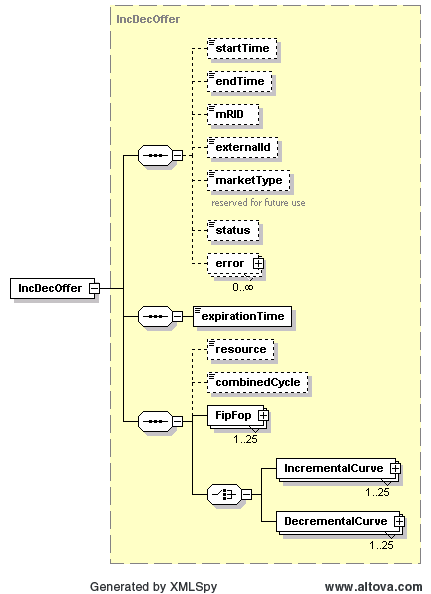

### Incremental and Decremental Energy Offer Curves (IDO)

The following diagram describes the structure of Incremental and
Decremental Energy Offer Curves. This shows the details of the FipFop
and PriceCurve structures that are contained within:

Both the IncrementalCurve and DecrementalCurve use the PriceCurve
structure as described previously in this document, but only one
(either an IncrementalCurve or a DecrementalCurve) can be specified
per each IncDecOffer. On submission, the following table describes the
items used for an IncDecOffer:

<table>
<colgroup>
<col style="width: 37%" />
<col style="width: 0%" />
<col style="width: 11%" />
<col style="width: 0%" />
<col style="width: 14%" />
<col style="width: 0%" />
<col style="width: 16%" />
<col style="width: 0%" />
<col style="width: 18%" />
</colgroup>
<thead>
<tr class="header">
<th colspan="2"><em>Element</em></th>
<th colspan="2"><em>Req?</em></th>
<th colspan="2"><em>Datatype</em></th>
<th><em>Description</em></th>
<th colspan="2"><em>Values</em></th>
</tr>
</thead>
<tbody>
<tr class="odd">
<td colspan="2">startTime</td>
<td colspan="2">N</td>
<td colspan="2">dateTime</td>
<td>Start time for bid</td>
<td colspan="2">Valid start hour boundary for trade date</td>
</tr>
<tr class="even">
<td colspan="2">endTime</td>
<td colspan="2">N</td>
<td colspan="2">dateTime</td>
<td>End time for bid</td>
<td colspan="2">Valid end hour boundary for trade date</td>
</tr>
<tr class="odd">
<td colspan="2">externalId</td>
<td colspan="2">N</td>
<td colspan="2">string</td>
<td colspan="3">External ID</td>
<td>QSE supplied</td>
</tr>
<tr class="even">
<td colspan="2">resource</td>
<td colspan="2">K</td>
<td colspan="2">string</td>
<td>Resource</td>
<td colspan="2">Valid resource name</td>
</tr>
<tr class="odd">
<td colspan="2">combinedCycle</td>
<td colspan="2">N</td>
<td colspan="2">string</td>
<td>Combined cycle to which resource is associated</td>
<td colspan="2">Not required. Value ignored if provided.</td>
</tr>
<tr class="even">
<td colspan="2">expirationTime</td>
<td colspan="2">Y</td>
<td colspan="2">dateTime</td>
<td>Offer expiration time</td>
<td colspan="2">Valid time before or during the trade date</td>
</tr>
<tr class="odd">
<td colspan="2">FipFop/fipPercent</td>
<td colspan="2">Y</td>
<td colspan="2">decimal</td>
<td>Fuel index price percent</td>
<td colspan="2">&gt;= 0, &lt;= 100</td>
</tr>
<tr class="even">
<td colspan="2">FipFop/fopPercent</td>
<td colspan="2">Y</td>
<td colspan="2">decimal</td>
<td>Fuel oil price percent</td>
<td colspan="2">&gt;= 0, &lt;= 100</td>
</tr>
<tr class="odd">
<td colspan="2">IncrementalCurve/startTime</td>
<td colspan="2">
If INC

offer
</td>
<td colspan="2">dateTime</td>
<td>Start time for curve</td>
<td colspan="2">Valid hour boundary</td>
</tr>
<tr class="even">
<td colspan="2">IncrementalCurve/endTime</td>
<td colspan="2">
If INC

offer
</td>
<td colspan="2">dateTime</td>
<td>End time for curve</td>
<td colspan="2">Valid hour boundary</td>
</tr>
<tr class="odd">
<td colspan="2">IncrementalCurve/curveStyle</td>
<td colspan="2">
If INC

offer
</td>
<td colspan="2">string</td>
<td>Type of curve</td>
<td colspan="2">CURVE</td>
</tr>
<tr class="even">
<td colspan="2">IncrementalCurve/CurveData/xvalue</td>
<td colspan="2">
If INC

offer
</td>
<td colspan="2">float</td>
<td>Megawatts</td>
<td colspan="2">Quantity in MW</td>
</tr>
<tr class="odd">
<td colspan="2">IncrementalCurve/CurveData/y1value</td>
<td colspan="2">
If INC

offer
</td>
<td colspan="2">float</td>
<td>$/MWh</td>
<td colspan="2">Incremental price in $/MWh, must be greater than
corresponding Decremental curve value</td>
</tr>
<tr class="even">
<td colspan="2">DecrementalCurve/startTime</td>
<td colspan="2">If DEC offer</td>
<td colspan="2">dateTime</td>
<td>Start time for curve</td>
<td colspan="2">Valid hour boundary</td>
</tr>
<tr class="odd">
<td colspan="2">DecrementalCurve/endTime</td>
<td colspan="2">If DEC offer</td>
<td colspan="2">dateTime</td>
<td>End time for curve</td>
<td colspan="2">Valid hour boundary</td>
</tr>
<tr class="even">
<td colspan="2">DecrementalCurve/curveStyle</td>
<td colspan="2">If DEC offer</td>
<td colspan="2">string</td>
<td>Type of curve</td>
<td colspan="2">CURVE</td>
</tr>
<tr class="odd">
<td colspan="2">DecrementalCurve/CurveData/xvalue</td>
<td colspan="2">If DEC offer</td>
<td colspan="2">float</td>
<td>Megawatts</td>
<td colspan="2">Quantity in MW</td>
</tr>
<tr class="even">
<td colspan="2">DecrementalCurve/CurveData/y1value</td>
<td colspan="2">If DEC offer</td>
<td colspan="2">float</td>
<td>$/MWh</td>
<td colspan="2">Decremental price in $/MWh, must be less than
corresponding incremental curve value</td>
</tr>
</tbody>
</table>

The following is an XML example for an IncDecOffer (In this case, a Decremental Curve)

~~~
<BidSet xmlns="http://www.ercot.com/schema/2007-06/nodal/ews" xmlns:xsi="http://www.w3.org/2001/XMLSchema-instance" xsi:schemaLocation="http://www.ercot.com/schema/2007-06/nodal/ews ErcotTransactions.xsd">
    <tradingDate>2008-01-01</tradingDate>
    <IncDecOffer>
        <startTime>2008-01-01T00:00:00-05:00</startTime>
        <endTime>2008-01-02T00:00:00-05:00</endTime>
        <marketType>DAM</marketType>
        <expirationTime>2008-01-02T00:00:00-05:00</expirationTime>
        <resource>Resource123</resource>
        <FipFop>
            <startTime>2008-01-01T00:00:00-05:00</startTime>
            <endTime>2008-01-02T00:00:00-05:00</endTime>
            <fipPercent>25</fipPercent>
            <fopPercent>75</fopPercent>
        </FipFop>
        <DecrementalCurve>
            <startTime>2008-01-01T00:00:00-05:00</startTime>
            <endTime>2008-01-02T00:00:00-05:00</endTime>
            <curveStyle>FIXED</curveStyle>
            <CurveData>
                <!--The price value in the pq_curve element of DEC Offer must be less than the existing INC offer price-->
                <xvalue>2.14</xvalue>
                <y1value>2.14</y1value>
            </CurveData>
            <reason>OUT</reason>
        </DecrementalCurve>
    </IncDecOffer>
</BidSet>
~~~

And the corresponding response:

~~~
<ns1:BidSet xmlns:ns1="http://www.ercot.com/schema/2007-06/nodal/ews">
    <ns1:tradingDate>2008-06-15</ns1:tradingDate>
    <ns1:IncDecOffer>
        <ns1:mRID>AEN.20080615.IDO.Resource1.DEC</ns1:mRID>
        <ns1:externalId/>
        <ns1:status>ACCEPTED</ns1:status>
        <ns1:error>
            <ns1:severity>INFORMATIVE</ns1:severity>
            <ns1:text>Successfully processed the ERCOT Inc Dec Offer.</ns1:text>
        </ns1:error>
    </ns1:IncDecOffer>
</ns1:BidSet>
~~~
