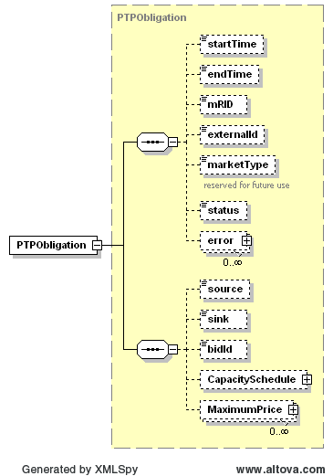

### PTP Obligation Bid (PTP)

The following diagram describes the structure of a PTP Obligation bid:

The CapacitySchedule structure is identical to the structure described
in the SelfArrangedAS and CapacityTrade sections of the document. The 
following diagram describes the structure for maximum prices. If more 
than one MaximumPrice block is provided, start and end times must not 
overlap.

On submission, the following table describes the items used for a
PTPObligation:

<table style="width:100%;">
<colgroup>
<col style="width: 30%" />
<col style="width: 12%" />
<col style="width: 15%" />
<col style="width: 19%" />
<col style="width: 21%" />
</colgroup>
<thead>
<tr class="header">
<th><em>Element</em></th>
<th><em>Req?</em></th>
<th><em>Datatype</em></th>
<th><em>Description</em></th>
<th><em>Values</em></th>
</tr>
</thead>
<tbody>
<tr class="odd">
<td>startTime</td>
<td>K</td>
<td>dateTime</td>
<td>Start time for bid</td>
<td>Valid start hour boundary for trade date</td>
</tr>
<tr class="even">
<td>endTime</td>
<td>K</td>
<td>dateTime</td>
<td>End time for bid</td>
<td>Valid end hour boundary for trade date</td>
</tr>
<tr class="odd">
<td>externalId</td>
<td>N</td>
<td>string</td>
<td>External ID</td>
<td>QSE supplied</td>
</tr>
<tr class="even">
<td>source</td>
<td>K</td>
<td>string</td>
<td>Source settlement point</td>
<td>Valid settlement point name</td>
</tr>
<tr class="odd">
<td>sink</td>
<td>K</td>
<td>string</td>
<td>Sink settlement point</td>
<td>Valid settlement point name</td>
</tr>
<tr class="even">
<td>bidId<a href="#fn1" class="footnote-ref" id="fnref1"
role="doc-noteref">1</a></td>
<td>K</td>
<td>string</td>
<td>
MP assigned bid ID

ERCOT’s preference is for QSEs to submit the same Bid/Offer ID for
each hour in the submission, versus submitting a different Bid/Offer ID
for every hour.  The market system treats either submission format the
exact same way.  The purpose of this is to optimize system
performance.
</td>
<td>
Value Restrictions:

Only alpha numeric, “_”(underscore) and “-“(dash) are valid
characters. First and last character should be alpha numeric.

Min Length: 2chars.

Max Length: 12 chars.
</td>
</tr>
<tr class="odd">
<td>MaximumPrice/startTime</td>
<td>Y</td>
<td>dateTime</td>
<td>Start time for maximum price</td>
<td>Valid hour boundary</td>
</tr>
<tr class="even">
<td>MaximumPrice/endTime</td>
<td>Y</td>
<td>dateTime</td>
<td>End time for maximum price</td>
<td>Valid hour boundary</td>
</tr>
<tr class="odd">
<td>MaximumPrice/price</td>
<td>Y</td>
<td>float</td>
<td>Maximum price</td>
<td>Any value</td>
</tr>
<tr class="even">
<td>CapacitySchedule/startTime</td>
<td>N</td>
<td>dateTime</td>
<td>not used</td>
<td>not used</td>
</tr>
<tr class="odd">
<td>CapacitySchedule/endTime</td>
<td>N</td>
<td>dateTime</td>
<td>not used</td>
<td>not used</td>
</tr>
<tr class="even">
<td>
CapacitySchedule/

TmPoint/time
</td>
<td>Y</td>
<td>dateTime</td>
<td>Absolute time for beginning of interval</td>
<td>Valid time between schedule start and end times</td>
</tr>
<tr class="odd">
<td>
CapacitySchedule/

TmPoint/ending
</td>
<td>N</td>
<td>dateTime</td>
<td>Absolute time for end of interval</td>
<td>Valid time between schedule start and end times</td>
</tr>
<tr class="even">
<td>
CapacitySchedule/

TmPoint/value1
</td>
<td>Y</td>
<td>float</td>
<td>Megawatts</td>
<td>&gt;= 0</td>
</tr>
<tr class="odd">
<td>
CapacitySchedule /

TmPoint/multiHourBlock
</td>
<td>N</td>
<td>Boolean</td>
<td>Indicates if offer must be taken as a block for all hours</td>
<td>true or false (default=false)</td>
</tr>
</tbody>
</table>
<aside id="footnotes" class="footnotes footnotes-end-of-document"
role="doc-endnotes">

<ol>
<li id="fn1">
Note that the bidID element isn’t defined with
consistent letter case across all submission and award types. To verify
the letter case, please refer to the corresponding XSD.<a href="#fnref1"
class="footnote-back" role="doc-backlink">↩︎</a>
</li>
</ol>
</aside>

The following is an XML example for a PTPObligation:

~~~
<BidSet xmlns="http://www.ercot.com/schema/2007-06/nodal/ews" xmlns:xsi="http://www.w3.org/2001/XMLSchema-instance" xsi:schemaLocation="http://www.ercot.com/schema/2007-06/nodal/ews ErcotTransactions.xsd">
	<tradingDate>2008-01-01</tradingDate>
	<PTPObligation>
		<startTime>2008-01-01T00:00:00-05:00</startTime>
		<endTime>2008-01-02T00:00:00-05:00</endTime>
		<marketType>DAM</marketType>
		<source>JNSNCNTY8101</source>
		<sink>JUDKINS_8</sink>
		<bidId>926606</bidId>
		<CapacitySchedule>
			<TmPoint>
				<time>2008-01-01T00:00:00-05:00</time>
				<ending>2008-01-02T00:00:00-05:00</ending>
				<value1>327</value1>
			</TmPoint>
		</CapacitySchedule>
		<MaximumPrice>
			<startTime>2008-01-01T00:00:00-05:00</startTime>
			<endTime>2008-01-02T00:00:00-05:00</endTime>
			<price>15.00</price>
		</MaximumPrice>
	</PTPObligation>
</BidSet>
~~~

And the corresponding response:

~~~
<ns1:BidSet xmlns:ns1="http://www.ercot.com/schema/2007-06/nodal/ews">
    <ns1:tradingDate>2008-06-14</ns1:tradingDate>
    <ns1:PTPObligation>
        <ns1:mRID>AEN.20080614.PTP.926606.AEN.JNSNCNTY8101.JUDKINS_8</ns1:mRID>
        <ns1:externalId/>
        <ns1:status>ACCEPTED</ns1:status>
        <ns1:error>
            <ns1:severity>INFORMATIVE</ns1:severity>
            <ns1:text>Successfully processed the ERCOT PTP BID.</ns1:text>
        </ns1:error>
    </ns1:PTPObligation>
</ns1:BidSet>
~~~
