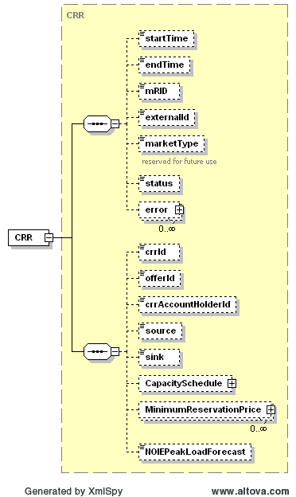
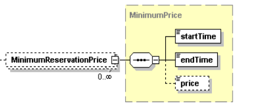

### PTP Obligation w/ Links to Option (CRR)

The following diagram describes the structure of a PTP Obligation w/
Links to Option:

The following structure is used for minimum reservation prices. Note
than if more than on MinimumReservationPrice is provided, the start
and end times must not overlap.

The CapacitySchedule structure is identical to the structure described
previously in this document. On submission, the following table
describes the items used for a CRR. In addition, the PeakLoadForecast
must be specified for NOIEs.

<table>
<colgroup>
<col style="width: 22%" />
<col style="width: 6%" />
<col style="width: 13%" />
<col style="width: 34%" />
<col style="width: 22%" />
</colgroup>
<thead>
<tr class="header">
<th><em>Element</em></th>
<th><em>Req?</em></th>
<th><em>Datatype</em></th>
<th><em>Description</em></th>
<th><em>Values</em></th>
</tr>
</thead>
<tbody>
<tr class="odd">
<td>startTime</td>
<td>K</td>
<td>dateTime</td>
<td>Start time for offer</td>
<td>Valid start hour boundary for trade date</td>
</tr>
<tr class="even">
<td>endTime</td>
<td>K</td>
<td>dateTime</td>
<td>End time for offer</td>
<td>Valid end hour boundary for trade date</td>
</tr>
<tr class="odd">
<td>externalId</td>
<td>N</td>
<td>string</td>
<td>External ID</td>
<td>QSE supplied</td>
</tr>
<tr class="even">
<td>crrId</td>
<td>K</td>
<td>string</td>
<td>CRR ID</td>
<td>ID of CRR</td>
</tr>
<tr class="odd">
<td>offerId</td>
<td>K</td>
<td>string</td>
<td>
Offer ID

ERCOT’s preference is for QSEs to submit the same Bid/Offer ID for
each hour in the submission, versus submitting a different Bid/Offer ID
for every hour.  The market system treats either submission format the
exact same way.  The purpose of this is to optimize system
performance.
</td>
<td>
QSE supplied

Value Restrictions:

Only alpha numeric, “_”(underscore) and “-“(dash) are valid
characters. First and last character should be alpha numeric.

Min Length: 2chars.

Max Length: 12 chars.
</td>
</tr>
<tr class="even">
<td>crrAccountHolderId</td>
<td>K</td>
<td>string</td>
<td>CRR account holder ID</td>
<td>ID of CRR account holder</td>
</tr>
<tr class="odd">
<td>Source</td>
<td>K</td>
<td>string</td>
<td>Source settlement point</td>
<td>Valid settlement point name</td>
</tr>
<tr class="even">
<td>Sink</td>
<td>K</td>
<td>string</td>
<td>Sink settlement point</td>
<td>Valid settlement point name</td>
</tr>
<tr class="odd">
<td>CapacitySchedule/startTime</td>
<td>N</td>
<td>dateTime</td>
<td>not used</td>
<td>not used</td>
</tr>
<tr class="even">
<td>CapacitySchedule/endTime</td>
<td>N</td>
<td>dateTime</td>
<td>not used</td>
<td>not used</td>
</tr>
<tr class="odd">
<td>
CapacitySchedule/

TmPoint/time
</td>
<td>Y</td>
<td>dateTime</td>
<td>Absolute start time for interval</td>
<td>Valid time in the trading date</td>
</tr>
<tr class="even">
<td>
CapacitySchedule/

TmPoint/ending
</td>
<td>N</td>
<td>dateTime</td>
<td>Absolute end time for interval</td>
<td>Valid time in the trading date</td>
</tr>
<tr class="odd">
<td>
CapacitySchedule/

TmPoint/value1
</td>
<td>Y</td>
<td>float</td>
<td>Megawatts</td>
<td>&gt;= 0</td>
</tr>
<tr class="even">
<td>
CapacitySchedule /

TmPoint/multiHourBlock
</td>
<td>N</td>
<td>Boolean</td>
<td>Indicates if offer must be taken as a block for all hours</td>
<td>true or false (default=false)</td>
</tr>
<tr class="odd">
<td>
MinimumReservationPrice/

startTime
</td>
<td>Y</td>
<td>dateTime</td>
<td>Start time for minimum reservation price</td>
<td>Valid hour boundary</td>
</tr>
<tr class="even">
<td>
MinimumReservationPrice/

endTime
</td>
<td>Y</td>
<td>dateTime</td>
<td>End time for minimum reservation price</td>
<td>Valid hour boundary</td>
</tr>
<tr class="odd">
<td>
MinimumReservationPrice/

Price
</td>
<td>N</td>
<td>decimal</td>
<td>Minimum price in $/MWh</td>
<td>Default (if not specified) is $2000</td>
</tr>
<tr class="even">
<td>NOIEPeakLoadForecast</td>
<td>Y</td>
<td>float</td>
<td>Peak load forecast</td>
<td>Peak load forecast in MW</td>
</tr>
</tbody>
</table>

The following is an XML example for a PTP Obligation w/ Links to
Option:

~~~
<BidSet xmlns="http://www.ercot.com/schema/2007-06/nodal/ews" xmlns:xsi="http://www.w3.org/2001/XMLSchema-instance" xsi:schemaLocation="http://www.ercot.com/schema/2007-06/nodal/ews ErcotTransactions.xsd">
    <tradingDate>2008-01-01</tradingDate>
    <CRR>
        <startTime>2008-01-01T00:00:00-05:00</startTime>
        <endTime>2008-01-02T00:00:00-05:00</endTime>
        <marketType>DAM</marketType>
        <crrId>779265</crrId>
        <offerId>868558</offerId>
        <crrAccountHolderId>XCRRAH</crrAccountHolderId>
        <source>TNSCLP3___8W</source>
        <sink>TNSCLP3___8X</sink>
        <CapacitySchedule>
            <TmPoint>
                <time>2008-01-01T00:00:00-05:00</time>
                <ending>2008-01-02T00:00:00-05:00</ending>
                <value1>20</value1>
            </TmPoint>
        </CapacitySchedule>
        <MinimumReservationPrice>
            <startTime>2008-01-01T00:00:00-05:00</startTime>
            <endTime>2008-01-02T00:00:00-05:00</endTime>
            <price>20</price>
        </MinimumReservationPrice>
        <NOIEPeakLoadForecast>20</NOIEPeakLoadForecast>
    </CRR>
</BidSet>
~~~

And the corresponding response:

~~~
<ns1:BidSet xmlns:ns1="http://www.ercot.com/schema/2007-06/nodal/ews">
    <ns1:tradingDate>2008-06-14</ns1:tradingDate>
    <ns1:CRR>
        <ns1:mRID>AEN.20080614.CRR.779265.868558.8008717662000.TNSCLP3___8W.TNSCLP3___8X</ns1:mRID>
        <ns1:externalId/>
        <ns1:status>ACCEPTED</ns1:status>
        <ns1:error>
            <ns1:severity>INFORMATIVE</ns1:severity>
            <ns1:text>Successfully processed the ERCOT CRR OFFER.</ns1:text>
        </ns1:error>
    </ns1:CRR>
</ns1:BidSet>
~~~
