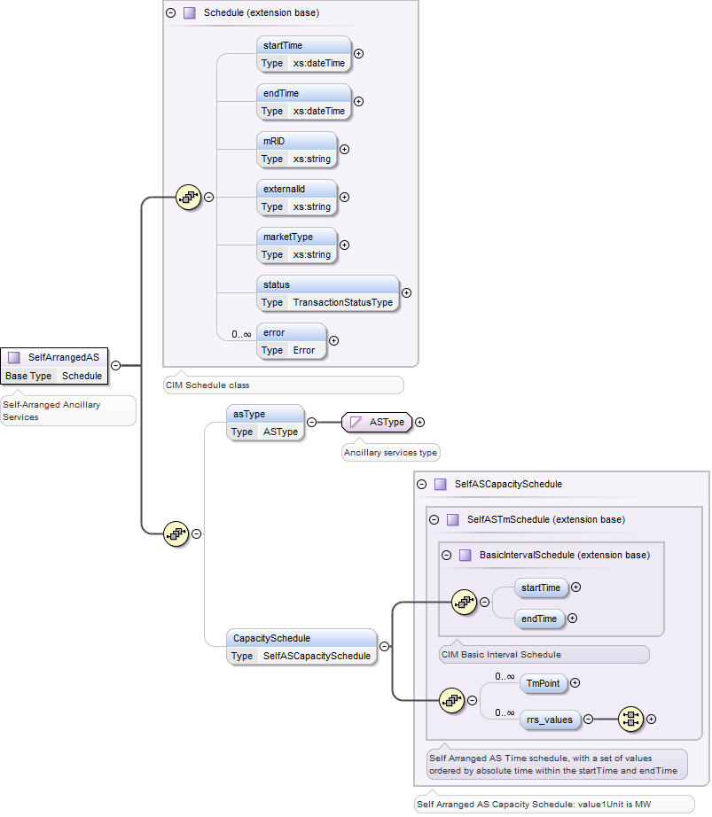
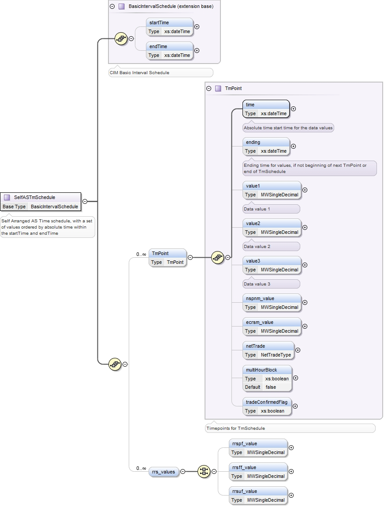

### Self-Arranged Ancillary Service Quantities (SAA)

Self-Arranged Ancillary Service Quantities describe a schedule of
ancillary services that a QSE has arranged. The following diagram
describes the structure of a schedule for self arranged ancillary
services:

- Within the SelfArrangedAS is a CapacitySchedule of
  SelfASCapacitySchedule type. SelfASCapacitySchedule are defined using
  SelfASTmSchedules types, as shown in the following diagram. The values
  of ‘value1’ within the SelfASCapacitySchedule are used to identify
  megawatts. The corresponding rrs_values are populated when RRS ASType
  is used in SelfArrangedAS submittals. The index of the TmPoint values
  should correspond to the index of the rrs_values.

- Please note that total values specified in the rrs_values should be
  equal to or less than the AS obligation MW:

*rrsuf_value + rrspf_value + rrsff_value \<= AS obligation MW*

The Market application rejects the SelfArrangedAS submittals if the above
condition is not met.

- The AS Obligation, which is a number produced by ERCOT, is the amount
  of AS per AS type that a QSE is obligated to provide.  QSEs may choose
  to self arrange all, a portion, or none of it.  The portion QSEs don't
  self arrange is procured by the DAM.

- To self arrange all of your RRS obligation, then enter:

*rrsuf_value + rrspf_value + and rrsff_value = RRS AS Obligation.*

- To self arrange a portion of your RRS obligation, then enter:

*rrsuf_value + rrspf_value + and rrsff_value \< RRS AS Obligation.*

- To self arrange none of RRS obligation, then enter

*zeroes for rrsuf_value, rrspf_value, and rrsff_value.*

- When ASType of RRS is used, TmPoint/value1 is ignored, and the
  corresponding RRS subtype values are entered in the rrsuf_value,
  rrspf_value, and rrsff_value elements.

- When ASType of ECRS is used, *value1* is used for ECRS provided from
  SCED dispatchable Resources and *ecrsm_value* is used for ECRS
  provided from manually dispatchable Resources. Please note the
  following validation rules:

  - The ECRSM (*ecrsm_value*) can not exceed 50% of the QSE’s ECRS
    Obligation.

  - A negative ECRSM (*ecrsm_value*) will not be accepted.

  - ECRSS + ECRSM (*value1 + ecrsm_value*) shall not exceed QSE’s ECRS
    obligation by 100 MW.

On submission, the following table describes the items used for a
SelfArrangedAS:

<table>
<colgroup>
<col style="width: 31%" />
<col style="width: 15%" />
<col style="width: 16%" />
<col style="width: 18%" />
<col style="width: 18%" />
</colgroup>
<thead>
<tr class="header">
<th><em>Element</em></th>
<th><em>Req?</em></th>
<th><em>Datatype</em></th>
<th><em>Description</em></th>
<th><em>Values</em></th>
</tr>
</thead>
<tbody>
<tr class="odd">
<td>startTime</td>
<td>K</td>
<td>dateTime</td>
<td>Start time for bid</td>
<td>Valid start hour boundary for trade date</td>
</tr>
<tr class="even">
<td>endTime</td>
<td>K</td>
<td>dateTime</td>
<td>End time for bid</td>
<td>Valid end hour boundary for trade date</td>
</tr>
<tr class="odd">
<td>externalId</td>
<td>N</td>
<td>string</td>
<td>External ID</td>
<td>QSE supplied</td>
</tr>
<tr class="even">
<td>asType</td>
<td>K</td>
<td>string</td>
<td>Ancillary service type</td>
<td>
Non-Spin

Reg-Down

Reg-Up

RRS

ECRS
</td>
</tr>
<tr class="odd">
<td>CapacitySchedule/startTime</td>
<td>N</td>
<td>dateTime</td>
<td>not used</td>
<td>not used</td>
</tr>
<tr class="even">
<td>CapacitySchedule/endTime</td>
<td>N</td>
<td>dateTime</td>
<td>not used</td>
<td>not used</td>
</tr>
<tr class="odd">
<td>
CapacitySchedule/

TmPoint/time
</td>
<td>Y</td>
<td>dateTime</td>
<td>Absolute time for start of interval</td>
<td>Valid time within trading date</td>
</tr>
<tr class="even">
<td>
CapacitySchedule/

TmPoint/ending
</td>
<td>N</td>
<td>dateTime</td>
<td>Absolute time for end of interval</td>
<td>Valid time within trading date</td>
</tr>
<tr class="odd">
<td>
CapacitySchedule/

TmPoint/value1
</td>
<td>Y</td>
<td>float</td>
<td>Megawatts</td>
<td>
Less than or equal to AS Obligation.

For ASType of Non-Spin, value1 is Non-Spin provided from SCED
dispatchable Resources.

For ASType of ECRS, value1 is ECRS provided from SCED dispatchable
Resources.
</td>
</tr>
<tr class="even">
<td>
CapacitySchedule/

TmPoint/nspnm_value
</td>
<td>N</td>
<td>float</td>
<td>Megawatts</td>
<td>For ASType of Non-Spin, nspnm_value is Non-Spin provided from
non-SCED dispatchable Resources.</td>
</tr>
<tr class="odd">
<td>
CapacitySchedule/

TmPoint/ecrsm_value
</td>
<td>N</td>
<td>float</td>
<td>Megawatts</td>
<td>For ASType of ECRS, ecrsm_value is ECRS provided from manually
dispatched Resources.</td>
</tr>
<tr class="even">
<td>
CapacitySchedule/

rrs_values/rrspf_value
</td>
<td rowspan="3">Y if ASType is RRS</td>
<td>float</td>
<td>RRS PF value (MW)</td>
<td rowspan="3">Total to be less than or equal to the AS
Obligations</td>
</tr>
<tr class="odd">
<td>
CapacitySchedule/

rrs_values/rrsff_value
</td>
<td>float</td>
<td>RRS FF value (MW)</td>
</tr>
<tr class="even">
<td>
CapacitySchedule/

rrs_values/rrsuf_value
</td>
<td>float</td>
<td>
RRS UF value

(MW)
</td>
</tr>
</tbody>
</table>

The following XML is an example of a Self-Arranged Ancillary Service
Quantities, showing the use of a CapacitySchedule:

~~~
<BidSet xmlns="http://www.ercot.com/schema/2007-06/nodal/ews">
    <tradingDate>2022-01-12</tradingDate>
    <SelfArrangedAS>
        <startTime>2022-01-12T00:00:00-06:00</startTime>
        <endTime>2022-01-12T01:00:00-06:00</endTime>
        <asType>Non-Spin</asType>
        <CapacitySchedule>
            <startTime>2022-01-12T00:00:00-06:00</startTime>
            <endTime>2022-01-12T01:00:00-06:00</endTime>
            <TmPoint>
                <time>2022-01-12T00:00:00-06:00</time>
                <ending>2022-01-12T01:00:00-06:00</ending>
                <value1>8</value1>
                <nspnm_value>0</nspnm_value>
            </TmPoint>
        </CapacitySchedule>
    </SelfArrangedAS>
    <SelfArrangedAS>
        <startTime>2022-01-12T00:00:00-06:00</startTime>
        <endTime>2022-01-12T01:00:00-06:00</endTime>
        <asType>RRS</asType>
        <CapacitySchedule>
            <startTime>2022-01-12T00:00:00-06:00</startTime>
            <endTime>2022-01-12T01:00:00-06:00</endTime>
            <TmPoint>
                <time>2022-01-12T00:00:00-06:00</time>
                <ending>2022-01-12T01:00:00-06:00</ending>
            </TmPoint>
            <rrs_values>
                <rrspf_value>100.1</rrspf_value>
                <rrsff_value>50.1</rrsff_value>
                <rrsuf_value>400.1</rrsuf_value>
            </rrs_values>
        </CapacitySchedule>
    </SelfArrangedAS>
    <SelfArrangedAS>
        <startTime>2022-01-12T00:00:00-06:00</startTime>
        <endTime>2022-01-12T01:00:00-06:00</endTime>
        <asType>ECRS</asType>
        <CapacitySchedule>
            <startTime>2022-01-12T00:00:00-06:00</startTime>
            <endTime>2022-01-12T01:00:00-06:00</endTime>
            <TmPoint>
                <time>2022-01-12T00:00:00-06:00</time>
                <ending>2022-01-12T01:00:00-06:00</ending>
                <value1>10</value1>
                <ecrsm_value>0</ecrsm_value>
            </TmPoint>
        </CapacitySchedule>
    </SelfArrangedAS>
</BidSet>
~~~

And the corresponding response:

~~~
<ns1:BidSet xmlns:ns1="http://www.ercot.com/schema/2007-06/nodal/ews">
    <ns1:tradingDate>2022-01-12</ns1:tradingDate>
    <ns1:submitTime>2022-01-09T11:53:36.736-06:00</ns1:submitTime>
    <ns1:SelfArrangedAS>
        <ns1:mRID>QSAMP.20220112.SAA.Non-Spin</ns1:mRID>
        <ns1:status>SUBMITTED</ns1:status>
    </ns1:SelfArrangedAS>
    <ns1:SelfArrangedAS>
        <ns1:mRID>QSAMP.20220112.SAA.RRS</ns1:mRID>
        <ns1:status>SUBMITTED</ns1:status>
    </ns1:SelfArrangedAS>
    <ns1:SelfArrangedAS>
        <ns1:mRID>QSAMP.20220112.SAA.ECRS</ns1:mRID>
        <ns1:status>SUBMITTED</ns1:status>
    </ns1:SelfArrangedAS>
</ns1:BidSet>
~~~
