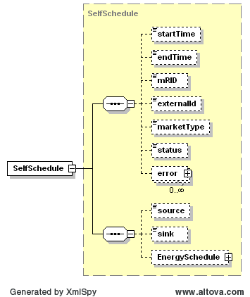

### Self-Schedule (SS)

The following diagram describes the structure of a Self-Schedule:

The EnergySchedule structure is defined using a TmSchedule type. On
submission, the following table describes the items used for a
SelfSchedule:

<table>
<colgroup>
<col style="width: 31%" />
<col style="width: 13%" />
<col style="width: 17%" />
<col style="width: 18%" />
<col style="width: 18%" />
</colgroup>
<thead>
<tr class="header">
<th><em>Element</em></th>
<th><em>Req?</em></th>
<th><em>Datatype</em></th>
<th><em>Description</em></th>
<th><em>Values</em></th>
</tr>
</thead>
<tbody>
<tr class="odd">
<td>startTime</td>
<td>K</td>
<td>dateTime</td>
<td>Start time for bid</td>
<td>Valid 15 minute boundary for trade date</td>
</tr>
<tr class="even">
<td>endTime</td>
<td>K</td>
<td>dateTime</td>
<td>End time for bid</td>
<td>Valid 15 minute boundary for trade date</td>
</tr>
<tr class="odd">
<td>externalId</td>
<td>N</td>
<td>string</td>
<td>External ID</td>
<td>QSE supplied</td>
</tr>
<tr class="even">
<td>source</td>
<td>K</td>
<td>string</td>
<td>Source settlement point</td>
<td>Valid settlement point name</td>
</tr>
<tr class="odd">
<td>sink</td>
<td>K</td>
<td>string</td>
<td>Sink settlement point</td>
<td>Valid settlement point name</td>
</tr>
<tr class="even">
<td>EnergySchedule/startTime</td>
<td>N</td>
<td>dateTime</td>
<td>not used</td>
<td>not used</td>
</tr>
<tr class="odd">
<td>EnergySchedule/endTime</td>
<td>N</td>
<td>dateTime</td>
<td>not used</td>
<td>not used</td>
</tr>
<tr class="even">
<td>
EnergySchedule/

TmPoint/time
</td>
<td>Y</td>
<td>dateTime</td>
<td>Absolute time for start of interval</td>
<td>Valid time within the trade date</td>
</tr>
<tr class="odd">
<td>
EnergySchedule/

TmPoint/ending
</td>
<td>N</td>
<td>dateTime</td>
<td>Absolute time for end of interval</td>
<td>Valid time within the trade date</td>
</tr>
<tr class="even">
<td>
EnergySchedule/

TmPoint/value1
</td>
<td>Y</td>
<td>float</td>
<td>Megawatts</td>
<td>&gt;= 0</td>
</tr>
</tbody>
</table>

The following is an XML example for a SelfSchedule:

~~~
<BidSet xmlns="http://www.ercot.com/schema/2007-06/nodal/ews" xmlns:xsi="http://www.w3.org/2001/XMLSchema-instance" xsi:schemaLocation="http://www.ercot.com/schema/2007-06/nodal/ews ErcotTransactions.xsd">
    <tradingDate>2008-01-01</tradingDate>
    <SelfSchedule>
        <startTime>2008-01-01T00:00:00-05:00</startTime>
        <endTime>2008-01-02T00:00:00-05:00</endTime>
        <marketType>DAM</marketType>
        <source>TNSCLP3___8Y</source>
        <sink>TNSCLP3___8X</sink>
        <EnergySchedule>
            <TmPoint>
                <time>2008-01-01T00:00:00-05:00</time>
                <ending>2008-01-02T00:00:00-05:00</ending>
                <value1>6353</value1>
            </TmPoint>
        </EnergySchedule>
    </SelfSchedule>
</BidSet>

~~~

And the corresponding response:

~~~
<ns1:BidSet xmlns:ns1="http://www.ercot.com/schema/2007-06/nodal/ews">
    <ns1:tradingDate>2008-06-14</ns1:tradingDate>
    <ns1:SelfSchedule>
        <ns1:mRID>AEN.20080614.SS.TNSCLP3___8Y.TNSCLP3___8X</ns1:mRID>
        <ns1:externalId/>
        <ns1:status>ACCEPTED</ns1:status>
        <ns1:error>
            <ns1:severity>INFORMATIVE</ns1:severity>
            <ns1:text>Successfully processed the ERCOT Self Schedule.</ns1:text>
        </ns1:error>
    </ns1:SelfSchedule>
</ns1:BidSet>
~~~
