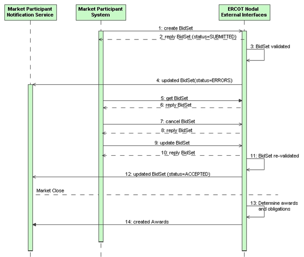
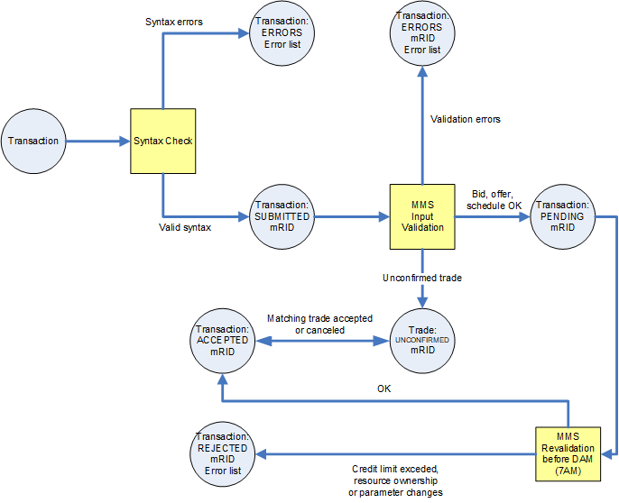
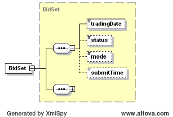
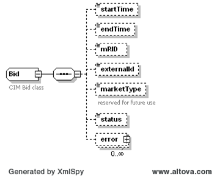
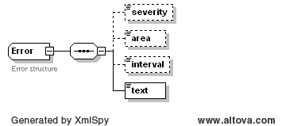

# Market Transaction Service

The purpose of the MarketTransaction Service is to support interfaces
required for market transactions. This section describes the use of web
services by Market Participants as required for bidding processes that
involve the submission, change, and cancellation of bids, trades,
offers, and schedules for specific markets.

On a given trading day, each Market Participant provides information
(using a BidSet) to ERCOT that will be used at the close of the market
to determine awards and obligations and to provide schedules needed for
market operations. Up until the close of the market, a Market
Participant may create, update, or cancel bids, trades, offers, and
schedules. When submitted, ERCOT will validate the submission, reporting
format or submission errors to Market Participants using notification
messages.

## Interfaces Provided 

The interfaces provide the means to create (i.e. submit), get (i.e.
query) and cancel (i.e. withdraw) bids/trades/offers/schedules on a
given trading date. A single container class ‘BidSet’ is used to hold a
set of bids/trades/offers/schedules within the Payload section of the
message, where each of the bids, trades, schedules or offers may be of a
different type.

The following diagram shows an example message sequence, using the
‘verb’ and ‘noun’ convention. Where this section focuses on the requests
made by Market Participant systems to the ERCOT Nodal Web Services, the
sequence diagram also includes notification messages sent from ERCOT to
Market Participant Notification services (as described in section 5).

The message sequence example shown involves the following steps:

1.  Market participant sends a RequestMessage for ‘create BidSet’ with
    an initial BidSet to ERCOT for a specific market

2.  In response to step 1, ERCOT performs a simple syntax scan and
    typically sends a ResponseMessage with ReplyCode=OK. In the response
    payload, each bid/offer/trade/schedule will identify a ‘SUBMITTED’
    status and an mRID value. (An alternative example could result in a
    reply of ‘ERRORS’ if the syntax check failed, in which case steps 3
    and 4 would not occur). This reply is synchronous.

3.  ERCOT validates the bids within the BidSet. This could take several
    minutes. This processing is done asynchronously.

4.  A notification message (using verb=changed) is sent to the
    notification interface provided by the Market Participant. The
    status of the bids within the BidSet will indicate whether the
    bid/offer/trade/schedule was PENDING/ACCEPTED or had ERRORS. This
    message will not include the complete BidSet.

5.  When multiple bids are submitted in a large payload, the Market
    Participant will asynchronously receive the notification holding the
    bids status for the "accepted" and "rejected" (in the event of
    ERRORS) bids along with the rejection reason.  As always, MPs may
    make a request to get the current bids within the submitted BidSet
    using a RequestMessage with verb=get. The request may be for
    individual bids using the mRID values, or for the entire set of bids
    within the BidSet using the TradeDate (using short mRIDs).  It will
    return all successful (accepted) bids and not the rejected bids.

6.  If appropriate, reply is sent for get BidSet in step 5.

7.  A Market Participant may choose to cancel one or more bids using a
    RequestMessage with verb=cancel. The mRID is used for cancellation
    of a bid. (See section 2.3.4)

8.  In response to step 7, a ResponseMessage is sent with verb=’reply’.
    This response is synchronous.

9.  The Market Participant may resubmit some bids (e.g. to correct
    errors), to change bids (e.g. change prices) and/or submit new bids,
    using a RequestMessage with verb=change (note that BidSets are a
    special case where the verbs ‘create’ and ‘change’ can be used
    interchangeably).

10. In response to step 9, a ResponseMessage is sent with verb=’reply’.
    This response is synchronous.

11. The newly submitted bids within the BidSet (i.e. the set of bids
    consequential to steps 7 and 9) are validated. This may take
    minutes, and processing is performed asynchronously.

12. As in step 4, a notification message is sent to the Market
    Participant to indicate whether or not the BidSet was validated and
    accepted (with either an ACCEPTED or PENDING state). The
    notification message uses verb=changed.

13. After the close of the market, awards and obligations are
    determined.

14. Market participants are notified of specific awards and/or
    obligations. The notification message uses verb=’created’,
    noun=’AwardSet’.

The following diagram describes the potential state transitions of each
bid/offer/trade/schedule within a BidSet:

## Interfaces Required 

> The following table describes the parameters used in the request
> message (RequestMessage) for market transactions, noting that each
> transaction has a request and a response message. The verbs create,
> update, get and cancel are respectively used to submit (create or
> change), query and cancel BidSets.

| Message Element | Value                                                                                                                                |
|-------------------------------------------|----------------------------------------------------------------------------------------------------------------------------------------------------------------|
| Header/Verb                               | *create/get/change/cancel*                                                                                                                                     |
| Header/Noun                               | BidSet                                                                                                                                                         |
| Header/Source                             | *Market participant ID*                                                                                                                                        |
| Header/UserID                             | *ID of user*                                                                                                                                                   |
| Payload                                   | BidSet (a single BidSet may be used for create and update request messages, and may optionally be used for get requests to identify specific bids of interest) |

The corresponding response messages (ResponseMessage) would use the
following message fields:

| Message Element | Value                                                                                                                                                                   |
|-------------------------------------------|---------------------------------------------------------------------------------------------------------------------------------------------------------------------------------------------------|
| Header/Verb                               | reply                                                                                                                                                                                             |
| Header/Noun                               | BidSet                                                                                                                                                                                            |
| Header/Source                             | ERCOT                                                                                                                                                                                             |
| Reply/ReplyCode                           | *Reply code, success=OK, error=ERROR or FATAL*                                                                                                                                                    |
| Reply/Error                               | *May be any number of error message if the ReplyCode is ERROR*                                                                                                                                    |
| Reply/Timestamp                           | *The time the submission was received by ERCOT*                                                                                                                                                   |
| Payload                                   | BidSet, where the status of each bid/offer/trade/schedule within the BidSet may be SUBMITTED, PENDING, ACCEPTED, UNCONFIRMED, REJECTED or ERRORS. Specific errors may be identified for each bid. |

> ![IMPORTANT]
> In the cases of payloads that would otherwise exceed 1 megabyte, the
> payloads should be zipped, base64 encoded and stored within the
> ‘Payload/Compressed’ tag.

For the purposes of BidSets, the verbs create and update can be used
interchangeably. Note that only one BidSet is permitted for a given
message, and all transactions within the BidSet must be for the same
trading date.

## Message Specifications

A BidSet is the payload type used for the submission, query, and
cancellation of bids and offers, and serves as a container for the
different types of bids, offers, trades and scheduled that are submitted
by a QSE for a given trading day. A BidSet identifies the trading date
and Market Participant with a sequence of any number of bids, trades,
offers, and schedules.

The header of a BidSet is shown in the following diagram:

An important note is that the BidSet uses an XSD sequence, requiring
each type of bid, trade, offer, or schedule to be provided in a specific
order. Please reference the XML Schema for the correct order.

The submission (using ’create’ verb and ‘BidSet’ noun in the message
header) of a BidSet by a Market Participant will have the effect of
either creating new bids (or offers, schedules, trades, etc.) for a
given trading date, or overwriting existing bids that were previously
submitted for a given BidSet for a given trading day.

Additionally, bids, offers, trades, and schedules may be submitted in
partial batches, where more than one BidSet is submitted for a given
trading day. When this is done, new bids are aggregated with previously
submitted bids and updates to previously submitted bids overwrite the
previous bid. The following sequence describes the aggregation of
BidSets:

1.  A first BidSet is submitted by a market participant for a trading
    day, with bids 1, 2, 3, 4.

2.  A second BidSet is submitted by the market participant for the day
    with bids 5, 6, 7, 8.

3.  The market participant ‘get’s the BidSet for the day, the reply
    returns the details of bids 1-8.

4.  The market participant submits a cancel for bid 1.

5.  A third BidSet is submitted by the market participant for the day,
    where there are updates to bids 5 and 7, as well as a new bid 9

6.  The market participant ‘get’s the BidSet for the day, the reply
    returns the details of bids 2-9.

In order to cancel a bid, a BidSet must be sent using the ‘cancel’ verb,
with the specific bids to be cancelled identified within the BidSet.
Cancel can only be used to cancel specific bids, not a whole BidSet for
a given market.

In order to query a BidSet, A BidSet is sent using the ‘get’ verb, where
the desired bids for the specific BidSet are identified. There are then
two options:

1.  If no bids are identified within the BidSet, all bids for the
    particular trading date will be returned in the BidSet in the
    response message.

2.  If specific bids are identified within the BidSet, only the details
    of the specified bids will be returned in the BidSet in the response
    message.

When a BidSet is returned by a ‘get’ request for a given trade date, the
status value of each in the BidSet is populated. Values could include:

- SUBMITTED (to indicate submission, but no further processing has been
  completed)

- ACCEPTED (to indicate successful validation and acceptance of the
  transaction)

- UNCONFIRMED (to indicate a trade that is not yet confirmed, once
  confirmed it would go to the ACCEPTED state)

- PENDING (to indicate a transaction that is not yet accepted, as it may
  be submitted for a day after the next trading date or the second phase
  of validation within MMS has not yet completed)

- REJECTED (to indicate a transaction that has been rejected)

- CANCELED (to indicate a transaction was canceled, this can not be
  retrieved by a get)

- ERRORS (to indicate that there are one or more errors for the
  transaction)

Additionally the “Submit Time” is returned with the response to a bid
retrieval request, indicating the bid receipt timestamp by ERCOT. 
Submit timestamp is an output only field and if populated by the
submitter on the bid creation request, it will be overwritten by the
ERCOT Integration layer at the time it is received (and returned via
bid retrieval).

The following sub sections describe the structure of specific bid,
offer, trade, and schedule types. Typically each
bid/offer/trade/schedule will have a set of properties that along with
the type of bid/offer/trade/schedule makes it unique (see section
2.3.3). Typically these would include:

- Bid, offer, schedule or trade type

- Resource

- Ancillary Service type

When submitting a bid/offer/schedule/trade using create or update, all
properties for the bid must be specified. When performing a get or
cancel request, only those parameters that uniquely identify the
bid/offer/trade/schedule must be specified through the use of an mRID.
The following diagram shows information commonly maintained for each
type of bid/offer/trade/schedule. The status for a given
bid/offer/trade/schedule may be SUBMITTED, PENDING, ACCEPTED, ERRORS
or CANCELED. If the status is ERRORS, there may be one or more error
stings identified.

The mRID is not supplied for the initial submission of a bid, but must
be supplied for cancellations to previously submitted bids. The
marketType is currently optional and is reserved for future use. When
an mRID is specified for a ‘get’ or ‘cancel’ request, it is supplied
using a message request/ID tag.

The ‘externalId’ may be populated by the QSE with an identifier of
their choice. If supplied upon submission, the identifier will then be
used in conjunction with notifications of acceptance or rejection due
to errors.

[Three-Part Supply Offer (TPO)](/ews/Market%20Transaction%20Messages/Three-Part%20Supply%20Offer%20(TPO).md)

[Self-Arranged Ancillary Service Quantities (SAA)](/ews/Market%20Transaction%20Messages/Self-Arranged%20Ancillary%20Service%20Quantities%20(SAA).md)

[Incremental and Decremental Energy Offer Curves (IDO)](/ews/Market%20Transaction%20Messages/Incremental%20and%20Decremental%20Energy%20Offer%20Curves%20(IDO).md)

[Ancillary Service Offer (ASO)](/ews/Market%20Transaction%20Messages/Ancillary%20Service%20Offer%20(ASO).md)

[Ancillary Service Trade (AST)](/ews/Market%20Transaction%20Messages/Ancillary%20Service%20Trade%20(AST).md)

[Availability Plan (AVP)](/ews/Market%20Transaction%20Messages/Availability%20Plan%20(AVP).md)

[Capacity Trade (CT)](/ews/Market%20Transaction%20Messages/Capacity%20Trade%20(CT).md)

[PTP Obligation w/ Links to Option (CRR)](/ews/Market%20Transaction%20Messages/PTP%20Obligation%20with%20Links%20to%20Option%20(CRR).md)

[Current Operating Plan (COP)](/ews/Market%20Transaction%20Messages/Current%20Operating%20Plan%20(COP).md)

[DAM Energy Bid (EB)](/ews/Market%20Transaction%20Messages/DAM%20Energy%20Bid%20(EB).md)

[DAM Energy-Only Offer (EOO)](/ews/Market%20Transaction%20Messages/DAM%20Energy-Only%20Offer%20(EOO).md)

[Energy Trade (ET)](/ews/Market%20Transaction%20Messages/Energy%20Trade%20(ET).md)

[Output Schedule (OS)](/ews/Market%20Transaction%20Messages/Output%20Schedule%20(OS).md)

[PTP Obligation Bid  (PTP)](/ews/Market%20Transaction%20Messages/PTP%20Obligation%20Bid%20%20(PTP).md)

[Self-Schedule (SS)](/ews/Market%20Transaction%20Messages/Self-Schedule%20(SS).md)

[Real-Time Market Energy Bid (REB)](/ews/Market%20Transaction%20Messages/Real-Time%20Market%20Energy%20Bid%20(REB).md)

[Exceptional Fuel Cost (EFC)](/ews/Market%20Transaction%20Messages/Exceptional%20Fuel%20Cost%20(EFC).md)

## Error Handling 

The purpose of this section is to describe the handling of errors
related to submissions, updates, queries, and cancellations. This is
especially important, as BidSets can be partially accepted, where some
bids, offers, trades, or schedules within a BidSet can be accepted,
and others rejected.

| *Condition*                                                                                              | *Action*                                                                                                                                                                                                                        | *Error Reported*                                                                                                   |
|----------------------------------------------------------------------------------------------------------|---------------------------------------------------------------------------------------------------------------------------------------------------------------------------------------------------------------------------------|--------------------------------------------------------------------------------------------------------------------|
| Bad parameters in message header                                                                         | Request is rejected                                                                                                                                                                                                             | ERROR: INVALID REQUEST                                                                                             |
| Invalid Source or UserID                                                                                 | Request is rejected                                                                                                                                                                                                             | ERROR: NOT AUTHORIZED                                                                                              |
| Payload can not be interpreted                                                                           | Request is rejected                                                                                                                                                                                                             | ERROR: BAD PAYLOAD                                                                                                 |
| Parameters within BidSet header are invalid, e.g. bad trading date                                       | No bids or updates are accepted                                                                                                                                                                                                 | ERROR: BAD BIDSET                                                                                                  |
| Request for a get, cancel or update identifies an unknown transaction (i.e. bid, offer, trade, schedule) | The request is processed only for the known transactions.                                                                                                                                                                       | WARNING: UNKNOWN ID: ……                                                                                            |
| Some transactions within a BidSet are rejected                                                           | For submissions containing multiple offers/bids, valid offers/bids are accepted as submitted, invalid offers/bids are rejected and marked with errors. An offer/bid will be rejected entirely if any hour within it is invalid. | BidSet on reply identifies errors for those transactions that were rejected on a transaction by transaction basis. |

It is also important to note that the submission of a BidSet involves
multiple steps:

1.  BidSet is syntax scanned, where only basic validity checks are
    performed. The reply identifies where basic validity checks failed.
    Transactions within the BidSet that pass basic validation checks are
    marked as ‘SUBMITTED’ and a transaction ID (mRID) value is returned.

2.  A more thorough validity check is performed asynchronously by the
    Market Management System (MMS)

3.  After acceptance or rejection by MMS, a notification is issued that
    identified whether the transaction was ‘ACCEPTED’, is ‘PENDING’, or
    had an error.

The following structure is used to report errors, where the severity,
area of the error or the specific time can be identified.

The error structure is populated in the following manner:

- *severity* may be ‘error’, ‘warning’ or ‘informational’, as determined
  by the source system

- *area* may be used to indicate the tag or parent tag (e.g.
  EnergySchedule), where an error was identified

- *interval* may be used to identify the time of the data item of
  concern, where many data items may be related to a schedule
  submission. For market transaction interfaces, a market interval
  (using hour ending and minute ending) is used as opposed to a
  timestamp

- *text* as provided by the source system

When possible, the described error structure will be used. However,
there are many cases where error5 structure can not be used, as in
cases where schema validations fail and normal validation is not
possible. These are typically the result of programming errors.
Examples would include:

- XML is not well formed

- XML is not schema compliant, from the perspective of basic data
  structures

- XML is not schema compliant, from the perspective that values provided
  are invalid (e.g. invalid time strings, nulls where values are
  required, non-numeric values where numeric values are required,
  obviously out of range values, invalid enumerations)

## Usage and XML Samples

This section provides usage details with XML examples for the submission
(create), query (get), update, and cancellation (cancel) of bidds, offers,
trades, and schedules.

### Offer and Bid Set Submission 

When submitting a set of bids, offers, trades, and/or schedules, the
following structures are used within the message:

| Message Element | Value |
|-------------------------------------------|---------------------------------|
| Header/Verb                               | create                          |
| Header/Noun                               | *BidSet*                        |
| Header/Source                             | *Market participant ID*         |
| Header/UserID                             | *ID of user*                    |
| Payload                                   | *BidSet*                        |

The corresponding response messages would use the following message
fields:

| Message Element | Value                                                                                     |
|-------------------------------------------|---------------------------------------------------------------------------------------------------------------------|
| Header/Verb                               | reply                                                                                                               |
| Header/Noun                               | *BidSet*                                                                                                            |
| Header/Source                             | ERCOT                                                                                                               |
| Reply/ReplyCode                           | *Reply code, success=OK, error=ERROR or FATAL*                                                                      |
| Reply/Error                               | *May be any number of error messages*                                                                               |
| Payload                                   | *BidSet, returning transaction IDs (mRIDs) for individual bids, offers, trades or schedules and/or error messages.* |

The following is an example message for a request message for the
submission of a BidSet by a Market Participant. The following example
uses a SelfArrangedAS.

~~~
<RequestMessage xmlns:xsi="http://www.w3.org/2001/XMLSchema-instance" xmlns="http://www.ercot.com/schema/2007-05/nodal/ews/msg">
	<Header>
		<Verb>create</Verb>
		<Noun>BidSet</Noun>
		<ReplayDetection>
			<Nonce>3264874657467444949</Nonce>
			<Created>2006-12-09 15:35:57Z</Created>
		</ReplayDetection>
		<Revision>001</Revision>
		<Source>SOMEQSE</Source>
		<UserID>Nemat</UserID>
		<MessageID>231232466</MessageID>
		<Comment>Example message</Comment>
	</Header>
	<Payload>
		<BidSet xmlns="http://www.ercot.com/schema/2007-05/nodal/ews" xmlns:xsi="http://www.w3.org/2001/XMLSchema-instance">            
                        <tradingDate>2007-01-04</tradingDate>
    		  <SelfArrangedAS>
			<startTime>2007-12-17T00:00:00-06:00</startTime>
		 	<endTime>2007-12-18T00:00:00-06:00</endTime>
	 		<externalId>myExternalID45473</externalId>
		<asType>On-Non-Spin</asType>
	    	<CapacitySchedule>
			<TmPoint>
				<time>2007-12-17T00:00:00-06:00</time>
				<value1>120</value1>
			</TmPoint>
			<TmPoint>
				<time>2007-12-17T02:00:00-06:00</time>
				<value1>130</value1>
			</TmPoint>
			<TmPoint>
				<time>2007-12-17T06:00:00-06:00</time>
				<value1>115</value1>
			</TmPoint>
		    </CapacitySchedule>
      		  </SelfArrangedAS>

		… additional bids inserted here …
		        
		</BidSet>
	</Payload>
</RequestMessage>
~~~

The following is an example response message, where the submission
request was successful:

~~~
<ResponseMessage xmlns:xsi="http://www.w3.org/2001/XMLSchema-instance" xmlns="http://www.ercot.com/schema/2007-05/nodal/ews/msg">
	<Header>
		<Verb>reply</Verb>
		<Noun>BidSet</Noun>
		<ReplayDetection>
			<Nonce>74646464</Nonce>
			<Created>2006-12-09T15:36:03-06:00</Created>
		</ReplayDetection>
		<Revision>001</Revision>
		<Source>ERCOT</Source>
		<UserID>MMS</UserID>
		<MessageID>231232466</MessageID>
	</Header>
	<Reply>
		<ReplyCode>OK</ReplyCode>
	</Reply>
	<Payload>
		<BidSet xmlns="http://www.ercot.com/schema/2007-05/nodal/ews" xmlns:xsi="http://www.w3.org/2001/XMLSchema-instance">                  
            <tradingDate>2007-01-04</tradingDate>
    		<SelfArrangedAS>
			    <mRID>SOMEQSE.20070104.SAA.Reg-Up</mRID>
			    <externalId>myExternalID45473</externalId>
			    <status>SUBMITTED</status>
    		</SelfArrangedAS>
		</BidSet>
	</Payload>
</ResponseMessage>
~~~

The following is an example response where a submission was
unsuccessful, as a consequence of invalid parameters on the BidSet:

~~~
<ResponseMessage xmlns:xsi="http://www.w3.org/2001/XMLSchema-instance" xmlns="http://www.ercot.com/schema/2007-05/nodal/ews/msg">
	<Header>
		<Verb>reply</Verb>
		<Noun>BidSet</Noun>
		<ReplayDetection>
			<Nonce>74646464</Nonce>
			<Created>2006-12-09T15:36:03-06:00</Created>
		</ReplayDetection>
		<Revision>001</Revision>
		<Source>ERCOT</Source>
		<UserID>MMS</UserID>
		<MessageID>231232466</MessageID>
	</Header>
	<Reply>
		<ReplyCode>ERROR</ReplyCode>
		<Error>Bad trading date</Error>
	</Reply>
</ResponseMessage>
~~~

The following is an example response where a submission was
unsuccessful, as a consequence of syntax failures within a specific
bid/offer/trade/schedule within the BidSet. It is important to note
that only the status and errors (if any exist) are returned for each
bid.

~~~
<ResponseMessage xmlns:xsi="http://www.w3.org/2001/XMLSchema-instance" xmlns="http://www.ercot.com/schema/2007-05/nodal/ews/msg">
	<Header>
		<Verb>reply</Verb>
		<Noun>BidSet</Noun>
		<ReplayDetection>
			<Nonce>74646464</Nonce>
			<Created>2006-12-09T15:36:03-06:00</Created>
		</ReplayDetection>
		<Revision>001</Revision>
		<Source>ERCOT</Source>
		<UserID>MMS</UserID>
		<MessageID>231232466</MessageID>
	</Header>
	<Reply>
		<ReplyCode>ERROR</ReplyCode>
		<Error>Bid syntax errors</Error>
	</Reply>
	<Payload>
		<BidSet xmlns="http://www.ercot.com/schema/2007-05/nodal/ews" xmlns:xsi="http://www.w3.org/2001/XMLSchema-instance">
            <tradingDate>2007-01-04</tradingDate>
            <XYZ>
                <status>ERROR</status>
                <error><severity>error</severity><text>Unknown bid type XYZ</text></error>
            </XYZ>
            <ThreePartOffer>
                <status>ERROR</status>
                <error><severity>error</severity><text>Bad schema</text></error>
            </ThreePartOffer>
            <COP>
                <mRID>SOMEQSE.20070104.COP.<Resource1></mRID>
                <externalId>SOMEQSE external ID 123</externalId>
                <status>SUBMITTED</status>
            </COP>

		        ... sequence of bids with status and  errors (if any)  appears here ...
		        
		</BidSet>
	</Payload>
</ResponseMessage>
~~~

The more detailed validations errors would typically be available
after a period of minutes, where a notification would be issued to
identify that errors were found.

> [!IMPORTANT] 
> The order of the bids, offers, trades, and schedules within the 
> reply BidSet is identical to the order that was provided in the 
> BidSet for the submission. This is important so that the mRID in 
> the response can be associated with the correct bid, offer, trade,
> or schedule from the submission.

# Querying Bids, Offers, Trades and Schedules

A query request uses the ‘get’ verb on the message header to query
specific bids, offers, trades and schedules. There are two options for
querying a set of bids, offers, trades, or schedules:

- The transaction ID (mRID) for each bid, offer, trade, or schedule of
  interest is identified using the message Request/ID parameter. These
  must be for the same trade date.

- In all cases only the trading date and a product type is supplied,
  where only the bids, offers, schedules and trades for that trading
  date of the specified product type will be returned. This is done
  using a partial (shortened) mRID in the form
  `<QSE>.<date>.<product>`, such as ‘SOMEQSE.20081112.COP’.

Table below reflects the required short mRID tokens for every bid type:

| *BID Type*                        | *Type (XML tag)* | * Short mRID Key String*                |
|-----------------------------------|------------------|-----------------------------------------|
| Ancillary Service Offer           | ASOffer          | `<QSE>.<TradingDate>.ASO`               |
| Ancillary Service Trade           | ASTrade          | `<QSE>.<TradingDate>.AST`               |
| Capacity Trade                    | CapacityTrade    | `<QSE>.<TradingDate>.CT`                |
| Current Operating Plan            | COP              | `<QSE>.<TradingDate>.COP`               |
| PTP Obligation w/ Links to Option | CRR              | `<QSE>.<TradingDate>.CRR.Source.Sink`   |
| DAM Energy Bid                    | EnergyBid        | `<QSE>.<TradingDate>.EB.SP`             |
| DAM Energy-Only Offer             | EnergyOnlyOffer  | `<QSE>.<TradingDate>.EOO.SP`            |
| Energy Trade                      | EnergyTrade      | `<QSE>.<TradingDate>.ET`                | 
| Inc Dec Energy Offer              | IncDecOffer      | `<QSE>.<TradingDate>.IDO`               |
| Output Schedule                   | OutputSchedule   | `<QSE>.<TradingDate>.OS`                |
| PTP Obligation Bid                | PTPObligation    | `<QSE>.<TradingDate>.PTP.Source.Sink`   |
| Real-Time Market Energy Bid       | RTMEnergyBid     | `<QSE>.<TradingDate>.REB`               |
| Self-Arranged AS                  | SelfArrangedAS   | `<QSE>.<TradingDate>.SAA`               |
| Self-Schedule                     | SelfSchedule     | `<QSE>.<TradingDate>.SS`                |
| Three Part Supply Offer           | ThreePartOffer   | `<QSE>.<TradingDate>.TPO`               |

In all cases the verb is ‘get’, the noun is ‘BidSet’. Please note that
this interface will not return any bids, offers, trades or schedules
that were invalid upon submission. The externalId will not be
returned, as it is not maintained by MMS.

| Message Element | Value                                                                   |
|-------------------------------------------|---------------------------------------------------------------------------------------------------|
| Header/Verb                               | get                                                                                               |
| Header/Noun                               | *BidSet*                                                                                          |
| Header/Source                             | *Market participant ID*                                                                           |
| Header/UserID                             | *ID of user*                                                                                      |
| Request/ID                                | *One or more mRID values, where the products are of the same type and for the same trading date.* |

The corresponding response messages would use the following message
fields:

| Message Element | Value                                            |
|-------------------------------------------|----------------------------------------------------------------------------|
| Header/Verb                               | reply                                                                      |
| Header/Noun                               | *BidSet*                                                                   |
| Header/Source                             | ERCOT                                                                      |
| Reply/ReplyCode                           | *Reply code, success=OK, error=ERROR or FATAL*                             |
| Reply/Error                               | *May be any number of error messages*                                      |
| Payload                                   | *BidSet, returning details for desired bids, offers, trades and schedules* |

The following is an example response payload:

~~~
<BidSet xmlns="http://www.ercot.com/schema/2007-05/nodal/ews" xmlns:xsi="http://www.w3.org/2001/XMLSchema-instance">
	<tradingDate>2008-01-01</tradingDate>
	<ASTrade>
		<startTime>2008-01-01T00:00:00-06:00</startTime>
		<endTime>2008-01-02T00:00:00-06:00</endTime>
		<mRID>ACME.20080101.AST.Reg-Up.<BuyerQSE>.<SellerQSE></mRID>
		<status>ACCEPTED</status>
		<buyer>Acme</buyer>
		<seller>Cogswell</seller>
		<asType>Reg-Up</asType>
		<ASSchedule>
			<startTime>2008-01-01T00:00:00-06:00</startTime>
			<endTime>2008-01-02T00:00:00-06:00</endTime>
			<TmPoint>
				<time>2008-01-01T00:00:00-06:00</time>
				<value1>40</value1>
			</TmPoint>
			<TmPoint>
				<time>2008-01-01T20:00:00-06:00</time>
				<value1>400</value1>
			</TmPoint>
		</ASSchedule>
	</ASTrade>
</BidSet>
~~~

### Updating Bids, Offers, Trades and Schedules

A request to update specific bids, offers, trades and schedules is
identically the same as a submission request. If the bid, offer,
schedule or trade was previously submitted it will be updated. If it
did not previously exist, it will be created.

For the purpose of bidding, the ‘create’ and ‘change’ verbs are used
interchangeably.

| Message Element | Value |
|-------------------------------------------|---------------------------------|
| Header/Verb                               | change                          |
| Header/Noun                               | *BidSet*                        |
| Header/Source                             | *Market participant ID*         |
| Header/UserID                             | *ID of user*                    |
| Payload                                   | *BidSet*                        |

The corresponding response messages would use the following message
fields:

| Message Element | Value                                                                                     |
|-------------------------------------------|---------------------------------------------------------------------------------------------------------------------|
| Header/Verb                               | reply                                                                                                               |
| Header/Noun                               | *BidSet*                                                                                                            |
| Header/Source                             | ERCOT                                                                                                               |
| Reply/ReplyCode                           | *Reply code, success=OK, error=ERROR or FATAL*                                                                      |
| Reply/Error                               | *May be any number of error messages*                                                                               |
| Payload                                   | *BidSet, returning transaction IDs (mRIDs) for individual bids, offers, trades or schedules and or error messages.* |

The following is an example request payload, where a previously
submitted ASTrade will be updated. There may be more than one bid,
offer, trade or schedule updated at a time. New submissions may also
be mixed with updates.

~~~
<BidSet xmlns="http://www.ercot.com/schema/2007-05/nodal/ews" xmlns:xsi="http://www.w3.org/2001/XMLSchema-instance">
	<tradingDate>2008-01-01</tradingDate>
	<ASTrade>
		<startTime>2008-01-01T00:00:00-06:00</startTime>
		<endTime>2008-01-02T00:00:00-06:00</endTime>
		<externalId>My External ID 123454</externalId>
		<buyer>Acme</buyer>
		<seller>Cogswell</seller>
		<asType>Reg-Up</asType>
		<ASSchedule>
			<startTime>2008-01-01T00:00:00-06:00</startTime>
			<endTime>2008-01-02T00:00:00-06:00</endTime>
			<TmPoint>
				<time>2008-01-01T00:00:00-06:00</time>
				<value1>40</value1>
			</TmPoint>
			<TmPoint>
				<time>2008-01-01T20:00:00-06:00</time>
				<value1>70</value1>
			</TmPoint>
		</ASSchedule>
	</ASTrade>
</BidSet>
~~~

### Canceling Bids, Offers, Trades and Schedules

A cancellation request uses the ‘cancel’ verb on the message header in
order to cancel one or more query specific bids, offers, trades and
schedules, as identified using an mRID. It is important to note that a
COP submission can not be canceled, as it is required and can
otherwise only be updated. It is also important to note that the mRID
values must identify bids, offers, trades and schedules for the same
trade date.

| Message Element | Value |
|-------------------------------------------|---------------------------------|
| Header/Verb                               | cancel                          |
| Header/Noun                               | *BidSet*                        |
| Header/Source                             | *Market participant ID*         |
| Header/UserID                             | *ID of user*                    |
| Request/ID                                | *One or more mRID values*       |

When canceling a bid, it is also possible to cancel individual hours of
a bid. This would be done by suffixing the mRID of the bid to be
canceled with the specific hour. If the hour is not provided, all hours
will be canceled.

The corresponding response messages would use the following message
fields:

| Message Element | Value                                          |
|-------------------------------------------|--------------------------------------------------------------------------|
| Header/Verb                               | reply                                                                    |
| Header/Noun                               | *BidSet*                                                                 |
| Header/Source                             | ERCOT                                                                    |
| Reply/ReplyCode                           | *Reply code, success=OK, error=ERROR or FATAL*                           |
| Reply/Error                               | *May be any number of error messages*                                    |
| Payload/BidSet                            | *BidSet identifying bids canceled, identifying mRID and status=CANCELED* |

The following is an example BidSet that would be provided in the
response message:

~~~
<BidSet xmlns="http://www.ercot.com/schema/2007-05/nodal/ews" xmlns:xsi="http://www.w3.org/2001/XMLSchema-instance">
	<tradingDate>2008-01-01</tradingDate>
	<ASOffer>
		<mRID>ACME.20080101.ASO.<Resource1>.<Reg-Up></mRID>
		<status>CANCELED</status>
	</ASOffer>
	<ASOffer>
		<mRID>ACME.20080101.ASO.<Resource2>.<Reg-Up></mRID>
		<status>CANCELED</status>
	</ASOffer>
</BidSet>
~~~
