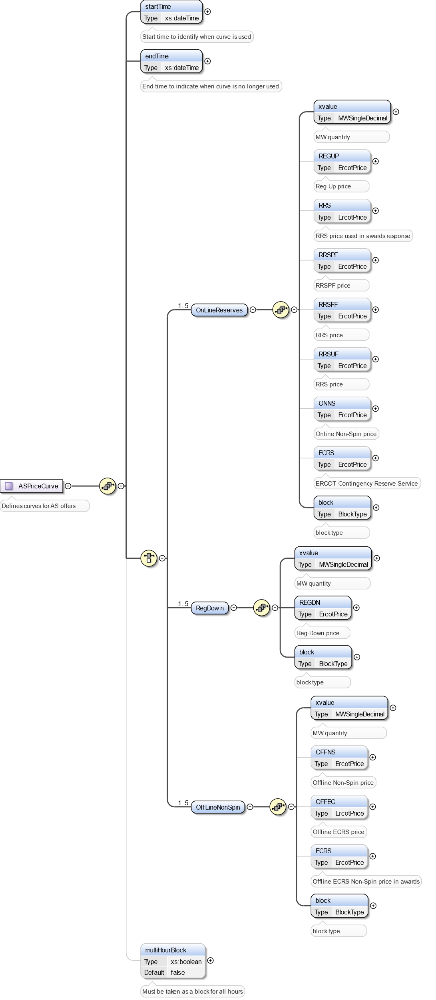
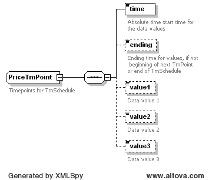

### Ancillary Service Awards

The purpose of this message is to notify a QSE of DAM or SASM
Ancillary Services Awards.

The following response message structure will be used for Ancillary
Service Awards notification:

| Message Element | Value                |
|-------------------------------------------|------------------------------------------------|
| Header/Verb                               | created                                        |
| Header/Noun                               | AwardedAS                                      |
| Header/Source                             | ERCOT                                          |
| Reply/ReplyCode                           | *Reply code, success=OK, error=ERROR or FATAL* |
| Reply/Error                               | *Error message, if error encountered*          |
| Reply/Timestamp                           | *Current System Timestamp*                     |
| Payload/AwardSet                          | *AwardedAS*                                    |

The payload structure of this message is shown by the following
diagrams:

The table found in the AwardedAS Market Information Services section describes the AwardedAS
structure.

The following are 3 XML fragments as examples:

~~~
<ns0:AwardedAS>
    <ns0:qse>QSAMP</ns0:qse>
    <ns0:startTime>2023-03-08T00:00:00-06:00</ns0:startTime>
    <ns0:endTime>2023-03-08T01:00:00-06:00</ns0:endTime>
    <ns0:tradingDate>2023-03-08</ns0:tradingDate>
    <ns0:resource>RES1 </ns0:resource>
    <ns0:asType>ECRSM</ns0:asType>
    <ns0:awardedMW>
        <ns0:startTime>2023-03-08T00:00:00-06:00</ns0:startTime>
        <ns0:endTime>2023-03-08T01:00:00-06:00</ns0:endTime>
        <ns0:OnLineReserves>
            <ns0:xvalue>0</ns0:xvalue>
            <ns0:ECRS>0.01</ns0:ECRS>
            <ns0:block>1</ns0:block>
        </ns0:OnLineReserves>

<ns0:AwardedAS>
    <ns0:qse> QSAMP </ns0:qse>
    <ns0:startTime>2023-03-08T00:00:00-06:00</ns0:startTime>
    <ns0:endTime>2023-03-08T01:00:00-06:00</ns0:endTime>
    <ns0:tradingDate>2023-03-08</ns0:tradingDate>
    <ns0:resource>RES1 </ns0:resource>
    <ns0:asType>ECRSS</ns0:asType>
    <ns0:awardedMW>
        <ns0:startTime>2023-03-08T00:00:00-06:00</ns0:startTime>
        <ns0:endTime>2023-03-08T01:00:00-06:00</ns0:endTime>
        <ns0:OnLineReserves>
            <ns0:xvalue>3.7</ns0:xvalue>
            <ns0:ECRS>0.01</ns0:ECRS>
            <ns0:block>1</ns0:block>
        </ns0:OnLineReserves>
      
<ns0:AwardedAS>
    <ns0:qse>QLUMN</ns0:qse>
    <ns0:startTime>2023-03-08T00:00:00-06:00</ns0:startTime>
    <ns0:endTime>2023-03-08T01:00:00-06:00</ns0:endTime>
    <ns0:tradingDate>2023-03-08</ns0:tradingDate>
    <ns0:resource>DCSES_CT10</ns0:resource>
    <ns0:asType>OFFEC</ns0:asType>
    <ns0:awardedMW>
        <ns0:startTime>2023-03-08T00:00:00-06:00</ns0:startTime>
        <ns0:endTime>2023-03-08T01:00:00-06:00</ns0:endTime>
        <ns0:OffLineNonSpin>
            <ns0:xvalue>0</ns0:xvalue>
            <ns0:ECRS>0.01</ns0:ECRS>
            <ns0:block>1</ns0:block>
        </ns0:OffLineNonSpin>
~~~
