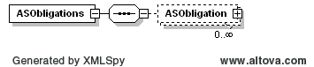

### Ancillary Service Obligations

The purpose of this notification message is to notify a QSE of DAM or
SASM Ancillary Service Obligations.

The following response message structure will be used for Ancillary
Service Obligations notification:

| Message Element | Value                |
|-------------------------------------------|------------------------------------------------|
| Header/Verb                               | created                                        |
| Header/Noun                               | ASObligations                                  |
| Header/Source                             | ERCOT                                          |
| Reply/ReplyCode                           | *Reply code, success=OK, error=ERROR or FATAL* |
| Reply/Error                               | *Error message, if error encountered*          |
| Reply/Timestamp                           | *Current System Timestamp*                     |
| Payload/                                  | ASObligations                                  |

The structure of this message is shown by the following diagrams:

The following is an XML example:

~~~
<ns1:ASObligations xmlns:ns0="http://www.ercot.com/schema/2007-05/nodal/eip/il"
    xmlns:ns1="http://www.ercot.com/schema/2007-06/nodal/ews">
    <ns1:ASObligation>
        <ns1:startTime>2023-04-18T00:00:00-05:00</ns1:startTime>
        <ns1:endTime>2023-04-18T01:00:00-05:00</ns1:endTime>
        <ns1:TmPoint>
            <ns1:time>2023-04-18T00:00:00-05:00</ns1:time>
            <ns1:ending>2023-04-18T01:00:00-05:00</ns1:ending>
            <ns1:value1>112.2</ns1:value1>
        </ns1:TmPoint>
        <ns1:asType>ECRS</ns1:asType>
        <ns1:qse>QSAMP</ns1:qse>
        <ns1:marketType>DAM</ns1:marketType>
    </ns1:ASObligation>
    <ns1:ASObligation>
        <ns1:startTime>2023-04-18T00:00:00-05:00</ns1:startTime>
        <ns1:endTime>2023-04-18T01:00:00-05:00</ns1:endTime>
        <ns1:TmPoint>
            <ns1:time>2023-04-18T00:00:00-05:00</ns1:time>
            <ns1:ending>2023-04-18T01:00:00-05:00</ns1:ending>
            <ns1:value1>169.3</ns1:value1>
        </ns1:TmPoint>
        <ns1:asType>Non-Spin</ns1:asType>
        <ns1:qse>QSAMP</ns1:qse>
        <ns1:marketType>DAM</ns1:marketType>
    </ns1:ASObligation>
    <ns1:ASObligation>
        <ns1:startTime>2023-04-18T00:00:00-05:00</ns1:startTime>
        <ns1:endTime>2023-04-18T01:00:00-05:00</ns1:endTime>
        <ns1:TmPoint>
            <ns1:time>2023-04-18T00:00:00-05:00</ns1:time>
            <ns1:ending>2023-04-18T01:00:00-05:00</ns1:ending>
            <ns1:value1>66.1</ns1:value1>
        </ns1:TmPoint>
        <ns1:asType>Reg-Down</ns1:asType>
        <ns1:qse>QSAMP</ns1:qse>
        <ns1:marketType>DAM</ns1:marketType>
    </ns1:ASObligation>
    <ns1:ASObligation>
        <ns1:startTime>2023-04-18T00:00:00-05:00</ns1:startTime>
        <ns1:endTime>2023-04-18T01:00:00-05:00</ns1:endTime>
        <ns1:TmPoint>
            <ns1:time>2023-04-18T00:00:00-05:00</ns1:time>
            <ns1:ending>2023-04-18T01:00:00-05:00</ns1:ending>
            <ns1:value1>40.6</ns1:value1>
        </ns1:TmPoint>
        <ns1:asType>Reg-Up</ns1:asType>
        <ns1:qse>QSAMP</ns1:qse>
        <ns1:marketType>DAM</ns1:marketType>
    </ns1:ASObligation>
    <ns1:ASObligation>
        <ns1:startTime>2023-04-18T00:00:00-05:00</ns1:startTime>
        <ns1:endTime>2023-04-18T01:00:00-05:00</ns1:endTime>
        <ns1:TmPoint>
            <ns1:time>2023-04-18T00:00:00-05:00</ns1:time>
            <ns1:ending>2023-04-18T01:00:00-05:00</ns1:ending>
            <ns1:value1>446.7</ns1:value1>
        </ns1:TmPoint>
        <ns1:asType>RRS</ns1:asType>
        <ns1:qse>QSAMP</ns1:qse>
        <ns1:marketType>DAM</ns1:marketType>
    </ns1:ASObligation>
</ns1:ASObligations>
~~~
